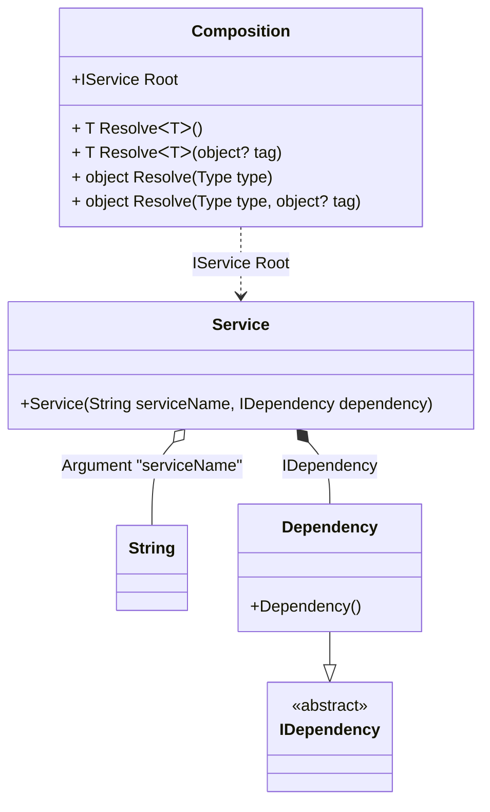

#### Instance Initialization

[](../tests/Pure.DI.UsageTests/Advanced/InstanceInitializationScenario.cs)

This example shows how to build up an instance with all the necessary dependencies and manually prepare it for further use.

```c#
interface IDependency;

class Dependency : IDependency;

interface IService
{
    string ServiceName { get; }

    IDependency Dependency { get; }

    bool IsInitialized { get; }
}

class Service(string serviceName, IDependency dependency): IService
{
    public string ServiceName { get; } = serviceName;

    public IDependency Dependency { get; } = dependency;

    public bool IsInitialized { get; private set; }

    public void Initialize() => IsInitialized = true;
}

DI.Setup(nameof(Composition))
    .Bind<IDependency>().To<Dependency>()
    .Arg<string>("serviceName")
    .Bind<IService>()
        .To<Service>(ctx =>
        {
            // Builds up an instance with all necessary dependencies
            ctx.Inject<Service>(out var service);

            // Executing all the necessary logic
            // to prepare the instance for further use
            service.Initialize();
            return service;
        })
        .Root<IService>("Root");

var composition = new Composition("My Service");
var service = composition.Root;
service.ServiceName.ShouldBe("My Service");
service.IsInitialized.ShouldBeTrue();
```

<details open>
<summary>Class Diagram</summary>



</details>

<details>
<summary>Pure.DI-generated partial class Composition</summary><blockquote>

```c#
partial class Composition
{
  private readonly Composition _rootM03D24di;
  private readonly string _argM03D24di_serviceName;
  
  public Composition(string serviceName)
  {
    _rootM03D24di = this;
    if (ReferenceEquals(serviceName, null))
    {
      throw new global::System.ArgumentNullException("serviceName");
    }
    
    _argM03D24di_serviceName = serviceName;
  }
  
  internal Composition(Composition baseComposition)
  {
    _rootM03D24di = baseComposition._rootM03D24di;
    _argM03D24di_serviceName = baseComposition._argM03D24di_serviceName;
  }
  
  public Pure.DI.UsageTests.Advanced.InstanceInitializationScenario.IService Root
  {
    get
    {
      Pure.DI.UsageTests.Advanced.InstanceInitializationScenario.Service transientM03D24di0_Service;
      {
          var service_M03D24di1 = new Pure.DI.UsageTests.Advanced.InstanceInitializationScenario.Service(_argM03D24di_serviceName, new Pure.DI.UsageTests.Advanced.InstanceInitializationScenario.Dependency());
          service_M03D24di1.Initialize();
          transientM03D24di0_Service = service_M03D24di1;
      }
      return transientM03D24di0_Service;
    }
  }
  
  public T Resolve<T>()
  {
    return ResolverM03D24di<T>.Value.Resolve(this);
  }
  
  public T Resolve<T>(object? tag)
  {
    return ResolverM03D24di<T>.Value.ResolveByTag(this, tag);
  }
  
  public object Resolve(global::System.Type type)
  {
    var index = (int)(_bucketSizeM03D24di * ((uint)global::System.Runtime.CompilerServices.RuntimeHelpers.GetHashCode(type) % 1));
    var finish = index + _bucketSizeM03D24di;
    do {
      ref var pair = ref _bucketsM03D24di[index];
      if (ReferenceEquals(pair.Key, type))
      {
        return pair.Value.Resolve(this);
      }
    } while (++index < finish);
    
    throw new global::System.InvalidOperationException($"Cannot resolve composition root of type {type}.");
  }
  
  public object Resolve(global::System.Type type, object? tag)
  {
    var index = (int)(_bucketSizeM03D24di * ((uint)global::System.Runtime.CompilerServices.RuntimeHelpers.GetHashCode(type) % 1));
    var finish = index + _bucketSizeM03D24di;
    do {
      ref var pair = ref _bucketsM03D24di[index];
      if (ReferenceEquals(pair.Key, type))
      {
        return pair.Value.ResolveByTag(this, tag);
      }
    } while (++index < finish);
    
    throw new global::System.InvalidOperationException($"Cannot resolve composition root \"{tag}\" of type {type}.");
  }
  
  public override string ToString()
  {
    return
      "classDiagram\n" +
        "  class Composition {\n" +
          "    +IService Root\n" +
          "    + T ResolveᐸTᐳ()\n" +
          "    + T ResolveᐸTᐳ(object? tag)\n" +
          "    + object Resolve(Type type)\n" +
          "    + object Resolve(Type type, object? tag)\n" +
        "  }\n" +
        "  class Service {\n" +
          "    +Service(String serviceName, IDependency dependency)\n" +
        "  }\n" +
        "  class String\n" +
        "  Dependency --|> IDependency : \n" +
        "  class Dependency {\n" +
          "    +Dependency()\n" +
        "  }\n" +
        "  class IDependency {\n" +
          "    <<abstract>>\n" +
        "  }\n" +
        "  Service o-- String : Argument \"serviceName\"\n" +
        "  Service *--  Dependency : IDependency\n" +
        "  Composition ..> Service : IService Root";
  }
  
  private readonly static int _bucketSizeM03D24di;
  private readonly static global::Pure.DI.Pair<global::System.Type, global::Pure.DI.IResolver<Composition, object>>[] _bucketsM03D24di;
  
  static Composition()
  {
    var valResolverM03D24di_0000 = new ResolverM03D24di_0000();
    ResolverM03D24di<Pure.DI.UsageTests.Advanced.InstanceInitializationScenario.IService>.Value = valResolverM03D24di_0000;
    _bucketsM03D24di = global::Pure.DI.Buckets<global::System.Type, global::Pure.DI.IResolver<Composition, object>>.Create(
      1,
      out _bucketSizeM03D24di,
      new global::Pure.DI.Pair<global::System.Type, global::Pure.DI.IResolver<Composition, object>>[1]
      {
         new global::Pure.DI.Pair<global::System.Type, global::Pure.DI.IResolver<Composition, object>>(typeof(Pure.DI.UsageTests.Advanced.InstanceInitializationScenario.IService), valResolverM03D24di_0000)
      });
  }
  
  private sealed class ResolverM03D24di<T>: global::Pure.DI.IResolver<Composition, T>
  {
    public static global::Pure.DI.IResolver<Composition, T> Value = new ResolverM03D24di<T>();
    
    public T Resolve(Composition composite)
    {
      throw new global::System.InvalidOperationException($"Cannot resolve composition root of type {typeof(T)}.");
    }
    
    public T ResolveByTag(Composition composite, object tag)
    {
      throw new global::System.InvalidOperationException($"Cannot resolve composition root \"{tag}\" of type {typeof(T)}.");
    }
  }
  
  private sealed class ResolverM03D24di_0000: global::Pure.DI.IResolver<Composition, Pure.DI.UsageTests.Advanced.InstanceInitializationScenario.IService>
  {
    public Pure.DI.UsageTests.Advanced.InstanceInitializationScenario.IService Resolve(Composition composition)
    {
      return composition.Root;
    }
    
    public Pure.DI.UsageTests.Advanced.InstanceInitializationScenario.IService ResolveByTag(Composition composition, object tag)
    {
      switch (tag)
      {
        case null:
          return composition.Root;
      }
      throw new global::System.InvalidOperationException($"Cannot resolve composition root \"{tag}\" of type Pure.DI.UsageTests.Advanced.InstanceInitializationScenario.IService.");
    }
  }
}
```

</blockquote></details>

