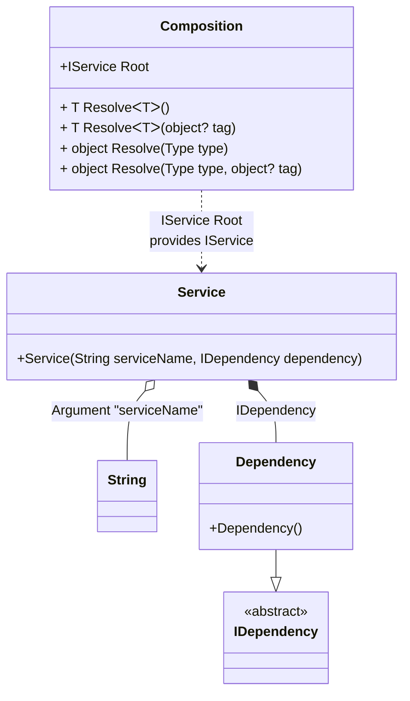

#### Instance Initialization

[](../tests/Pure.DI.UsageTests/Basics/InstanceInitializationScenario.cs)

This example shows how to build up an instance with all the necessary dependencies and manually prepare it for further use.

```c#
interface IDependency;

class Dependency : IDependency;

interface IService
{
    string ServiceName { get; }

    IDependency Dependency { get; }

    bool IsInitialized { get; }
}

class Service(string serviceName, IDependency dependency): IService
{
    public string ServiceName { get; } = serviceName;

    public IDependency Dependency { get; } = dependency;

    public bool IsInitialized { get; private set; }

    public void Initialize() => IsInitialized = true;
}

DI.Setup(nameof(Composition))
    .Bind<IDependency>().To<Dependency>()
    .Arg<string>("serviceName")
    .Bind<IService>()
        .To<Service>(ctx =>
        {
            // Builds up an instance with all necessary dependencies
            ctx.Inject<Service>(out var service);

            // Executing all the necessary logic
            // to prepare the instance for further use
            service.Initialize();
            return service;
        })
        .Root<IService>("Root");

var composition = new Composition("My Service");
var service = composition.Root;
service.ServiceName.ShouldBe("My Service");
service.IsInitialized.ShouldBeTrue();
```

<details open>
<summary>Class Diagram</summary>



</details>

<details>
<summary>Pure.DI-generated partial class Composition</summary><blockquote>

```c#
/// <para>
/// <b>Composition roots</b><br/>
/// <list type="table">
/// <listheader>
/// <term>Root</term>
/// <description>Description</description>
/// </listheader>
/// <item>
/// <term>
/// <see cref="Pure.DI.UsageTests.Basics.InstanceInitializationScenario.IService"/> <see cref="Root"/><br/>or using <see cref="Resolve{T}()"/> method: <c>Resolve&lt;Pure.DI.UsageTests.Basics.InstanceInitializationScenario.IService&gt;()</c>
/// </term>
/// <description>
/// Provides a composition root of type <see cref="Pure.DI.UsageTests.Basics.InstanceInitializationScenario.Service"/>.
/// </description>
/// </item>
/// </list>
/// </para>
/// </summary>
/// <example>
/// This shows how to get an instance of type <see cref="Pure.DI.UsageTests.Basics.InstanceInitializationScenario.Service"/> using the composition root <see cref="Root"/>:
/// <code>
/// var composition = new Composition(_argM03D13di_serviceName);
/// var instance = composition.Root;
/// </code>
/// </example>
/// <a href="https://mermaid.live/view#pako:eNqdU0FuwyAQ_AriXKlRckibm2Onki89JD5ywWbl0gawMLEURflD_tJLv5Of1IBdY7dNpV5WsOzMzg5wwoVigFe42NO6TjgtNRVEE-n2KFaiUjU3XElEDrPZcm3P7Gq-TnegG14A2iplhjTK0BZqtW_gevnIrpd3l35w8fHPMpW_QmHsevGEDC2_wXxBj_Wg7FgBMm34R3WMbrdcJoMb_cBTJ7q8p98ZzWWJap97pqLvkyZQgWQgiyNiX8sb3RyR3QdAV54McRk74ZsRu0tFaKCanIXah6Of7inUk_7KsvAiYprXRtPOy00XR0y9gyqco5u0lx3p8iBAGkRwaCIO8Q4YjUimQ7ZMgWILnj7muZPoY-tgyG3Bo-ft5ss1uffFlVYNZ9Ca0t99y4_vsAAtKGftfzoRbF7A6l4RzKh-I_iMz5-_eyvo">Class diagram</a><br/>
/// This class was created by <a href="https://github.com/DevTeam/Pure.DI">Pure.DI</a> source code generator.
/// <seealso cref="Pure.DI.DI.Setup"/>
/// <seealso cref="Pure.DI.IConfiguration.Bind(object[])"/>
/// <seealso cref="Pure.DI.IConfiguration.Bind{T}(object[])"/>
[global::System.Diagnostics.CodeAnalysis.ExcludeFromCodeCoverage]
partial class Composition
{
  private readonly Composition _rootM03D13di;
  private readonly string _argM03D13di_serviceName;
  
  /// <summary>
  /// This parameterized constructor creates a new instance of <see cref="Composition"/> with arguments.
  /// </summary>
  /// <param name="serviceName">The composition argument of type <see cref="string"/>.</param>
  public Composition(string serviceName)
  {
    _rootM03D13di = this;
    if (ReferenceEquals(serviceName, null))
    {
      throw new global::System.ArgumentNullException("serviceName");
    }
    
    _argM03D13di_serviceName = serviceName;
  }
  
  /// <summary>
  /// This constructor creates a new instance of <see cref="Composition"/> scope based on <paramref name="baseComposition"/>. This allows the <see cref="Lifetime.Scoped"/> life time to be applied.
  /// </summary>
  /// <param name="baseComposition">Base composition.</param>
  internal Composition(Composition baseComposition)
  {
    _rootM03D13di = baseComposition._rootM03D13di;
    _argM03D13di_serviceName = baseComposition._argM03D13di_serviceName;
  }
  
  #region Composition Roots
  /// <summary>
  /// Provides a composition root of type <see cref="Pure.DI.UsageTests.Basics.InstanceInitializationScenario.Service"/>.
  /// </summary>
  /// <example>
  /// This shows how to get an instance of type <see cref="Pure.DI.UsageTests.Basics.InstanceInitializationScenario.Service"/>:
  /// <code>
  /// var composition = new Composition(_argM03D13di_serviceName);
  /// var instance = composition.Root;
  /// </code>
  /// </example>
  public Pure.DI.UsageTests.Basics.InstanceInitializationScenario.IService Root
  {
    #if NETSTANDARD2_0_OR_GREATER || NETCOREAPP || NET40_OR_GREATER || NET
    [global::System.Diagnostics.Contracts.Pure]
    #endif
    get
    {
      Pure.DI.UsageTests.Basics.InstanceInitializationScenario.Service transientM03D13di0_Service;
      {
          var service_M03D13di1 = new Pure.DI.UsageTests.Basics.InstanceInitializationScenario.Service(_argM03D13di_serviceName, new Pure.DI.UsageTests.Basics.InstanceInitializationScenario.Dependency());
          service_M03D13di1.Initialize();
          transientM03D13di0_Service = service_M03D13di1;
      }
      return transientM03D13di0_Service;
    }
  }
  #endregion
  
  #region API
  /// <summary>
  /// Resolves the composition root.
  /// </summary>
  /// <typeparam name="T">The type of the composition root.</typeparam>
  /// <returns>A composition root.</returns>
  #if NETSTANDARD2_0_OR_GREATER || NETCOREAPP || NET40_OR_GREATER || NET
  [global::System.Diagnostics.Contracts.Pure]
  #endif
  public T Resolve<T>()
  {
    return ResolverM03D13di<T>.Value.Resolve(this);
  }
  
  /// <summary>
  /// Resolves the composition root by tag.
  /// </summary>
  /// <typeparam name="T">The type of the composition root.</typeparam>
  /// <param name="tag">The tag of a composition root.</param>
  /// <returns>A composition root.</returns>
  #if NETSTANDARD2_0_OR_GREATER || NETCOREAPP || NET40_OR_GREATER || NET
  [global::System.Diagnostics.Contracts.Pure]
  #endif
  public T Resolve<T>(object? tag)
  {
    return ResolverM03D13di<T>.Value.ResolveByTag(this, tag);
  }
  
  /// <summary>
  /// Resolves the composition root.
  /// </summary>
  /// <param name="type">The type of the composition root.</param>
  /// <returns>A composition root.</returns>
  #if NETSTANDARD2_0_OR_GREATER || NETCOREAPP || NET40_OR_GREATER || NET
  [global::System.Diagnostics.Contracts.Pure]
  #endif
  public object Resolve(global::System.Type type)
  {
    var index = (int)(_bucketSizeM03D13di * ((uint)global::System.Runtime.CompilerServices.RuntimeHelpers.GetHashCode(type) % 1));
    var finish = index + _bucketSizeM03D13di;
    do {
      ref var pair = ref _bucketsM03D13di[index];
      if (ReferenceEquals(pair.Key, type))
      {
        return pair.Value.Resolve(this);
      }
    } while (++index < finish);
    
    throw new global::System.InvalidOperationException($"Cannot resolve composition root of type {type}.");
  }
  
  /// <summary>
  /// Resolves the composition root by tag.
  /// </summary>
  /// <param name="type">The type of the composition root.</param>
  /// <param name="tag">The tag of a composition root.</param>
  /// <returns>A composition root.</returns>
  #if NETSTANDARD2_0_OR_GREATER || NETCOREAPP || NET40_OR_GREATER || NET
  [global::System.Diagnostics.Contracts.Pure]
  #endif
  public object Resolve(global::System.Type type, object? tag)
  {
    var index = (int)(_bucketSizeM03D13di * ((uint)global::System.Runtime.CompilerServices.RuntimeHelpers.GetHashCode(type) % 1));
    var finish = index + _bucketSizeM03D13di;
    do {
      ref var pair = ref _bucketsM03D13di[index];
      if (ReferenceEquals(pair.Key, type))
      {
        return pair.Value.ResolveByTag(this, tag);
      }
    } while (++index < finish);
    
    throw new global::System.InvalidOperationException($"Cannot resolve composition root \"{tag}\" of type {type}.");
  }
  #endregion
  
  /// <summary>
  /// This method provides a class diagram in mermaid format. To see this diagram, simply call the method and copy the text to this site https://mermaid.live/.
  /// </summary>
  public override string ToString()
  {
    return
      "classDiagram\n" +
        "  class Composition {\n" +
          "    +IService Root\n" +
          "    + T ResolveᐸTᐳ()\n" +
          "    + T ResolveᐸTᐳ(object? tag)\n" +
          "    + object Resolve(Type type)\n" +
          "    + object Resolve(Type type, object? tag)\n" +
        "  }\n" +
        "  class Service {\n" +
          "    +Service(String serviceName, IDependency dependency)\n" +
        "  }\n" +
        "  class String\n" +
        "  Dependency --|> IDependency : \n" +
        "  class Dependency {\n" +
          "    +Dependency()\n" +
        "  }\n" +
        "  class IDependency {\n" +
          "    <<abstract>>\n" +
        "  }\n" +
        "  Service o-- String : Argument \"serviceName\"\n" +
        "  Service *--  Dependency : IDependency\n" +
        "  Composition ..> Service : IService Root<br/>provides IService";
  }
  
  private readonly static int _bucketSizeM03D13di;
  private readonly static global::Pure.DI.Pair<global::System.Type, global::Pure.DI.IResolver<Composition, object>>[] _bucketsM03D13di;
  
  static Composition()
  {
    var valResolverM03D13di_0000 = new ResolverM03D13di_0000();
    ResolverM03D13di<Pure.DI.UsageTests.Basics.InstanceInitializationScenario.IService>.Value = valResolverM03D13di_0000;
    _bucketsM03D13di = global::Pure.DI.Buckets<global::System.Type, global::Pure.DI.IResolver<Composition, object>>.Create(
      1,
      out _bucketSizeM03D13di,
      new global::Pure.DI.Pair<global::System.Type, global::Pure.DI.IResolver<Composition, object>>[1]
      {
         new global::Pure.DI.Pair<global::System.Type, global::Pure.DI.IResolver<Composition, object>>(typeof(Pure.DI.UsageTests.Basics.InstanceInitializationScenario.IService), valResolverM03D13di_0000)
      });
  }
  
  #region Resolvers
  private sealed class ResolverM03D13di<T>: global::Pure.DI.IResolver<Composition, T>
  {
    public static global::Pure.DI.IResolver<Composition, T> Value = new ResolverM03D13di<T>();
    
    public T Resolve(Composition composite)
    {
      throw new global::System.InvalidOperationException($"Cannot resolve composition root of type {typeof(T)}.");
    }
    
    public T ResolveByTag(Composition composite, object tag)
    {
      throw new global::System.InvalidOperationException($"Cannot resolve composition root \"{tag}\" of type {typeof(T)}.");
    }
  }
  
  private sealed class ResolverM03D13di_0000: global::Pure.DI.IResolver<Composition, Pure.DI.UsageTests.Basics.InstanceInitializationScenario.IService>
  {
    public Pure.DI.UsageTests.Basics.InstanceInitializationScenario.IService Resolve(Composition composition)
    {
      return composition.Root;
    }
    
    public Pure.DI.UsageTests.Basics.InstanceInitializationScenario.IService ResolveByTag(Composition composition, object tag)
    {
      switch (tag)
      {
        case null:
          return composition.Root;
      }
      throw new global::System.InvalidOperationException($"Cannot resolve composition root \"{tag}\" of type Pure.DI.UsageTests.Basics.InstanceInitializationScenario.IService.");
    }
  }
  #endregion
}
```

</blockquote></details>

