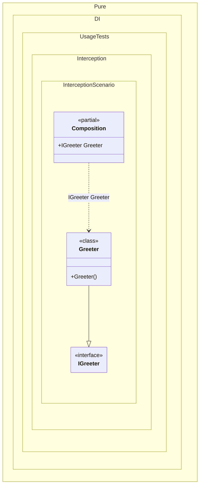

#### Interception

Interception allows you to enrich or change the behavior of a certain set of objects from the object graph being created without changing the code of the corresponding types.


```c#
using Shouldly;
using Castle.DynamicProxy;
using System.Runtime.CompilerServices;
using Pure.DI;

// OnDependencyInjection = On
// OnDependencyInjectionContractTypeNameWildcard = *IGreeter
DI.Setup(nameof(Composition))
    .Bind().To<Greeter>()
    .Root<IGreeter>("Greeter");

var composition = new Composition();
var greeter = composition.Greeter;

// The greeting is modified by the interceptor
greeter.Greet("World").ShouldBe("Hello World !!!");

public interface IGreeter
{
    string Greet(string name);
}

class Greeter : IGreeter
{
    public string Greet(string name) => $"Hello {name}";
}

partial class Composition : IInterceptor
{
    private static readonly ProxyGenerator ProxyGenerator = new();

    // Intercepts the instantiation of services to wrap them in a proxy
    [MethodImpl(MethodImplOptions.AggressiveInlining)]
    private partial T OnDependencyInjection<T>(
        in T value,
        object? tag,
        Lifetime lifetime)
    {
        // Proxying is only possible for reference types (interfaces, classes)
        if (typeof(T).IsValueType)
        {
            return value;
        }

        // Creates a proxy that delegates calls to the 'value' object
        // and passes them through the 'this' interceptor
        return (T)ProxyGenerator.CreateInterfaceProxyWithTargetInterface(
            typeof(T),
            value,
            this);
    }

    // Logic performed when a method on the proxy is called
    public void Intercept(IInvocation invocation)
    {
        // Executes the original method
        invocation.Proceed();

        // Enhances the result of the Greet method
        if (invocation.Method.Name == nameof(IGreeter.Greet)
            && invocation.ReturnValue is string message)
        {
            invocation.ReturnValue = $"{message} !!!";
        }
    }
}
```

<details>
<summary>Running this code sample locally</summary>

- Make sure you have the [.NET SDK 10.0](https://dotnet.microsoft.com/en-us/download/dotnet/10.0) or later is installed
```bash
dotnet --list-sdk
```
- Create a net10.0 (or later) console application
```bash
dotnet new console -n Sample
```
- Add references to NuGet packages
  - [Pure.DI](https://www.nuget.org/packages/Pure.DI)
  - [Shouldly](https://www.nuget.org/packages/Shouldly)
  - [Castle.DynamicProxy](https://www.nuget.org/packages/Castle.DynamicProxy)
```bash
dotnet add package Pure.DI
dotnet add package Shouldly
dotnet add package Castle.DynamicProxy
```
- Copy the example code into the _Program.cs_ file

You are ready to run the example 🚀
```bash
dotnet run
```

</details>

Using an intercept gives you the ability to add end-to-end functionality such as:

- Logging

- Action logging

- Performance monitoring

- Security

- Caching

- Error handling

- Providing resistance to failures, etc.

The following partial class will be generated:

```c#
partial class Composition
{
  [OrdinalAttribute(256)]
  public Composition()
  {
  }

  internal Composition(Composition parentScope)
  {
  }

  public IGreeter Greeter
  {
    [MethodImpl(MethodImplOptions.AggressiveInlining)]
    get
    {
      return OnDependencyInjection<IGreeter>(new Greeter(), null, Lifetime.Transient);
    }
  }


  private partial T OnDependencyInjection<T>(in T value, object? tag, Lifetime lifetime);
}
```

Class diagram:



