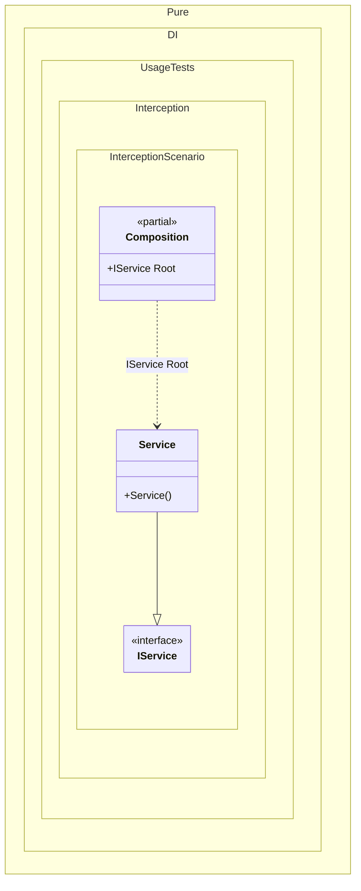

#### Interception

[](../tests/Pure.DI.UsageTests/Interception/InterceptionScenario.cs)

Interception allows you to enrich or change the behavior of a certain set of objects from the object graph being created without changing the code of the corresponding types.


```c#
public interface IService
{
    string GetMessage();
}

class Service : IService
{
    public string GetMessage() => "Hello World";
}

partial class Composition : IInterceptor
{
    private static readonly ProxyGenerator ProxyGenerator = new();

    private partial T OnDependencyInjection<T>(
        in T value,
        object? tag,
        Lifetime lifetime)
    {
        if (typeof(T).IsValueType)
        {
            return value;
        }

        return (T)ProxyGenerator.CreateInterfaceProxyWithTargetInterface(
            typeof(T),
            value,
            this);
    }

    public void Intercept(IInvocation invocation)
    {
        invocation.Proceed();
        if (invocation.Method.Name == nameof(IService.GetMessage)
            && invocation.ReturnValue is string message)
        {
            invocation.ReturnValue = $"{message} !!!";
        }
    }
}

// OnDependencyInjection = On
// OnDependencyInjectionContractTypeNameRegularExpression = IService
DI.Setup(nameof(Composition))
    .Bind().To<Service>()
    .Root<IService>("Root");

var composition = new Composition();
var service = composition.Root;
service.GetMessage().ShouldBe("Hello World !!!");
```

Using an intercept gives you the ability to add end-to-end functionality such as:

- Logging

- Action logging

- Performance monitoring

- Security

- Caching

- Error handling

- Providing resistance to failures, etc.

The following partial class will be generated:

```c#
partial class Composition
{
  private readonly Composition _root;

  [OrdinalAttribute(20)]
  public Composition()
  {
    _root = this;
  }

  internal Composition(Composition parentScope)
  {
    _root = (parentScope ?? throw new ArgumentNullException(nameof(parentScope)))._root;
  }

  public IService Root
  {
    [MethodImpl(MethodImplOptions.AggressiveInlining)]
    get
    {
      return OnDependencyInjection<IService>(new Service(), null, Lifetime.Transient);
    }
  }


  private partial T OnDependencyInjection<T>(in T value, object? tag, Lifetime lifetime);
}
```

Class diagram:



