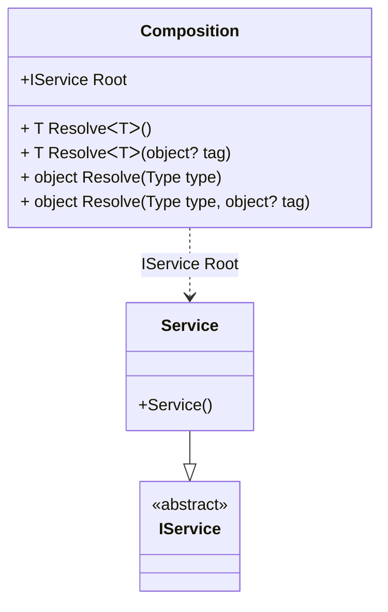

#### Interception

[](../tests/Pure.DI.UsageTests/Interception/InterceptionScenario.cs)

Interception allows you to enrich or change the behavior of a certain set of objects from the object graph being created without changing the code of the corresponding types.

```c#
public interface IService { string GetMessage(); }

class Service : IService
{
    public string GetMessage() => "Hello World";
}

partial class Composition: IInterceptor
{
    private static readonly ProxyGenerator ProxyGenerator = new();

    private partial T OnDependencyInjection<T>(
        in T value,
        object? tag,
        Lifetime lifetime)
    {
        if (typeof(T).IsValueType)
        {
            return value;
        }

        return (T)ProxyGenerator.CreateInterfaceProxyWithTargetInterface(
            typeof(T),
            value,
            this);
    }

    public void Intercept(IInvocation invocation)
    {
        invocation.Proceed();
        if (invocation.Method.Name == nameof(IService.GetMessage)
            && invocation.ReturnValue is string message)
        {
            invocation.ReturnValue = $"{message} !!!";
        }
    }
}

// OnDependencyInjection = On
// OnDependencyInjectionContractTypeNameRegularExpression = IService
DI.Setup(nameof(Composition))
    .Bind<IService>().To<Service>().Root<IService>("Root");

var composition = new Composition();
var service = composition.Root;
service.GetMessage().ShouldBe("Hello World !!!");
```

<details open>
<summary>Class Diagram</summary>



</details>

<details>
<summary>Pure.DI-generated partial class Composition</summary><blockquote>

```c#
partial class Composition
{
  private readonly Composition _rootM03D19di;
  
  public Composition()
  {
    _rootM03D19di = this;
  }
  
  internal Composition(Composition baseComposition)
  {
    _rootM03D19di = baseComposition._rootM03D19di;
  }
  
  public Pure.DI.UsageTests.Interception.InterceptionScenario.IService Root
  {
    get
    {
      return OnDependencyInjection<Pure.DI.UsageTests.Interception.InterceptionScenario.IService>(new Pure.DI.UsageTests.Interception.InterceptionScenario.Service(), null, Pure.DI.Lifetime.Transient);
    }
  }
  
  public T Resolve<T>()
  {
    return ResolverM03D19di<T>.Value.Resolve(this);
  }
  
  public T Resolve<T>(object? tag)
  {
    return ResolverM03D19di<T>.Value.ResolveByTag(this, tag);
  }
  
  public object Resolve(global::System.Type type)
  {
    var index = (int)(_bucketSizeM03D19di * ((uint)global::System.Runtime.CompilerServices.RuntimeHelpers.GetHashCode(type) % 1));
    var finish = index + _bucketSizeM03D19di;
    do {
      ref var pair = ref _bucketsM03D19di[index];
      if (ReferenceEquals(pair.Key, type))
      {
        return pair.Value.Resolve(this);
      }
    } while (++index < finish);
    
    throw new global::System.InvalidOperationException($"Cannot resolve composition root of type {type}.");
  }
  
  public object Resolve(global::System.Type type, object? tag)
  {
    var index = (int)(_bucketSizeM03D19di * ((uint)global::System.Runtime.CompilerServices.RuntimeHelpers.GetHashCode(type) % 1));
    var finish = index + _bucketSizeM03D19di;
    do {
      ref var pair = ref _bucketsM03D19di[index];
      if (ReferenceEquals(pair.Key, type))
      {
        return pair.Value.ResolveByTag(this, tag);
      }
    } while (++index < finish);
    
    throw new global::System.InvalidOperationException($"Cannot resolve composition root \"{tag}\" of type {type}.");
  }
  
  private partial T OnDependencyInjection<T>(in T value, object? tag, global::Pure.DI.Lifetime lifetime);
  
  public override string ToString()
  {
    return
      "classDiagram\n" +
        "  class Composition {\n" +
          "    +IService Root\n" +
          "    + T ResolveᐸTᐳ()\n" +
          "    + T ResolveᐸTᐳ(object? tag)\n" +
          "    + object Resolve(Type type)\n" +
          "    + object Resolve(Type type, object? tag)\n" +
        "  }\n" +
        "  Service --|> IService : \n" +
        "  class Service {\n" +
          "    +Service()\n" +
        "  }\n" +
        "  class IService {\n" +
          "    <<abstract>>\n" +
        "  }\n" +
        "  Composition ..> Service : IService Root";
  }
  
  private readonly static int _bucketSizeM03D19di;
  private readonly static global::Pure.DI.Pair<global::System.Type, global::Pure.DI.IResolver<Composition, object>>[] _bucketsM03D19di;
  
  static Composition()
  {
    var valResolverM03D19di_0000 = new ResolverM03D19di_0000();
    ResolverM03D19di<Pure.DI.UsageTests.Interception.InterceptionScenario.IService>.Value = valResolverM03D19di_0000;
    _bucketsM03D19di = global::Pure.DI.Buckets<global::System.Type, global::Pure.DI.IResolver<Composition, object>>.Create(
      1,
      out _bucketSizeM03D19di,
      new global::Pure.DI.Pair<global::System.Type, global::Pure.DI.IResolver<Composition, object>>[1]
      {
         new global::Pure.DI.Pair<global::System.Type, global::Pure.DI.IResolver<Composition, object>>(typeof(Pure.DI.UsageTests.Interception.InterceptionScenario.IService), valResolverM03D19di_0000)
      });
  }
  
  private sealed class ResolverM03D19di<T>: global::Pure.DI.IResolver<Composition, T>
  {
    public static global::Pure.DI.IResolver<Composition, T> Value = new ResolverM03D19di<T>();
    
    public T Resolve(Composition composite)
    {
      throw new global::System.InvalidOperationException($"Cannot resolve composition root of type {typeof(T)}.");
    }
    
    public T ResolveByTag(Composition composite, object tag)
    {
      throw new global::System.InvalidOperationException($"Cannot resolve composition root \"{tag}\" of type {typeof(T)}.");
    }
  }
  
  private sealed class ResolverM03D19di_0000: global::Pure.DI.IResolver<Composition, Pure.DI.UsageTests.Interception.InterceptionScenario.IService>
  {
    public Pure.DI.UsageTests.Interception.InterceptionScenario.IService Resolve(Composition composition)
    {
      return composition.Root;
    }
    
    public Pure.DI.UsageTests.Interception.InterceptionScenario.IService ResolveByTag(Composition composition, object tag)
    {
      switch (tag)
      {
        case null:
          return composition.Root;
      }
      throw new global::System.InvalidOperationException($"Cannot resolve composition root \"{tag}\" of type Pure.DI.UsageTests.Interception.InterceptionScenario.IService.");
    }
  }
}
```

</blockquote></details>

