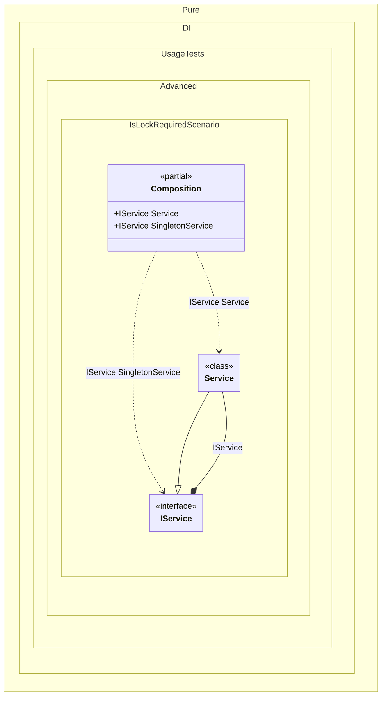

#### IsLockRequired

`IsLockRequired` indicates whether a lock is required for thread-safe operations in the current context. This property is useful when you need to conditionally synchronize based on thread safety requirements.


```c#
using Shouldly;
using Pure.DI;

var composition = new Composition();

var service = composition.Service;
service.Locked.ShouldBeTrue();

var singletonService = composition.SingletonService;
singletonService.Locked.ShouldBeFalse();

interface IService
{
    bool Locked { get; }
}

class Service(bool lockRequired) : IService
{
    public bool Locked => lockRequired;
}

partial class Composition
{
    private void Setup() =>

        DI.Setup(nameof(Composition))
            .Hint(Hint.ThreadSafe, "On")
            .Bind().To(ctx =>
            {
                // In a thread-safe context, IsLockRequired is true
                // Use it to conditionally lock the context
                if (ctx.IsLockRequired)
                {
                    lock (ctx.Lock)
                    {
                        return new Service(ctx.IsLockRequired);
                    }
                }

                return new Service(ctx.IsLockRequired);
            })
            .Bind(Tag.Single).As(Lifetime.Singleton).To((IService service) => service)
            .Root<IService>(nameof(Service))
            .Root<IService>(nameof(SingletonService), Tag.Single);
}
```

<details>
<summary>Running this code sample locally</summary>

- Make sure you have the [.NET SDK 10.0](https://dotnet.microsoft.com/en-us/download/dotnet/10.0) or later installed
```bash
dotnet --list-sdk
```
- Create a net10.0 (or later) console application
```bash
dotnet new console -n Sample
```
- Add references to the NuGet packages
  - [Pure.DI](https://www.nuget.org/packages/Pure.DI)
  - [Shouldly](https://www.nuget.org/packages/Shouldly)
```bash
dotnet add package Pure.DI
dotnet add package Shouldly
```
- Copy the example code into the _Program.cs_ file

You are ready to run the example 🚀
```bash
dotnet run
```

</details>

The following partial class will be generated:

```c#
partial class Composition
{
#if NET9_0_OR_GREATER
  private readonly Lock _lock = new Lock();
#else
  private readonly Object _lock = new Object();
#endif

  private IService? _singletonIService63;

  public IService Service
  {
    [MethodImpl(MethodImplOptions.AggressiveInlining)]
    get
    {
      Service transientService63;
      // In a thread-safe context, IsLockRequired is true
      // Use it to conditionally lock the context
      if (true)
      {
        lock (_lock)
        {
          {
            transientService63 = new Service(true);
            goto transientService63Finish;
          }
        }
      }

      transientService63 = new Service(true);
      transientService63Finish:
        ;
      return transientService63;
    }
  }

  public IService SingletonService
  {
    [MethodImpl(MethodImplOptions.AggressiveInlining)]
    get
    {
      if (_singletonIService63 is null)
        lock (_lock)
          if (_singletonIService63 is null)
          {
            Service transientService62;
            // In a thread-safe context, IsLockRequired is true
            // Use it to conditionally lock the context
            if (false)
            {
              lock (_lock)
              {
                {
                  transientService62 = new Service(false);
                  goto transientService62Finish;
                }
              }
            }

            transientService62 = new Service(false);
            transientService62Finish:
              ;
            IService localService = transientService62;
            _singletonIService63 = localService;
          }

      return _singletonIService63;
    }
  }
}
```

Class diagram:



