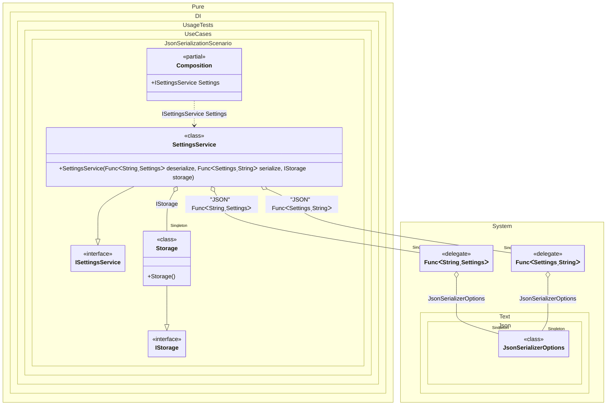

#### JSON serialization


```c#
using Shouldly;
using Pure.DI;
using System.Text.Json;
using static Pure.DI.Lifetime;
using static Pure.DI.Tag;

var composition = new Composition();
var settings = composition.Settings;
settings.Size.ShouldBe(10);

settings.Size = 99;
settings.Size.ShouldBe(99);

settings.Size = 33;
settings.Size.ShouldBe(33);

record Settings(int Size)
{
    public static readonly Settings Default = new(10);
}

interface IStorage
{
    void Save(string data);

    string? Load();
}

class Storage : IStorage
{
    private string? _data;

    public void Save(string data) => _data = data;

    public string? Load() => _data;
}

interface ISettingsService
{
    int Size { get; set; }
}

class SettingsService(
    [Tag(JSON)] Func<string, Settings?> deserialize,
    [Tag(JSON)] Func<Settings, string> serialize,
    IStorage storage)
    : ISettingsService
{
    public int Size
    {
        // ReSharper disable once ConditionalAccessQualifierIsNonNullableAccordingToAPIContract
        get => GetSettings().Size;
        set => SaveSettings(GetSettings() with { Size = value });
    }

    private Settings GetSettings() =>
        storage.Load() is {} data && deserialize(data) is {} settings
            ? settings
            : Settings.Default;

    private void SaveSettings(Settings settings) =>
        storage.Save(serialize(settings));
}

partial class Composition
{
    private void Setup() =>

        DI.Setup(nameof(Composition))
            .Root<ISettingsService>(nameof(Settings))
            .Bind().To<SettingsService>()
            .DefaultLifetime(Singleton)
            .Bind().To(_ => new JsonSerializerOptions { WriteIndented = true })
            .Bind(JSON).To<JsonSerializerOptions, Func<string, TT?>>(options => json => JsonSerializer.Deserialize<TT>(json, options))
            .Bind(JSON).To<JsonSerializerOptions, Func<TT, string>>(options => value => JsonSerializer.Serialize(value, options))
            .Bind().To<Storage>();
}
```

<details>
<summary>Running this code sample locally</summary>

- Make sure you have the [.NET SDK 9.0](https://dotnet.microsoft.com/en-us/download/dotnet/9.0) or later is installed
```bash
dotnet --list-sdk
```
- Create a net9.0 (or later) console application
```bash
dotnet new console -n Sample
```
- Add references to NuGet packages
  - [Pure.DI](https://www.nuget.org/packages/Pure.DI)
  - [Shouldly](https://www.nuget.org/packages/Shouldly)
```bash
dotnet add package Pure.DI
dotnet add package Shouldly
```
- Copy the example code into the _Program.cs_ file

You are ready to run the example 🚀
```bash
dotnet run
```

</details>

The following partial class will be generated:

```c#
partial class Composition
{
  private readonly Composition _root;
#if NET9_0_OR_GREATER
  private readonly Lock _lock;
#else
  private readonly Object _lock;
#endif

  private Func<string, Settings>? _singleFunc56;
  private Func<Settings, string>? _singleFunc57;
  private Storage? _singleStorage55;
  private Text.Json.JsonSerializerOptions? _singleJsonSerializerOptions52;

  [OrdinalAttribute(256)]
  public Composition()
  {
    _root = this;
#if NET9_0_OR_GREATER
    _lock = new Lock();
#else
    _lock = new Object();
#endif
  }

  internal Composition(Composition parentScope)
  {
    _root = (parentScope ?? throw new ArgumentNullException(nameof(parentScope)))._root;
    _lock = parentScope._lock;
  }

  public ISettingsService Settings
  {
    [MethodImpl(MethodImplOptions.AggressiveInlining)]
    get
    {
      if (_root._singleStorage55 is null)
        lock (_lock)
          if (_root._singleStorage55 is null)
          {
            _root._singleStorage55 = new Storage();
          }

      if (_root._singleFunc56 is null)
        lock (_lock)
          if (_root._singleFunc56 is null)
          {
            EnsureJsonSerializerOptionsExists();
            Text.Json.JsonSerializerOptions localOptions = _root._singleJsonSerializerOptions52;
            _root._singleFunc56 = json => JsonSerializer.Deserialize<Settings>(json, localOptions);
          }

      if (_root._singleFunc57 is null)
        lock (_lock)
          if (_root._singleFunc57 is null)
          {
            EnsureJsonSerializerOptionsExists();
            Text.Json.JsonSerializerOptions localOptions1 = _root._singleJsonSerializerOptions52;
            _root._singleFunc57 = value => JsonSerializer.Serialize(value, localOptions1);
          }

      return new SettingsService(_root._singleFunc56, _root._singleFunc57, _root._singleStorage55);
      [MethodImpl(MethodImplOptions.AggressiveInlining)]
      void EnsureJsonSerializerOptionsExists()
      {
        if (_root._singleJsonSerializerOptions52 is null)
          lock (_lock)
            if (_root._singleJsonSerializerOptions52 is null)
            {
              _root._singleJsonSerializerOptions52 = new JsonSerializerOptions
              {
                WriteIndented = true
              };
            }
      }
    }
  }
}
```

Class diagram:



