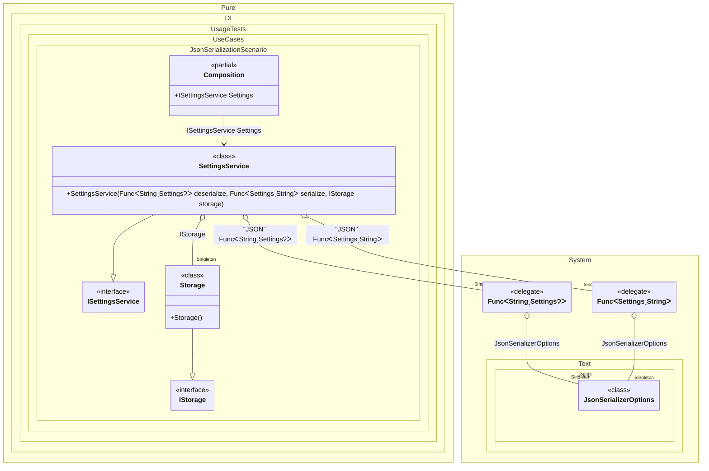

#### JSON serialization

Serialization can be hidden behind injectable functions instead of scattering `JsonSerializer` calls across the code. A shared `JsonSerializerOptions` instance is bound as a singleton, and two generic bindings tagged `JSON` expose `Func<string, TT?>` and `Func<TT, string>` delegates that deserialize and serialize any type using those options. `SettingsService` then just injects these functions to load and save its `Settings`, keeping it decoupled from the serializer.


```c#
using Shouldly;
using Pure.DI;
using System.Text.Json;
using static Pure.DI.Lifetime;
using static Pure.DI.Tag;

var composition = new Composition();
var settings = composition.Settings;
settings.Size.ShouldBe(10);

settings.Size = 99;
settings.Size.ShouldBe(99);

settings.Size = 33;
settings.Size.ShouldBe(33);

record Settings(int Size)
{
    public static readonly Settings Default = new(10);
}

interface IStorage
{
    void Save(string data);

    string? Load();
}

class Storage : IStorage
{
    private string? _data;

    public void Save(string data) => _data = data;

    public string? Load() => _data;
}

interface ISettingsService
{
    int Size { get; set; }
}

class SettingsService(
    [Tag(JSON)] Func<string, Settings?> deserialize,
    [Tag(JSON)] Func<Settings, string> serialize,
    IStorage storage)
    : ISettingsService
{
    public int Size
    {
        // ReSharper disable once ConditionalAccessQualifierIsNonNullableAccordingToAPIContract
        get => GetSettings().Size;
        set => SaveSettings(GetSettings() with { Size = value });
    }

    private Settings GetSettings() =>
        storage.Load() is {} data && deserialize(data) is {} settings
            ? settings
            : Settings.Default;

    private void SaveSettings(Settings settings) =>
        storage.Save(serialize(settings));
}

partial class Composition
{
    private void Setup() =>

        DI.Setup(nameof(Composition))
            .Root<ISettingsService>(nameof(Settings))
            .Bind().To<SettingsService>()
            .DefaultLifetime(Singleton)
            .Bind().To(() => new JsonSerializerOptions { WriteIndented = true })
            .Bind(JSON).To<JsonSerializerOptions, Func<string, TT?>>(options => json => JsonSerializer.Deserialize<TT>(json, options))
            .Bind(JSON).To<JsonSerializerOptions, Func<TT, string>>(options => value => JsonSerializer.Serialize(value, options))
            .Bind().To<Storage>();
}
```

<details>
<summary>Running this code sample locally</summary>

- Make sure you have the [.NET SDK 10.0](https://dotnet.microsoft.com/en-us/download/dotnet/10.0) or later installed
```bash
dotnet --list-sdk
```
- Create a net10.0 (or later) console application
```bash
dotnet new console -n Sample
```
- Add references to the NuGet packages
  - [Pure.DI](https://www.nuget.org/packages/Pure.DI)
  - [Shouldly](https://www.nuget.org/packages/Shouldly)
```bash
dotnet add package Pure.DI
dotnet add package Shouldly
```
- Copy the example code into the _Program.cs_ file

You are ready to run the example 🚀
```bash
dotnet run
```

</details>

>[!TIP]
>Binding delegates with generic type markers like `TT` produces a serialize/deserialize function for every type where it is injected — no per-type bindings are needed.

<details>
<summary>The following partial class will be generated</summary>

```c#
partial class Composition
{
#if NET9_0_OR_GREATER
  private readonly Lock _lock = new Lock();
#else
  private readonly Object _lock = new Object();
#endif

  private Func<string, Settings?>? _singletonFunc2147481181;
  private Func<Settings, string>? _singletonFunc2147481182;
  private Storage? _singletonStorage75;
  private Text.Json.JsonSerializerOptions? _singletonJsonSerializerOptions72;

  public ISettingsService Settings
  {
    [MethodImpl(MethodImplOptions.AggressiveInlining)]
    get
    {
      if (_singletonStorage75 is null)
        lock (_lock)
          if (_singletonStorage75 is null)
          {
            _singletonStorage75 = new Storage();
          }

      if (_singletonFunc2147481182 is null)
        lock (_lock)
          if (_singletonFunc2147481182 is null)
          {
            EnsureJsonSerializerOptionsExists();
            Text.Json.JsonSerializerOptions localOptions = _singletonJsonSerializerOptions72;
            _singletonFunc2147481182 = value => JsonSerializer.Serialize(value, localOptions);
          }

      if (_singletonFunc2147481181 is null)
        lock (_lock)
          if (_singletonFunc2147481181 is null)
          {
            EnsureJsonSerializerOptionsExists();
            Text.Json.JsonSerializerOptions localOptions1 = _singletonJsonSerializerOptions72;
            _singletonFunc2147481181 = json => JsonSerializer.Deserialize<Settings?>(json, localOptions1);
          }

      return new SettingsService(_singletonFunc2147481181, _singletonFunc2147481182, _singletonStorage75);
      [MethodImpl(MethodImplOptions.AggressiveInlining)]
      void EnsureJsonSerializerOptionsExists()
      {
        if (_singletonJsonSerializerOptions72 is null)
          lock (_lock)
            if (_singletonJsonSerializerOptions72 is null)
            {
              _singletonJsonSerializerOptions72 = new JsonSerializerOptions
              {
                WriteIndented = true
              };
            }
      }
    }
  }
}
```

</details>

Class diagram:


```mermaid
---
 config:
  class:
   hideEmptyMembersBox: true
---
classDiagram
	SettingsService --|> ISettingsService
	Storage --|> IStorage
	Composition ..> SettingsService : ISettingsService Settings
	SettingsService o-- "Singleton" Storage : IStorage
	SettingsService o-- "Singleton" FuncᐸStringˏSettingsɁᐳ : "JSON" FuncᐸStringˏSettingsɁᐳ
	SettingsService o-- "Singleton" FuncᐸSettingsˏStringᐳ : "JSON" FuncᐸSettingsˏStringᐳ
	FuncᐸStringˏSettingsɁᐳ o-- "Singleton" JsonSerializerOptions : JsonSerializerOptions
	FuncᐸSettingsˏStringᐳ o-- "Singleton" JsonSerializerOptions : JsonSerializerOptions
	namespace Pure.DI.UsageTests.UseCases.JsonSerializationScenario {
		class Composition {
		<<partial>>
		+ISettingsService Settings
		}
		class ISettingsService {
			<<interface>>
		}
		class IStorage {
			<<interface>>
		}
		class SettingsService {
				<<class>>
			+SettingsService(FuncᐸStringˏSettingsɁᐳ deserialize, FuncᐸSettingsˏStringᐳ serialize, IStorage storage)
		}
		class Storage {
				<<class>>
			+Storage()
		}
	}
	namespace System {
		class FuncᐸSettingsˏStringᐳ {
				<<delegate>>
		}
		class FuncᐸStringˏSettingsɁᐳ {
				<<delegate>>
		}
	}
	namespace System.Text.Json {
		class JsonSerializerOptions {
				<<class>>
		}
	}
```

See also:

- [Generics](generics.md)

