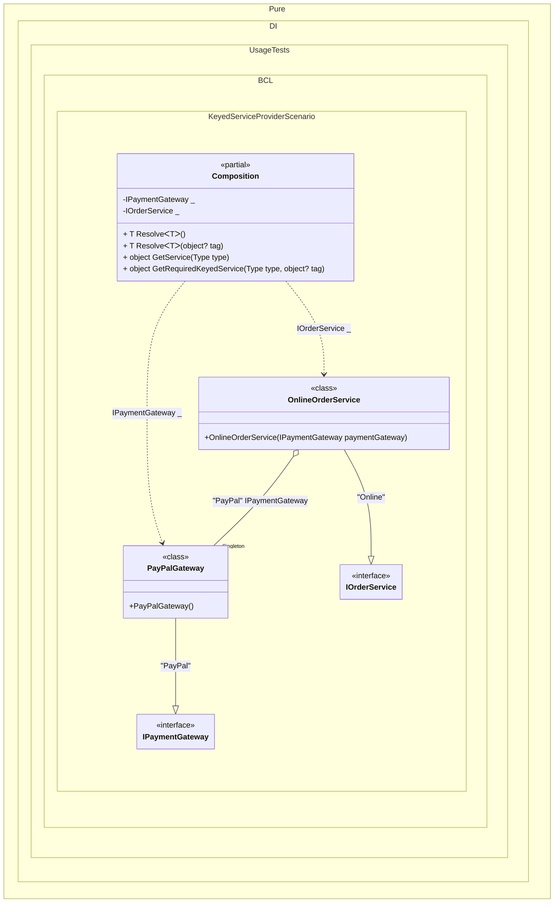

#### Keyed service provider


```c#
using Shouldly;
using Microsoft.Extensions.DependencyInjection;
using Pure.DI;

var serviceProvider = new Composition();

// Resolve the order service by key "Online".
// This service expects a dependency with the key "PayPal".
var orderService = serviceProvider.GetRequiredKeyedService<IOrderService>("Online");

// Resolve the payment gateway by key "PayPal" to verify the correct injection
var paymentGateway = serviceProvider.GetRequiredKeyedService<IPaymentGateway>("PayPal");

// Check that the expected gateway instance was injected into the order service
orderService.PaymentGateway.ShouldBe(paymentGateway);

// Payment gateway interface
interface IPaymentGateway;

// Payment gateway implementation (e.g., PayPal)
class PayPalGateway : IPaymentGateway;

// Order service interface
interface IOrderService
{
    IPaymentGateway PaymentGateway { get; }
}

// Implementation of the service for online orders.
// The [Tag("PayPal")] attribute indicates that an implementation
// of IPaymentGateway registered with the key "PayPal" should be injected.
class OnlineOrderService([Tag("PayPal")] IPaymentGateway paymentGateway) : IOrderService
{
    public IPaymentGateway PaymentGateway { get; } = paymentGateway;
}

partial class Composition : IKeyedServiceProvider
{
    static void Setup() =>
        DI.Setup()
            // The following hint overrides the name of the
            // "object Resolve(Type type)" method in "GetService",
            // which implements the "IServiceProvider" interface
            .Hint(Hint.ObjectResolveMethodName, "GetService")
            // The following hint overrides the name of the
            // "object Resolve(Type type, object tag)" method in "GetRequiredKeyedService",
            // which implements the "IKeyedServiceProvider" interface
            .Hint(Hint.ObjectResolveByTagMethodName, "GetRequiredKeyedService")

            // Register PayPalGateway as a singleton with the key "PayPal"
            .Bind<IPaymentGateway>("PayPal").As(Lifetime.Singleton).To<PayPalGateway>()

            // Register OnlineOrderService with the key "Online"
            .Bind<IOrderService>("Online").To<OnlineOrderService>()

            // Composition roots available by keys
            .Root<IPaymentGateway>(tag: "PayPal")
            .Root<IOrderService>(tag: "Online");

    public object GetKeyedService(Type serviceType, object? serviceKey) =>
        GetRequiredKeyedService(serviceType, serviceKey);
}
```

<details>
<summary>Running this code sample locally</summary>

- Make sure you have the [.NET SDK 10.0](https://dotnet.microsoft.com/en-us/download/dotnet/10.0) or later is installed
```bash
dotnet --list-sdk
```
- Create a net10.0 (or later) console application
```bash
dotnet new console -n Sample
```
- Add references to NuGet packages
  - [Pure.DI](https://www.nuget.org/packages/Pure.DI)
  - [Shouldly](https://www.nuget.org/packages/Shouldly)
  - [Microsoft.Extensions.DependencyInjection](https://www.nuget.org/packages/Microsoft.Extensions.DependencyInjection)
```bash
dotnet add package Pure.DI
dotnet add package Shouldly
dotnet add package Microsoft.Extensions.DependencyInjection
```
- Copy the example code into the _Program.cs_ file

You are ready to run the example 🚀
```bash
dotnet run
```

</details>

The following partial class will be generated:

```c#
partial class Composition
{
#if NET9_0_OR_GREATER
  private readonly Lock _lock = new Lock();
#else
  private readonly Object _lock = new Object();
#endif

  private PayPalGateway? _singletonPayPalGateway51;

  private IPaymentGateway Root2
  {
    [MethodImpl(MethodImplOptions.AggressiveInlining)]
    get
    {
      EnsurePayPalGatewayPayPalExists();
      return _singletonPayPalGateway51;
      [MethodImpl(MethodImplOptions.AggressiveInlining)]
      void EnsurePayPalGatewayPayPalExists()
      {
        if (_singletonPayPalGateway51 is null)
          lock (_lock)
            if (_singletonPayPalGateway51 is null)
            {
              _singletonPayPalGateway51 = new PayPalGateway();
            }
      }
    }
  }

  private IOrderService Root1
  {
    [MethodImpl(MethodImplOptions.AggressiveInlining)]
    get
    {
      EnsurePayPalGatewayPayPalExists();
      return new OnlineOrderService(_singletonPayPalGateway51);
      [MethodImpl(MethodImplOptions.AggressiveInlining)]
      void EnsurePayPalGatewayPayPalExists()
      {
        if (_singletonPayPalGateway51 is null)
          lock (_lock)
            if (_singletonPayPalGateway51 is null)
            {
              _singletonPayPalGateway51 = new PayPalGateway();
            }
      }
    }
  }

  [MethodImpl(MethodImplOptions.AggressiveInlining)]
  public T Resolve<T>()
  {
    return Resolver<T>.Value.Resolve(this);
  }

  [MethodImpl(MethodImplOptions.AggressiveInlining)]
  public T Resolve<T>(object? tag)
  {
    return Resolver<T>.Value.ResolveByTag(this, tag);
  }

  [MethodImpl(MethodImplOptions.AggressiveInlining)]
  public object GetService(Type type)
  {
    #if NETCOREAPP3_0_OR_GREATER
    var index = (int)(_bucketSize * (((uint)type.TypeHandle.GetHashCode()) % 4));
    #else
    var index = (int)(_bucketSize * (((uint)RuntimeHelpers.GetHashCode(type)) % 4));
    #endif
    ref var pair = ref _buckets[index];
    return Object.ReferenceEquals(pair.Key, type) ? pair.Value.Resolve(this) : Resolve(type, index);
  }

  [MethodImpl(MethodImplOptions.NoInlining)]
  private object Resolve(Type type, int index)
  {
    var finish = index + _bucketSize;
    while (++index < finish)
    {
      ref var pair = ref _buckets[index];
      if (Object.ReferenceEquals(pair.Key, type))
      {
        return pair.Value.Resolve(this);
      }
    }

    throw new CannotResolveException($"{CannotResolveMessage} {OfTypeMessage} {type}.", type, null);
  }

  [MethodImpl(MethodImplOptions.AggressiveInlining)]
  public object GetRequiredKeyedService(Type type, object? tag)
  {
    #if NETCOREAPP3_0_OR_GREATER
    var index = (int)(_bucketSize * (((uint)type.TypeHandle.GetHashCode()) % 4));
    #else
    var index = (int)(_bucketSize * (((uint)RuntimeHelpers.GetHashCode(type)) % 4));
    #endif
    ref var pair = ref _buckets[index];
    return Object.ReferenceEquals(pair.Key, type) ? pair.Value.ResolveByTag(this, tag) : Resolve(type, tag, index);
  }

  [MethodImpl(MethodImplOptions.NoInlining)]
  private object Resolve(Type type, object? tag, int index)
  {
    var finish = index + _bucketSize;
    while (++index < finish)
    {
      ref var pair = ref _buckets[index];
      if (Object.ReferenceEquals(pair.Key, type))
      {
        return pair.Value.ResolveByTag(this, tag);
      }
    }

    throw new CannotResolveException($"{CannotResolveMessage} \"{tag}\" {OfTypeMessage} {type}.", type, tag);
  }

  private readonly static uint _bucketSize;
  private readonly static Pair<IResolver<Composition, object>>[] _buckets;

  static Composition()
  {
    var valResolver_0000 = new Resolver_0000();
    Resolver<IPaymentGateway>.Value = valResolver_0000;
    var valResolver_0001 = new Resolver_0001();
    Resolver<IOrderService>.Value = valResolver_0001;
    _buckets = Buckets<IResolver<Composition, object>>.Create(
      4,
      out _bucketSize,
      new Pair<IResolver<Composition, object>>[2]
      {
         new Pair<IResolver<Composition, object>>(typeof(IPaymentGateway), valResolver_0000)
        ,new Pair<IResolver<Composition, object>>(typeof(IOrderService), valResolver_0001)
      });
  }

  private const string CannotResolveMessage = "Cannot resolve composition root ";
  private const string OfTypeMessage = "of type ";

  private class Resolver<T>: IResolver<Composition, T>
  {
    public static IResolver<Composition, T> Value = new Resolver<T>();

    public virtual T Resolve(Composition composite)
    {
      throw new CannotResolveException($"{CannotResolveMessage}{OfTypeMessage}{typeof(T)}.", typeof(T), null);
    }

    public virtual T ResolveByTag(Composition composite, object tag)
    {
      throw new CannotResolveException($"{CannotResolveMessage}\"{tag}\" {OfTypeMessage}{typeof(T)}.", typeof(T), tag);
    }
  }

  private sealed class Resolver_0000: Resolver<IPaymentGateway>
  {
    public override IPaymentGateway Resolve(Composition composition)
    {
      return base.Resolve(composition);
    }

    public override IPaymentGateway ResolveByTag(Composition composition, object tag)
    {
      switch (tag)
      {
        case "PayPal":
          return composition.Root2;

        default:
          return base.ResolveByTag(composition, tag);
      }
    }
  }

  private sealed class Resolver_0001: Resolver<IOrderService>
  {
    public override IOrderService Resolve(Composition composition)
    {
      return base.Resolve(composition);
    }

    public override IOrderService ResolveByTag(Composition composition, object tag)
    {
      switch (tag)
      {
        case "Online":
          return composition.Root1;

        default:
          return base.ResolveByTag(composition, tag);
      }
    }
  }
}
```

Class diagram:



