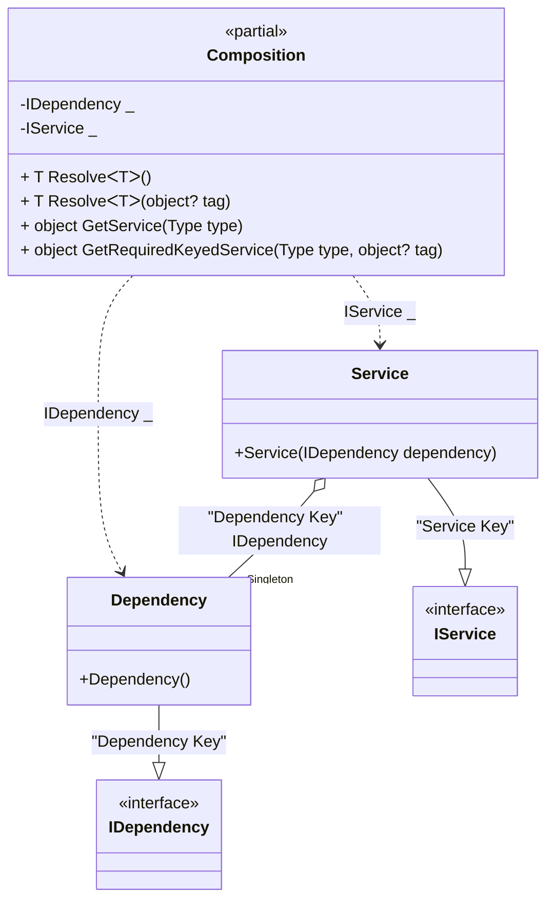

#### Keyed service provider

[](../tests/Pure.DI.UsageTests/BaseClassLibrary/KeyedServiceProviderScenario.cs)


```c#
interface IDependency;

class Dependency : IDependency;

interface IService
{
    IDependency Dependency { get; }
}

class Service([Tag("Dependency Key")] IDependency dependency) : IService
{
    public IDependency Dependency { get; } = dependency;
}

partial class Composition: IKeyedServiceProvider
{
    static void Setup() =>
        DI.Setup()
            // The following hint overrides the name of the
            // "object Resolve(Type type)" method in "GetService",
            // which implements the "IServiceProvider" interface
            .Hint(Hint.ObjectResolveMethodName, "GetService")
            // The following hint overrides the name of the
            // "object Resolve(Type type, object tag)" method in "GetRequiredKeyedService",
            // which implements the "IKeyedServiceProvider" interface
            .Hint(Hint.ObjectResolveByTagMethodName, "GetRequiredKeyedService")
            .Bind<IDependency>("Dependency Key").As(Lifetime.Singleton).To<Dependency>()
            .Bind<IService>("Service Key").To<Service>()
            .Root<IDependency>(tag: "Dependency Key")
            .Root<IService>(tag: "Service Key");

    public object GetKeyedService(Type serviceType, object? serviceKey) =>
        GetRequiredKeyedService(serviceType, serviceKey);
}

var serviceProvider = new Composition();
var service = serviceProvider.GetRequiredKeyedService<IService>("Service Key");
var dependency = serviceProvider.GetRequiredKeyedService<IDependency>("Dependency Key");
service.Dependency.ShouldBe(dependency);
```

The following partial class will be generated:

```c#
partial class Composition
{
  private readonly Composition _root;
  private readonly object _lock;

  private Dependency? _singletonDependency39;

  [OrdinalAttribute(20)]
  public Composition()
  {
    _root = this;
    _lock = new object();
  }

  internal Composition(Composition parentScope)
  {
    _root = (parentScope ?? throw new ArgumentNullException(nameof(parentScope)))._root;
    _lock = _root._lock;
  }

  private IDependency Root2
  {
    [MethodImpl(MethodImplOptions.AggressiveInlining)]
    get
    {
      if (_root._singletonDependency39 == null)
      {
        lock (_lock)
        {
          if (_root._singletonDependency39 == null)
          {
            _root._singletonDependency39 = new Dependency();
          }
        }
      }

      return _root._singletonDependency39!;
    }
  }

  private IService Root1
  {
    [MethodImpl(MethodImplOptions.AggressiveInlining)]
    get
    {
      if (_root._singletonDependency39 == null)
      {
        lock (_lock)
        {
          if (_root._singletonDependency39 == null)
          {
            _root._singletonDependency39 = new Dependency();
          }
        }
      }

      return new Service(_root._singletonDependency39!);
    }
  }

  [MethodImpl(MethodImplOptions.AggressiveInlining)]
  public T Resolve<T>()
  {
    return Resolver<T>.Value.Resolve(this);
  }

  [MethodImpl(MethodImplOptions.AggressiveInlining)]
  public T Resolve<T>(object? tag)
  {
    return Resolver<T>.Value.ResolveByTag(this, tag);
  }

  [MethodImpl(MethodImplOptions.AggressiveInlining)]
  public object GetService(Type type)
  {
    var index = (int)(_bucketSize * ((uint)RuntimeHelpers.GetHashCode(type) % 4));
    ref var pair = ref _buckets[index];
    return pair.Key == type ? pair.Value.Resolve(this) : Resolve(type, index);
  }

  [MethodImpl(MethodImplOptions.NoInlining)]
  private object Resolve(Type type, int index)
  {
    var finish = index + _bucketSize;
    while (++index < finish)
    {
      ref var pair = ref _buckets[index];
      if (pair.Key == type)
      {
        return pair.Value.Resolve(this);
      }
    }

    throw new InvalidOperationException($"{CannotResolveMessage} {OfTypeMessage} {type}.");
  }

  [MethodImpl(MethodImplOptions.AggressiveInlining)]
  public object GetRequiredKeyedService(Type type, object? tag)
  {
    var index = (int)(_bucketSize * ((uint)RuntimeHelpers.GetHashCode(type) % 4));
    ref var pair = ref _buckets[index];
    return pair.Key == type ? pair.Value.ResolveByTag(this, tag) : Resolve(type, tag, index);
  }

  [MethodImpl(MethodImplOptions.NoInlining)]
  private object Resolve(Type type, object? tag, int index)
  {
    var finish = index + _bucketSize;
    while (++index < finish)
    {
      ref var pair = ref _buckets[index];
      if (pair.Key == type)
      {
        return pair.Value.ResolveByTag(this, tag);
      }
    }

    throw new InvalidOperationException($"{CannotResolveMessage} \"{tag}\" {OfTypeMessage} {type}.");
  }

  private readonly static int _bucketSize;
  private readonly static Pair<Type, IResolver<Composition, object>>[] _buckets;

  static Composition()
  {
    var valResolver_0000 = new Resolver_0000();
    Resolver<IDependency>.Value = valResolver_0000;
    var valResolver_0001 = new Resolver_0001();
    Resolver<IService>.Value = valResolver_0001;
    _buckets = Buckets<Type, IResolver<Composition, object>>.Create(
      4,
      out _bucketSize,
      new Pair<Type, IResolver<Composition, object>>[2]
      {
         new Pair<Type, IResolver<Composition, object>>(typeof(IDependency), valResolver_0000)
        ,new Pair<Type, IResolver<Composition, object>>(typeof(IService), valResolver_0001)
      });
  }

  private const string CannotResolveMessage = "Cannot resolve composition root ";
  private const string OfTypeMessage = "of type ";

  private class Resolver<T>: IResolver<Composition, T>
  {
    public static IResolver<Composition, T> Value = new Resolver<T>();

    public virtual T Resolve(Composition composite)
    {
      throw new InvalidOperationException($"{CannotResolveMessage}{OfTypeMessage}{typeof(T)}.");
    }

    public virtual T ResolveByTag(Composition composite, object tag)
    {
      throw new InvalidOperationException($"{CannotResolveMessage}\"{tag}\" {OfTypeMessage}{typeof(T)}.");
    }
  }

  private sealed class Resolver_0000: Resolver<IDependency>
  {
    public override IDependency Resolve(Composition composition)
    {
      return base.Resolve(composition);
    }

    public override IDependency ResolveByTag(Composition composition, object tag)
    {
      switch (tag)
      {
        case "Dependency Key":
          return composition.Root2;

        default:
          return base.ResolveByTag(composition, tag);
      }
    }
  }

  private sealed class Resolver_0001: Resolver<IService>
  {
    public override IService Resolve(Composition composition)
    {
      return base.Resolve(composition);
    }

    public override IService ResolveByTag(Composition composition, object tag)
    {
      switch (tag)
      {
        case "Service Key":
          return composition.Root1;

        default:
          return base.ResolveByTag(composition, tag);
      }
    }
  }
}
```

Class diagram:



