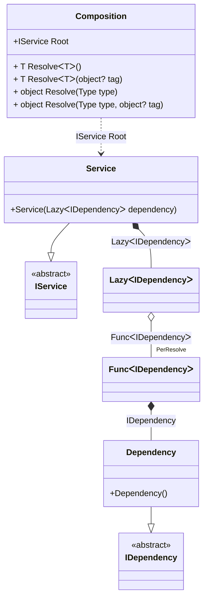

#### Lazy

[](../tests/Pure.DI.UsageTests/BaseClassLibrary/LazyScenario.cs)

```c#
interface IDependency { }

class Dependency : IDependency { }

interface IService
{
    IDependency Dependency { get; }
}

class Service : IService
{
    private readonly Lazy<IDependency> _dependency;

    public Service(Lazy<IDependency> dependency) =>
        _dependency = dependency;

    public IDependency Dependency => _dependency.Value;
}

DI.Setup("Composition")
    .Bind<IDependency>().To<Dependency>()
    .Bind<IService>().To<Service>().Root<IService>("Root");

var composition = new Composition();
var service = composition.Root;
service.Dependency.ShouldBe(service.Dependency);
```

<details open>
<summary>Class Diagram</summary>



</details>

<details>
<summary>Pure.DI-generated partial class Composition</summary><blockquote>

```c#
partial class Composition
{
  public Composition()
  {
  }
  
  internal Composition(Composition parent)
  {
  }
  
  #region Composition Roots
  public Pure.DI.UsageTests.BCL.LazyScenario.IService Root
  {
    [global::System.Runtime.CompilerServices.MethodImpl((global::System.Runtime.CompilerServices.MethodImplOptions)0x300)]
    get
    {
      System.Func<Pure.DI.UsageTests.BCL.LazyScenario.IDependency> perResolveM08D07di2;
      perResolveM08D07di2 = new global::System.Func<Pure.DI.UsageTests.BCL.LazyScenario.IDependency>(() =>
      {
          Pure.DI.UsageTests.BCL.LazyScenario.IDependency value;
          var transientM08D07di5 = new Pure.DI.UsageTests.BCL.LazyScenario.Dependency();
          value = transientM08D07di5;
          return value;
      });
      System.Lazy<Pure.DI.UsageTests.BCL.LazyScenario.IDependency> transientM08D07di1;
      {
          global::System.Func<Pure.DI.UsageTests.BCL.LazyScenario.IDependency> func;
          func = perResolveM08D07di2;
          transientM08D07di1 = new global::System.Lazy<Pure.DI.UsageTests.BCL.LazyScenario.IDependency>(func, true);
      }
      var transientM08D07di0 = new Pure.DI.UsageTests.BCL.LazyScenario.Service(transientM08D07di1);
      return transientM08D07di0;
    }
  }
  #endregion
  
  #region API
  #if NETSTANDARD2_0_OR_GREATER || NETCOREAPP || NET40_OR_GREATER
  [global::System.Diagnostics.Contracts.Pure]
  #endif
  [global::System.Runtime.CompilerServices.MethodImpl((global::System.Runtime.CompilerServices.MethodImplOptions)0x300)]
  public T Resolve<T>()
  {
    return ResolverM08D07di<T>.Value.Resolve(this);
  }
  
  #if NETSTANDARD2_0_OR_GREATER || NETCOREAPP || NET40_OR_GREATER
  [global::System.Diagnostics.Contracts.Pure]
  #endif
  [global::System.Runtime.CompilerServices.MethodImpl((global::System.Runtime.CompilerServices.MethodImplOptions)0x300)]
  public T Resolve<T>(object? tag)
  {
    return ResolverM08D07di<T>.Value.ResolveByTag(this, tag);
  }
  
  #if NETSTANDARD2_0_OR_GREATER || NETCOREAPP || NET40_OR_GREATER
  [global::System.Diagnostics.Contracts.Pure]
  #endif
  [global::System.Runtime.CompilerServices.MethodImpl((global::System.Runtime.CompilerServices.MethodImplOptions)0x300)]
  public object Resolve(global::System.Type type)
  {
    var index = (int)(_bucketSizeM08D07di * ((uint)global::System.Runtime.CompilerServices.RuntimeHelpers.GetHashCode(type) % 1));
    var finish = index + _bucketSizeM08D07di;
    do {
      ref var pair = ref _bucketsM08D07di[index];
      if (ReferenceEquals(pair.Key, type))
      {
        return pair.Value.Resolve(this);
      }
    } while (++index < finish);
    
    throw new global::System.InvalidOperationException($"Cannot resolve composition root of type {type}.");
  }
  
  #if NETSTANDARD2_0_OR_GREATER || NETCOREAPP || NET40_OR_GREATER
  [global::System.Diagnostics.Contracts.Pure]
  #endif
  [global::System.Runtime.CompilerServices.MethodImpl((global::System.Runtime.CompilerServices.MethodImplOptions)0x300)]
  public object Resolve(global::System.Type type, object? tag)
  {
    var index = (int)(_bucketSizeM08D07di * ((uint)global::System.Runtime.CompilerServices.RuntimeHelpers.GetHashCode(type) % 1));
    var finish = index + _bucketSizeM08D07di;
    do {
      ref var pair = ref _bucketsM08D07di[index];
      if (ReferenceEquals(pair.Key, type))
      {
        return pair.Value.ResolveByTag(this, tag);
      }
    } while (++index < finish);
    
    throw new global::System.InvalidOperationException($"Cannot resolve composition root \"{tag}\" of type {type}.");
  }
  #endregion
  
  public override string ToString()
  {
    return
      "classDiagram\n" +
        "  class Composition {\n" +
          "    +IService Root\n" +
          "    + T ResolveᐸTᐳ()\n" +
          "    + T ResolveᐸTᐳ(object? tag)\n" +
          "    + object Resolve(Type type)\n" +
          "    + object Resolve(Type type, object? tag)\n" +
        "  }\n" +
        "  Service --|> IService : \n" +
        "  class Service {\n" +
          "    +Service(LazyᐸIDependencyᐳ dependency)\n" +
        "  }\n" +
        "  Dependency --|> IDependency : \n" +
        "  class Dependency {\n" +
          "    +Dependency()\n" +
        "  }\n" +
        "  class LazyᐸIDependencyᐳ\n" +
        "  class FuncᐸIDependencyᐳ\n" +
        "  class IService {\n" +
          "    <<abstract>>\n" +
        "  }\n" +
        "  class IDependency {\n" +
          "    <<abstract>>\n" +
        "  }\n" +
        "  Service *--  LazyᐸIDependencyᐳ : LazyᐸIDependencyᐳ\n" +
        "  Composition ..> Service : IService Root\n" +
        "  LazyᐸIDependencyᐳ o--  \"PerResolve\" FuncᐸIDependencyᐳ : FuncᐸIDependencyᐳ\n" +
        "  FuncᐸIDependencyᐳ *--  Dependency : IDependency";
  }
  
  private readonly static int _bucketSizeM08D07di;
  private readonly static global::Pure.DI.Pair<global::System.Type, global::Pure.DI.IResolver<Composition, object>>[] _bucketsM08D07di;
  
  static Composition()
  {
    var valResolverM08D07di_0000 = new ResolverM08D07di_0000();
    ResolverM08D07di<Pure.DI.UsageTests.BCL.LazyScenario.IService>.Value = valResolverM08D07di_0000;
    _bucketsM08D07di = global::Pure.DI.Buckets<global::System.Type, global::Pure.DI.IResolver<Composition, object>>.Create(
      1,
      out _bucketSizeM08D07di,
      new global::Pure.DI.Pair<global::System.Type, global::Pure.DI.IResolver<Composition, object>>[1]
      {
         new global::Pure.DI.Pair<global::System.Type, global::Pure.DI.IResolver<Composition, object>>(typeof(Pure.DI.UsageTests.BCL.LazyScenario.IService), valResolverM08D07di_0000)
      });
  }
  
  #region Resolvers
  private sealed class ResolverM08D07di<T>: global::Pure.DI.IResolver<Composition, T>
  {
    public static global::Pure.DI.IResolver<Composition, T> Value = new ResolverM08D07di<T>();
    
    public T Resolve(Composition composite)
    {
      throw new global::System.InvalidOperationException($"Cannot resolve composition root of type {typeof(T)}.");
    }
    
    public T ResolveByTag(Composition composite, object tag)
    {
      throw new global::System.InvalidOperationException($"Cannot resolve composition root \"{tag}\" of type {typeof(T)}.");
    }
  }
  
  private sealed class ResolverM08D07di_0000: global::Pure.DI.IResolver<Composition, Pure.DI.UsageTests.BCL.LazyScenario.IService>
  {
    [global::System.Runtime.CompilerServices.MethodImpl((global::System.Runtime.CompilerServices.MethodImplOptions)0x300)]
    public Pure.DI.UsageTests.BCL.LazyScenario.IService Resolve(Composition composition)
    {
      return composition.Root;
    }
    
    [global::System.Runtime.CompilerServices.MethodImpl((global::System.Runtime.CompilerServices.MethodImplOptions)0x300)]
    public Pure.DI.UsageTests.BCL.LazyScenario.IService ResolveByTag(Composition composition, object tag)
    {
      if (Equals(tag, null)) return composition.Root;
      throw new global::System.InvalidOperationException($"Cannot resolve composition root \"{tag}\" of type Pure.DI.UsageTests.BCL.LazyScenario.IService.");
    }
  }
  #endregion
}
```

</blockquote></details>

