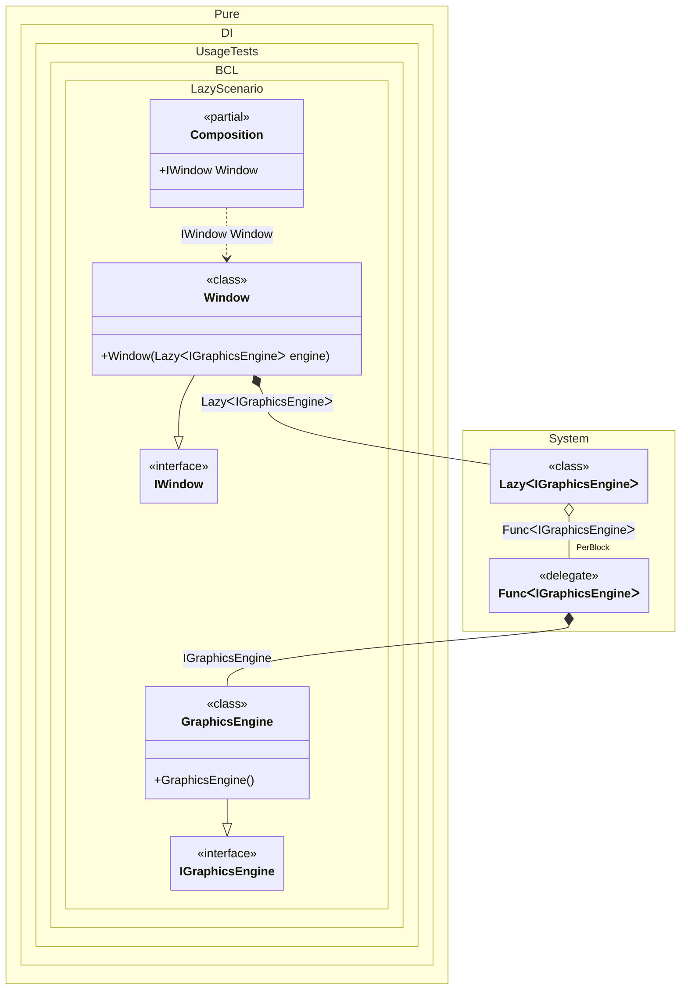

#### Lazy

Demonstrates lazy injection using Lazy<T>, delaying instance creation until the Value property is accessed.


```c#
using Shouldly;
using Pure.DI;

DI.Setup(nameof(Composition))
    .Bind<IGraphicsEngine>().To<GraphicsEngine>()
    .Bind<IWindow>().To<Window>()

    // Composition root
    .Root<IWindow>("Window");

var composition = new Composition();
var window = composition.Window;

// The graphics engine is created only when it is first accessed
window.Engine.ShouldBe(window.Engine);

interface IGraphicsEngine;

class GraphicsEngine : IGraphicsEngine;

interface IWindow
{
    IGraphicsEngine Engine { get; }
}

class Window(Lazy<IGraphicsEngine> engine) : IWindow
{
    public IGraphicsEngine Engine => engine.Value;
}
```

<details>
<summary>Running this code sample locally</summary>

- Make sure you have the [.NET SDK 10.0](https://dotnet.microsoft.com/en-us/download/dotnet/10.0) or later installed
```bash
dotnet --list-sdk
```
- Create a net10.0 (or later) console application
```bash
dotnet new console -n Sample
```
- Add references to the NuGet packages
  - [Pure.DI](https://www.nuget.org/packages/Pure.DI)
  - [Shouldly](https://www.nuget.org/packages/Shouldly)
```bash
dotnet add package Pure.DI
dotnet add package Shouldly
```
- Copy the example code into the _Program.cs_ file

You are ready to run the example 🚀
```bash
dotnet run
```

</details>

>[!NOTE]
>Lazy<T> is useful for expensive-to-create objects or when the instance may never be needed, improving application startup performance.

The following partial class will be generated:

```c#
partial class Composition
{
  public IWindow Window
  {
    [MethodImpl(MethodImplOptions.AggressiveInlining)]
    get
    {
      Lazy<IGraphicsEngine> transientLazy397;
      // Injects an instance factory
      Func<IGraphicsEngine> perBlockFunc398 = new Func<IGraphicsEngine>(
      [MethodImpl(MethodImplOptions.AggressiveInlining)]
      () =>
      {
        return new GraphicsEngine();
      });
      Func<IGraphicsEngine> localFactory3 = perBlockFunc398;
      // Creates an instance that supports lazy initialization
      transientLazy397 = new Lazy<IGraphicsEngine>(localFactory3, true);
      return new Window(transientLazy397);
    }
  }
}
```

Class diagram:


```mermaid
---
 config:
  maxTextSize: 2147483647
  maxEdges: 2147483647
  class:
   hideEmptyMembersBox: true
---
classDiagram
	GraphicsEngine --|> IGraphicsEngine
	Window --|> IWindow
	Composition ..> Window : IWindow Window
	Window *--  LazyᐸIGraphicsEngineᐳ : LazyᐸIGraphicsEngineᐳ
	LazyᐸIGraphicsEngineᐳ o-- "PerBlock" FuncᐸIGraphicsEngineᐳ : FuncᐸIGraphicsEngineᐳ
	FuncᐸIGraphicsEngineᐳ *--  GraphicsEngine : IGraphicsEngine
	namespace Pure.DI.UsageTests.BCL.LazyScenario {
		class Composition {
		<<partial>>
		+IWindow Window
		}
		class GraphicsEngine {
				<<class>>
			+GraphicsEngine()
		}
		class IGraphicsEngine {
			<<interface>>
		}
		class IWindow {
			<<interface>>
		}
		class Window {
				<<class>>
			+Window(LazyᐸIGraphicsEngineᐳ engine)
		}
	}
	namespace System {
		class FuncᐸIGraphicsEngineᐳ {
				<<delegate>>
		}
		class LazyᐸIGraphicsEngineᐳ {
				<<class>>
		}
	}
```

