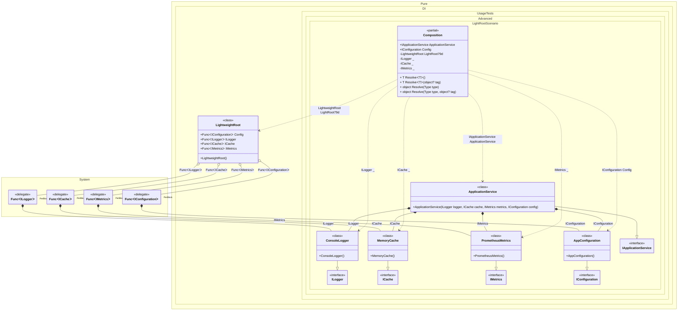

#### Light roots

Light roots optimize code generation by avoiding the creation of separate composition objects for each root. Instead, they share a common lightweight composition and use delegates to create instances. This is particularly useful for simple, frequently resolved roots where the overhead of generating separate compositions outweighs the benefits. Anonymous roots (roots without explicit names) are lightweight by default.


```c#
using Shouldly;
using Pure.DI;
using static Pure.DI.RootKinds;

DI.Setup(nameof(Composition))
    // Infrastructure bindings with simple lifetimes
    .Bind().To<ConsoleLogger>()
    .Bind().To<MemoryCache>()
    .Bind().To<PrometheusMetrics>()
    .Bind().To<AppConfiguration>()
    .Bind().To<ApplicationService>()

    // Regular root for complex composition
    .Root<IApplicationService>("ApplicationService")

    // Named lightweight root
    .Root<IConfiguration>("Config", kind: Light)

    // Anonymous lightweight roots (lightweight by default)
    .Root<ILogger>()
    .Root<ICache>()
    .Root<IMetrics>();

var composition = new Composition();
var applicationService = composition.ApplicationService;
var config = composition.Config;

// Anonymous roots are resolved via the Resolve method
var logger = composition.Resolve<ILogger>();
var cache = composition.Resolve<ICache>();
var metrics = composition.Resolve<IMetrics>();

// Verify that all light roots return correct types
logger.ShouldBeOfType<ConsoleLogger>();
cache.ShouldBeOfType<MemoryCache>();
metrics.ShouldBeOfType<PrometheusMetrics>();
config.ShouldBeOfType<AppConfiguration>();

// Light roots can be resolved independently without complex composition overhead
var anotherLogger = composition.Resolve<ILogger>();
anotherLogger.ShouldNotBeSameAs(logger);

// Application service with complex dependencies
interface IApplicationService;

class ApplicationService(
    ILogger logger,
    ICache cache,
    IMetrics metrics,
    IConfiguration config)
    : IApplicationService;

// Simple logger interface and implementation
interface ILogger;

class ConsoleLogger : ILogger;

// Simple cache interface and implementation
interface ICache;

class MemoryCache : ICache;

// Simple metrics interface and implementation
interface IMetrics;

class PrometheusMetrics : IMetrics;

// Simple configuration interface and implementation
interface IConfiguration;

class AppConfiguration : IConfiguration;
```

<details>
<summary>Running this code sample locally</summary>

- Make sure you have the [.NET SDK 10.0](https://dotnet.microsoft.com/en-us/download/dotnet/10.0) or later installed
```bash
dotnet --list-sdk
```
- Create a net10.0 (or later) console application
```bash
dotnet new console -n Sample
```
- Add references to the NuGet packages
  - [Pure.DI](https://www.nuget.org/packages/Pure.DI)
  - [Shouldly](https://www.nuget.org/packages/Shouldly)
```bash
dotnet add package Pure.DI
dotnet add package Shouldly
```
- Copy the example code into the _Program.cs_ file

You are ready to run the example 🚀
```bash
dotnet run
```

</details>

>[!NOTE]
>Light roots are ideal for simple services, factories, or utilities that don't require complex dependency graphs. They reduce generated code size and improve compilation time.

The following partial class will be generated:

```c#
partial class Composition
{
  public IConfiguration Config
  {
    [MethodImpl(MethodImplOptions.AggressiveInlining)]
    get
    {
      return LightRoot.Config();
    }
  }

  public IApplicationService ApplicationService
  {
    [MethodImpl(MethodImplOptions.AggressiveInlining)]
    get
    {
      return new ApplicationService(new ConsoleLogger(), new MemoryCache(), new PrometheusMetrics(), new AppConfiguration());
    }
  }

  private LightweightRoot LightRoot
  {
    [MethodImpl(MethodImplOptions.AggressiveInlining)]
    get
    {
      Func<IConfiguration> perBlockFunc65 = new Func<IConfiguration>(
      [MethodImpl(MethodImplOptions.AggressiveInlining)]
      () =>
      {
        return new AppConfiguration();
      });
      Func<ILogger> perBlockFunc66 = new Func<ILogger>(
      [MethodImpl(MethodImplOptions.AggressiveInlining)]
      () =>
      {
        return new ConsoleLogger();
      });
      Func<ICache> perBlockFunc67 = new Func<ICache>(
      [MethodImpl(MethodImplOptions.AggressiveInlining)]
      () =>
      {
        return new MemoryCache();
      });
      Func<IMetrics> perBlockFunc68 = new Func<IMetrics>(
      [MethodImpl(MethodImplOptions.AggressiveInlining)]
      () =>
      {
        return new PrometheusMetrics();
      });
      return new LightweightRoot()
      {
        Config = perBlockFunc65,
        ILogger = perBlockFunc66,
        ICache = perBlockFunc67,
        IMetrics = perBlockFunc68
      };
    }
  }

  private ILogger Root3
  {
    [MethodImpl(MethodImplOptions.AggressiveInlining)]
    get
    {
      return LightRoot.ILogger();
    }
  }

  private ICache Root2
  {
    [MethodImpl(MethodImplOptions.AggressiveInlining)]
    get
    {
      return LightRoot.ICache();
    }
  }

  private IMetrics Root1
  {
    [MethodImpl(MethodImplOptions.AggressiveInlining)]
    get
    {
      return LightRoot.IMetrics();
    }
  }

  [MethodImpl(MethodImplOptions.AggressiveInlining)]
  public T Resolve<T>()
  {
    return Resolver<T>.Value.Resolve(this);
  }

  [MethodImpl(MethodImplOptions.AggressiveInlining)]
  public T Resolve<T>(object? tag)
  {
    return Resolver<T>.Value.ResolveByTag(this, tag);
  }

  [MethodImpl(MethodImplOptions.AggressiveInlining)]
  public object Resolve(Type type)
  {
    #if NETCOREAPP3_0_OR_GREATER
    var index = (int)(_bucketSize * (((uint)type.TypeHandle.GetHashCode()) % 10));
    #else
    var index = (int)(_bucketSize * (((uint)RuntimeHelpers.GetHashCode(type)) % 10));
    #endif
    ref var pair = ref _buckets[index];
    return Object.ReferenceEquals(pair.Key, type) ? pair.Value.Resolve(this) : Resolve(type, index);
  }

  [MethodImpl(MethodImplOptions.NoInlining)]
  private object Resolve(Type type, int index)
  {
    var finish = index + _bucketSize;
    while (++index < finish)
    {
      ref var pair = ref _buckets[index];
      if (Object.ReferenceEquals(pair.Key, type))
      {
        return pair.Value.Resolve(this);
      }
    }

    throw new CannotResolveException($"{CannotResolveMessage} {OfTypeMessage} {type}.", type, null);
  }

  [MethodImpl(MethodImplOptions.AggressiveInlining)]
  public object Resolve(Type type, object? tag)
  {
    #if NETCOREAPP3_0_OR_GREATER
    var index = (int)(_bucketSize * (((uint)type.TypeHandle.GetHashCode()) % 10));
    #else
    var index = (int)(_bucketSize * (((uint)RuntimeHelpers.GetHashCode(type)) % 10));
    #endif
    ref var pair = ref _buckets[index];
    return Object.ReferenceEquals(pair.Key, type) ? pair.Value.ResolveByTag(this, tag) : Resolve(type, tag, index);
  }

  [MethodImpl(MethodImplOptions.NoInlining)]
  private object Resolve(Type type, object? tag, int index)
  {
    var finish = index + _bucketSize;
    while (++index < finish)
    {
      ref var pair = ref _buckets[index];
      if (Object.ReferenceEquals(pair.Key, type))
      {
        return pair.Value.ResolveByTag(this, tag);
      }
    }

    throw new CannotResolveException($"{CannotResolveMessage} \"{tag}\" {OfTypeMessage} {type}.", type, tag);
  }

  private readonly static uint _bucketSize;
  private readonly static Pair<IResolver<Composition, object>>[] _buckets;

  static Composition()
  {
    var valResolver_0000 = new Resolver_0000();
    Resolver<IConfiguration>.Value = valResolver_0000;
    var valResolver_0001 = new Resolver_0001();
    Resolver<IApplicationService>.Value = valResolver_0001;
    var valResolver_0002 = new Resolver_0002();
    Resolver<ILogger>.Value = valResolver_0002;
    var valResolver_0003 = new Resolver_0003();
    Resolver<ICache>.Value = valResolver_0003;
    var valResolver_0004 = new Resolver_0004();
    Resolver<IMetrics>.Value = valResolver_0004;
    _buckets = Buckets<IResolver<Composition, object>>.Create(
      10,
      out _bucketSize,
      new Pair<IResolver<Composition, object>>[5]
      {
         new Pair<IResolver<Composition, object>>(typeof(IConfiguration), valResolver_0000)
        ,new Pair<IResolver<Composition, object>>(typeof(IApplicationService), valResolver_0001)
        ,new Pair<IResolver<Composition, object>>(typeof(ILogger), valResolver_0002)
        ,new Pair<IResolver<Composition, object>>(typeof(ICache), valResolver_0003)
        ,new Pair<IResolver<Composition, object>>(typeof(IMetrics), valResolver_0004)
      });
  }

  private const string CannotResolveMessage = "Cannot resolve composition root ";
  private const string OfTypeMessage = "of type ";

  private class Resolver<T>: IResolver<Composition, T>
  {
    public static IResolver<Composition, T> Value = new Resolver<T>();

    public virtual T Resolve(Composition composite)
    {
      throw new CannotResolveException($"{CannotResolveMessage}{OfTypeMessage}{typeof(T)}.", typeof(T), null);
    }

    public virtual T ResolveByTag(Composition composite, object tag)
    {
      throw new CannotResolveException($"{CannotResolveMessage}\"{tag}\" {OfTypeMessage}{typeof(T)}.", typeof(T), tag);
    }
  }

  private sealed class Resolver_0000: Resolver<IConfiguration>
  {
    public override IConfiguration Resolve(Composition composition)
    {
      return composition.Config;
    }

    public override IConfiguration ResolveByTag(Composition composition, object tag)
    {
      switch (tag)
      {
        case null:
          return composition.Config;

        default:
          return base.ResolveByTag(composition, tag);
      }
    }
  }

  private sealed class Resolver_0001: Resolver<IApplicationService>
  {
    public override IApplicationService Resolve(Composition composition)
    {
      return composition.ApplicationService;
    }

    public override IApplicationService ResolveByTag(Composition composition, object tag)
    {
      switch (tag)
      {
        case null:
          return composition.ApplicationService;

        default:
          return base.ResolveByTag(composition, tag);
      }
    }
  }

  private sealed class Resolver_0002: Resolver<ILogger>
  {
    public override ILogger Resolve(Composition composition)
    {
      return composition.Root3;
    }

    public override ILogger ResolveByTag(Composition composition, object tag)
    {
      switch (tag)
      {
        case null:
          return composition.Root3;

        default:
          return base.ResolveByTag(composition, tag);
      }
    }
  }

  private sealed class Resolver_0003: Resolver<ICache>
  {
    public override ICache Resolve(Composition composition)
    {
      return composition.Root2;
    }

    public override ICache ResolveByTag(Composition composition, object tag)
    {
      switch (tag)
      {
        case null:
          return composition.Root2;

        default:
          return base.ResolveByTag(composition, tag);
      }
    }
  }

  private sealed class Resolver_0004: Resolver<IMetrics>
  {
    public override IMetrics Resolve(Composition composition)
    {
      return composition.Root1;
    }

    public override IMetrics ResolveByTag(Composition composition, object tag)
    {
      switch (tag)
      {
        case null:
          return composition.Root1;

        default:
          return base.ResolveByTag(composition, tag);
      }
    }
  }

  #pragma warning disable CS0649
  private sealed class LightweightRoot: LightweightRoot
  {
    [OrdinalAttribute()] public Func<IConfiguration> Config;
    [OrdinalAttribute()] public Func<ILogger> ILogger;
    [OrdinalAttribute()] public Func<ICache> ICache;
    [OrdinalAttribute()] public Func<IMetrics> IMetrics;
  }
}
```

Class diagram:



