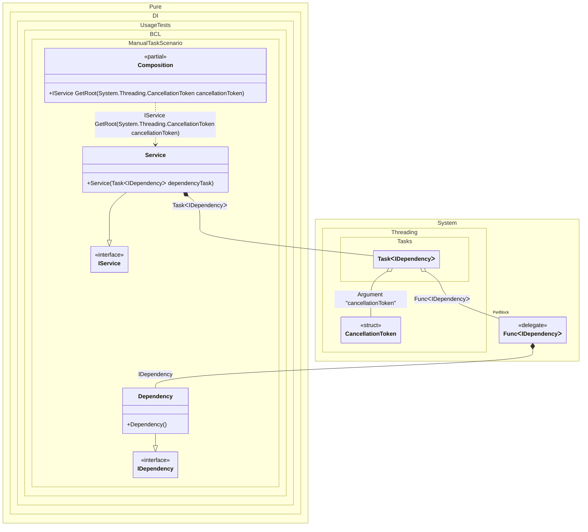

#### Manually started tasks

[](../tests/Pure.DI.UsageTests/BaseClassLibrary/ManualTaskScenario.cs)

By default, tasks are started automatically when they are injected. But you can override this behavior as shown in the example below. It is also recommended to add a binding for <c>CancellationToken</c> to be able to cancel the execution of a task.


```c#
interface IDependency
{
    ValueTask DoSomething(CancellationToken cancellationToken);
}

class Dependency : IDependency
{
    public ValueTask DoSomething(CancellationToken cancellationToken) => ValueTask.CompletedTask;
}

interface IService
{
    Task RunAsync(CancellationToken cancellationToken);
}

class Service : IService
{
    private readonly Task<IDependency> _dependencyTask;

    public Service(Task<IDependency> dependencyTask)
    {
        _dependencyTask = dependencyTask;
        // This is where the task starts
        _dependencyTask.Start();
    }

    public async Task RunAsync(CancellationToken cancellationToken)
    {
        var dependency = await _dependencyTask;
        await dependency.DoSomething(cancellationToken);
    }
}

DI.Setup(nameof(Composition))
    .Hint(Hint.Resolve, "Off")
    // Overrides the default binding that performs an auto-start of a task
    // when it is created. This binding will simply create the task.
    // The start will be handled by the consumer.
    .Bind<Task<TT>>().To(ctx =>
    {
        ctx.Inject(ctx.Tag, out Func<TT> factory);
        ctx.Inject(out CancellationToken cancellationToken);
        return new Task<TT>(factory, cancellationToken);
    })
    // Specifies to use CancellationToken from the composition root argument,
    // if not specified then CancellationToken.None will be used
    .RootArg<CancellationToken>("cancellationToken")
    .Bind<IDependency>().To<Dependency>()
    .Bind<IService>().To<Service>()

    // Composition root
    .Root<IService>("GetRoot");

var composition = new Composition();
using var cancellationTokenSource = new CancellationTokenSource();

// Creates a composition root with the CancellationToken passed to it
var service = composition.GetRoot(cancellationTokenSource.Token);
await service.RunAsync(cancellationTokenSource.Token);
```

> [!IMPORTANT]
> The method `Inject()`cannot be used outside of the binding setup.

The following partial class will be generated:

```c#
partial class Composition
{
  private readonly Composition _root;

  [OrdinalAttribute(10)]
  public Composition()
  {
    _root = this;
  }

  internal Composition(Composition parentScope)
  {
    _root = (parentScope ?? throw new ArgumentNullException(nameof(parentScope)))._root;
  }

  [MethodImpl(MethodImplOptions.AggressiveInlining)]
  public IService GetRoot(CancellationToken cancellationToken)
  {
    Func<IDependency> perBlockFunc2 = new Func<IDependency>([MethodImpl(MethodImplOptions.AggressiveInlining)] () =>
    {
      IDependency localValue50 = new Dependency();
      return localValue50;
    });
    Task<IDependency> transientTask1;
    Func<IDependency> localFactory51 = perBlockFunc2;
    CancellationToken localCancellationToken52 = cancellationToken;
    transientTask1 = new Task<IDependency>(localFactory51, localCancellationToken52);
    return new Service(transientTask1);
  }
}
```

Class diagram:



