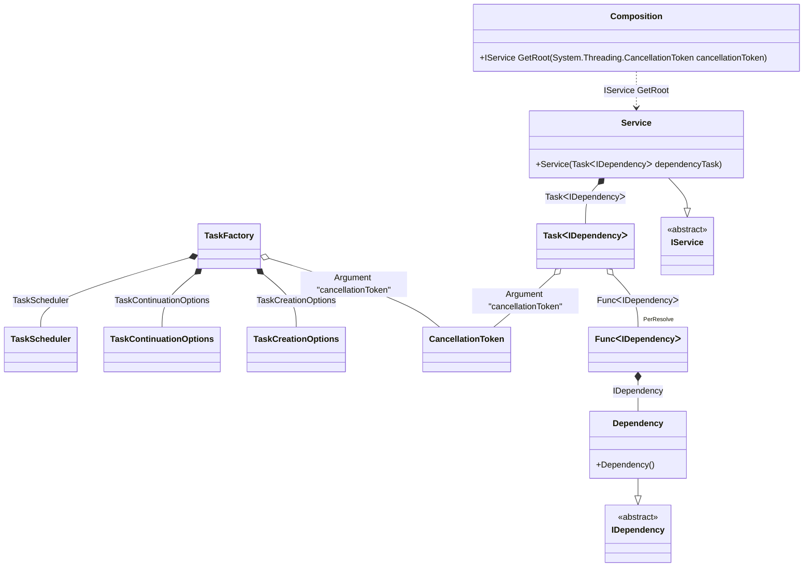

#### Manually started tasks

[](../tests/Pure.DI.UsageTests/BaseClassLibrary/ManualTaskScenario.cs)

By default, tasks are started automatically when they are injected. But you can override this behavior as shown in the example below. It is also recommended to add a binding for <c>CancellationToken</c> to be able to cancel the execution of a task.

```c#
interface IDependency
{
    ValueTask DoSomething(CancellationToken cancellationToken);
}

class Dependency : IDependency
{
    public ValueTask DoSomething(CancellationToken cancellationToken) => ValueTask.CompletedTask;
}

interface IService
{
    Task RunAsync(CancellationToken cancellationToken);
}

class Service : IService
{
    private readonly Task<IDependency> _dependencyTask;

    public Service(Task<IDependency> dependencyTask)
    {
        _dependencyTask = dependencyTask;
        // This is where the task starts
        _dependencyTask.Start();
    }

    public async Task RunAsync(CancellationToken cancellationToken)
    {
        var dependency = await _dependencyTask;
        await dependency.DoSomething(cancellationToken);
    }
}

DI.Setup("Composition")
    .Hint(Hint.Resolve, "Off")
    // Overrides the default binding that performs an auto-start of a task
    // when it is created. This binding will simply create the task.
    // The start will be handled by the consumer.
    .Bind<Task<TT>>().To(ctx =>
    {
        ctx.Inject(ctx.Tag, out Func<TT> factory);
        ctx.Inject(out CancellationToken cancellationToken);
        return new Task<TT>(factory, cancellationToken);
    })
    // Specifies to use CancellationToken from the composition root argument,
    // if not specified then CancellationToken.None will be used
    .RootArg<CancellationToken>("cancellationToken")
    .Bind<IDependency>().To<Dependency>()
    .Bind<IService>().To<Service>()
    .Root<IService>("GetRoot");

var composition = new Composition();
using var cancellationTokenSource = new CancellationTokenSource();
        
// Creates a composition root with the CancellationToken passed to it
var service = composition.GetRoot(cancellationTokenSource.Token);
await service.RunAsync(cancellationTokenSource.Token);
```

<details open>
<summary>Class Diagram</summary>



</details>

<details>
<summary>Pure.DI-generated partial class Composition</summary><blockquote>

```c#
partial class Composition
{
  private readonly global::System.IDisposable[] _disposableSingletonsM01D20di;
  
  public Composition()
  {
    _disposableSingletonsM01D20di = new global::System.IDisposable[0];
  }
  
  internal Composition(Composition parent)
  {
    _disposableSingletonsM01D20di = new global::System.IDisposable[0];
  }
  
  #region Composition Roots
  #if NETSTANDARD2_0_OR_GREATER || NETCOREAPP || NET40_OR_GREATER || NET
  [global::System.Diagnostics.Contracts.Pure]
  #endif
  public Pure.DI.UsageTests.BCL.ManualTaskScenario.IService GetRoot(System.Threading.CancellationToken cancellationToken)
  {
    var perResolveM01D20di39_Func = default(System.Func<Pure.DI.UsageTests.BCL.ManualTaskScenario.IDependency>);
    perResolveM01D20di39_Func = new global::System.Func<Pure.DI.UsageTests.BCL.ManualTaskScenario.IDependency>(
    [global::System.Runtime.CompilerServices.MethodImpl((global::System.Runtime.CompilerServices.MethodImplOptions)768)]
    () =>
    {
        var factory_M01D20di1 = new Pure.DI.UsageTests.BCL.ManualTaskScenario.Dependency();
        return factory_M01D20di1;
    });
    System.Threading.Tasks.Task<Pure.DI.UsageTests.BCL.ManualTaskScenario.IDependency> transientM01D20di1_Task;
    {
        var factory_M01D20di2 = perResolveM01D20di39_Func;
        var cancellationToken_M01D20di3 = cancellationToken;
        transientM01D20di1_Task = new Task<Pure.DI.UsageTests.BCL.ManualTaskScenario.IDependency>(factory_M01D20di2, cancellationToken_M01D20di3);
    }
    return new Pure.DI.UsageTests.BCL.ManualTaskScenario.Service(transientM01D20di1_Task);
  }
  #endregion
  
  
  public override string ToString()
  {
    return
      "classDiagram\n" +
        "  class Composition {\n" +
          "    +IService GetRoot(System.Threading.CancellationToken cancellationToken)\n" +
        "  }\n" +
        "  class TaskFactory\n" +
        "  class CancellationToken\n" +
        "  Dependency --|> IDependency : \n" +
        "  class Dependency {\n" +
          "    +Dependency()\n" +
        "  }\n" +
        "  Service --|> IService : \n" +
        "  class Service {\n" +
          "    +Service(TaskᐸIDependencyᐳ dependencyTask)\n" +
        "  }\n" +
        "  class TaskᐸIDependencyᐳ\n" +
        "  class FuncᐸIDependencyᐳ\n" +
        "  class IDependency {\n" +
          "    <<abstract>>\n" +
        "  }\n" +
        "  class IService {\n" +
          "    <<abstract>>\n" +
        "  }\n" +
        "  TaskFactory o-- CancellationToken : Argument \"cancellationToken\"\n" +
        "  TaskFactory *--  TaskCreationOptions : TaskCreationOptions\n" +
        "  TaskFactory *--  TaskContinuationOptions : TaskContinuationOptions\n" +
        "  TaskFactory *--  TaskScheduler : TaskScheduler\n" +
        "  Service *--  TaskᐸIDependencyᐳ : TaskᐸIDependencyᐳ\n" +
        "  Composition ..> Service : IService GetRoot\n" +
        "  TaskᐸIDependencyᐳ o--  \"PerResolve\" FuncᐸIDependencyᐳ : FuncᐸIDependencyᐳ\n" +
        "  TaskᐸIDependencyᐳ o-- CancellationToken : Argument \"cancellationToken\"\n" +
        "  FuncᐸIDependencyᐳ *--  Dependency : IDependency";
  }
}
```

</blockquote></details>

