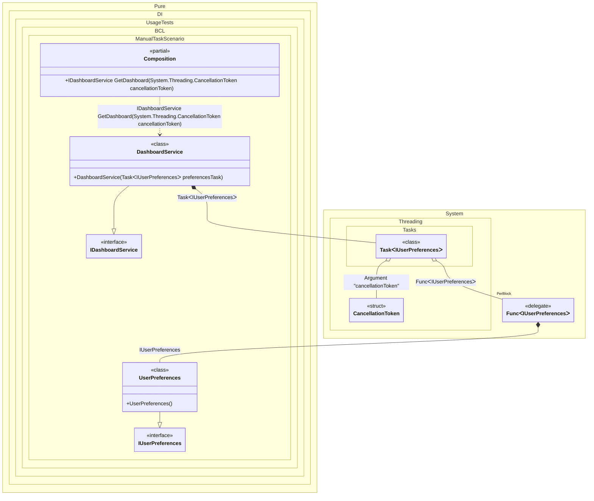

#### Manually started tasks

By default, tasks are started automatically when they are injected. But you can override this behavior as shown in the example below. It is also recommended to add a binding for <c>CancellationToken</c> to be able to cancel the execution of a task.


```c#
using Pure.DI;

DI.Setup(nameof(Composition))
    // Overrides the default binding that performs an auto-start of a task
    // when it is created. This binding will simply create the task.
    // The start will be handled by the consumer.
    .Bind<Task<TT>>().To(ctx => {
        ctx.Inject(ctx.Tag, out Func<TT> factory);
        ctx.Inject(out CancellationToken cancellationToken);
        return new Task<TT>(factory, cancellationToken);
    })
    // Specifies to use CancellationToken from the composition root argument,
    // if not specified, then CancellationToken.None will be used
    .RootArg<CancellationToken>("cancellationToken")
    .Bind<IUserPreferences>().To<UserPreferences>()
    .Bind<IDashboardService>().To<DashboardService>()

    // Composition root
    .Root<IDashboardService>("GetDashboard");

var composition = new Composition();
using var cancellationTokenSource = new CancellationTokenSource();

// Creates a composition root with the CancellationToken passed to it
var dashboard = composition.GetDashboard(cancellationTokenSource.Token);
await dashboard.LoadAsync(cancellationTokenSource.Token);

interface IUserPreferences
{
    ValueTask LoadAsync(CancellationToken cancellationToken);
}

class UserPreferences : IUserPreferences
{
    public ValueTask LoadAsync(CancellationToken cancellationToken) => ValueTask.CompletedTask;
}

interface IDashboardService
{
    Task LoadAsync(CancellationToken cancellationToken);
}

class DashboardService : IDashboardService
{
    private readonly Task<IUserPreferences> _preferencesTask;

    public DashboardService(Task<IUserPreferences> preferencesTask)
    {
        _preferencesTask = preferencesTask;
        // The task is started manually in the constructor.
        // This allows the loading of preferences to begin immediately in the background,
        // while the service continues its initialization.
        _preferencesTask.Start();
    }

    public async Task LoadAsync(CancellationToken cancellationToken)
    {
        // Wait for the preferences loading task to complete
        var preferences = await _preferencesTask;
        await preferences.LoadAsync(cancellationToken);
    }
}
```

<details>
<summary>Running this code sample locally</summary>

- Make sure you have the [.NET SDK 10.0](https://dotnet.microsoft.com/en-us/download/dotnet/10.0) or later is installed
```bash
dotnet --list-sdk
```
- Create a net10.0 (or later) console application
```bash
dotnet new console -n Sample
```
- Add reference to NuGet package
  - [Pure.DI](https://www.nuget.org/packages/Pure.DI)
```bash
dotnet add package Pure.DI
```
- Copy the example code into the _Program.cs_ file

You are ready to run the example 🚀
```bash
dotnet run
```

</details>

> [!IMPORTANT]
> The method `Inject()`cannot be used outside of the binding setup.

The following partial class will be generated:

```c#
partial class Composition
{
#if NET9_0_OR_GREATER
  private readonly Lock _lock = new Lock();
#else
  private readonly Object _lock = new Object();
#endif

  [MethodImpl(MethodImplOptions.AggressiveInlining)]
  public IDashboardService GetDashboard(CancellationToken cancellationToken)
  {
    Task<IUserPreferences> transientTask1;
    Func<IUserPreferences> transientFunc2 = new Func<IUserPreferences>(
    [MethodImpl(MethodImplOptions.AggressiveInlining)]
    () =>
    {
      IUserPreferences localValue23 = new UserPreferences();
      return localValue23;
    });
    Func<IUserPreferences> localFactory4 = transientFunc2;
    CancellationToken localCancellationToken1 = cancellationToken;
    transientTask1 = new Task<IUserPreferences>(localFactory4, localCancellationToken1);
    return new DashboardService(transientTask1);
  }
}
```

Class diagram:



