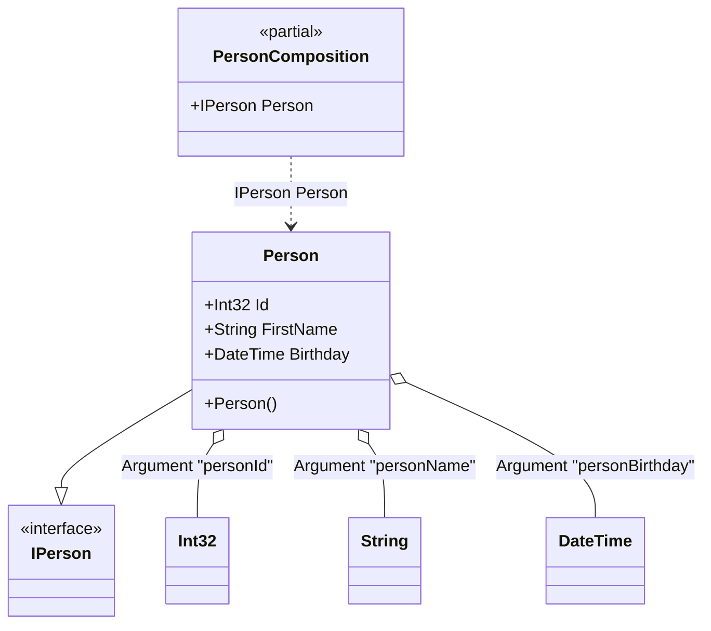

#### Member ordinal attribute

[](../tests/Pure.DI.UsageTests/Attributes/MemberOrdinalAttributeScenario.cs)

When applied to a property or field, these type members will also participate in dependency injection in the appropriate order from smallest value to largest.


```c#
interface IPerson
{
    string Name { get; }
}

class Person : IPerson
{
    private readonly StringBuilder _name = new();

    public string Name => _name.ToString();

    // The Ordinal attribute specifies to perform an injection,
    // the integer value in the argument specifies
    // the ordinal of injection
    [Ordinal(0)]
    public int Id;

    [Ordinal(1)]
    public string FirstName
    {
        set
        {
            _name.Append(Id);
            _name.Append(' ');
            _name.Append(value);
        }
    }

    [Ordinal(2)]
    public DateTime Birthday
    {
        set
        {
            _name.Append(' ');
            _name.Append($"{value:yyyy-MM-dd}");
        }
    }
}

DI.Setup(nameof(PersonComposition))
    .Arg<int>("personId")
    .Arg<string>("personName")
    .Arg<DateTime>("personBirthday")
    .Bind<IPerson>().To<Person>()

    // Composition root
    .Root<IPerson>("Person");

var composition = new PersonComposition(
    personId: 123,
    personName: "Nik",
    personBirthday: new DateTime(1977, 11, 16));

var person = composition.Person;
person.Name.ShouldBe("123 Nik 1977-11-16");
```

The attribute `Ordinal` is part of the API, but you can use your own attribute at any time, and this allows you to define them in the assembly and namespace you want.

The following partial class will be generated:

```c#
partial class PersonComposition
{
  private readonly PersonComposition _root;

  private readonly int _arg_personId;
  private readonly string _arg_personName;
  private readonly DateTime _arg_personBirthday;

  public PersonComposition(int personId, string personName, DateTime personBirthday)
  {
    _arg_personId = personId;
    _arg_personName = personName ?? throw new ArgumentNullException(nameof(personName));
    _arg_personBirthday = personBirthday;
    _root = this;
  }

  internal PersonComposition(PersonComposition parentScope)
  {
    _root = (parentScope ?? throw new ArgumentNullException(nameof(parentScope)))._root;
    _arg_personId = _root._arg_personId;
    _arg_personName = _root._arg_personName;
    _arg_personBirthday = _root._arg_personBirthday;
  }

  public IPerson Person
  {
    [MethodImpl(MethodImplOptions.AggressiveInlining)]
    get
    {
      Person transient0_Person = new Person();
      transient0_Person.Id = _arg_personId;
      transient0_Person.FirstName = _arg_personName;
      transient0_Person.Birthday = _arg_personBirthday;
      return transient0_Person;
    }
  }
}
```

Class diagram:



