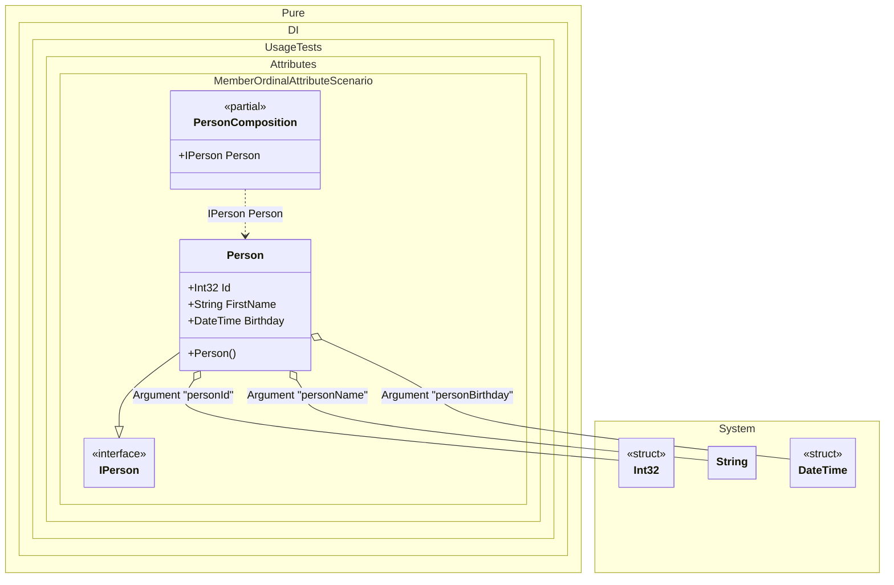

#### Member ordinal attribute

[](../tests/Pure.DI.UsageTests/Attributes/MemberOrdinalAttributeScenario.cs)

When applied to a property or field, these type members will also participate in dependency injection in the appropriate order from smallest value to largest.


```c#
using Shouldly;
using Pure.DI;
using System.Text;

DI.Setup(nameof(PersonComposition))
    .Arg<int>("personId")
    .Arg<string>("personName")
    .Arg<DateTime>("personBirthday")
    .Bind().To<Person>()

    // Composition root
    .Root<IPerson>("Person");

var composition = new PersonComposition(
    personId: 123,
    personName: "Nik",
    personBirthday: new DateTime(1977, 11, 16));

var person = composition.Person;
person.Name.ShouldBe("123 Nik 1977-11-16");

interface IPerson
{
    string Name { get; }
}

class Person : IPerson
{
    private readonly StringBuilder _name = new();

    public string Name => _name.ToString();

    // The Ordinal attribute specifies to perform an injection,
    // the integer value in the argument specifies
    // the ordinal of injection
    [Ordinal(0)] public int Id;

    [Ordinal(1)]
    public string FirstName
    {
        set
        {
            _name.Append(Id);
            _name.Append(' ');
            _name.Append(value);
        }
    }

    [Ordinal(2)]
    public DateTime Birthday
    {
        set
        {
            _name.Append(' ');
            _name.Append($"{value:yyyy-MM-dd}");
        }
    }
}
```

<details>
<summary>Running this code sample locally</summary>

- Make sure you have the [.NET SDK 9.0](https://dotnet.microsoft.com/en-us/download/dotnet/9.0) or later is installed
- Create a net9.0 (or later) console application
- Add references to NuGet packages
  - [Pure.DI](https://www.nuget.org/packages/Pure.DI)
  - [Shouldly](https://www.nuget.org/packages/Shouldly)
- Copy the example code into the _Program.cs_ file

You are ready to run the example!

</details>

The attribute `Ordinal` is part of the API, but you can use your own attribute at any time, and this allows you to define them in the assembly and namespace you want.


Class diagram:



