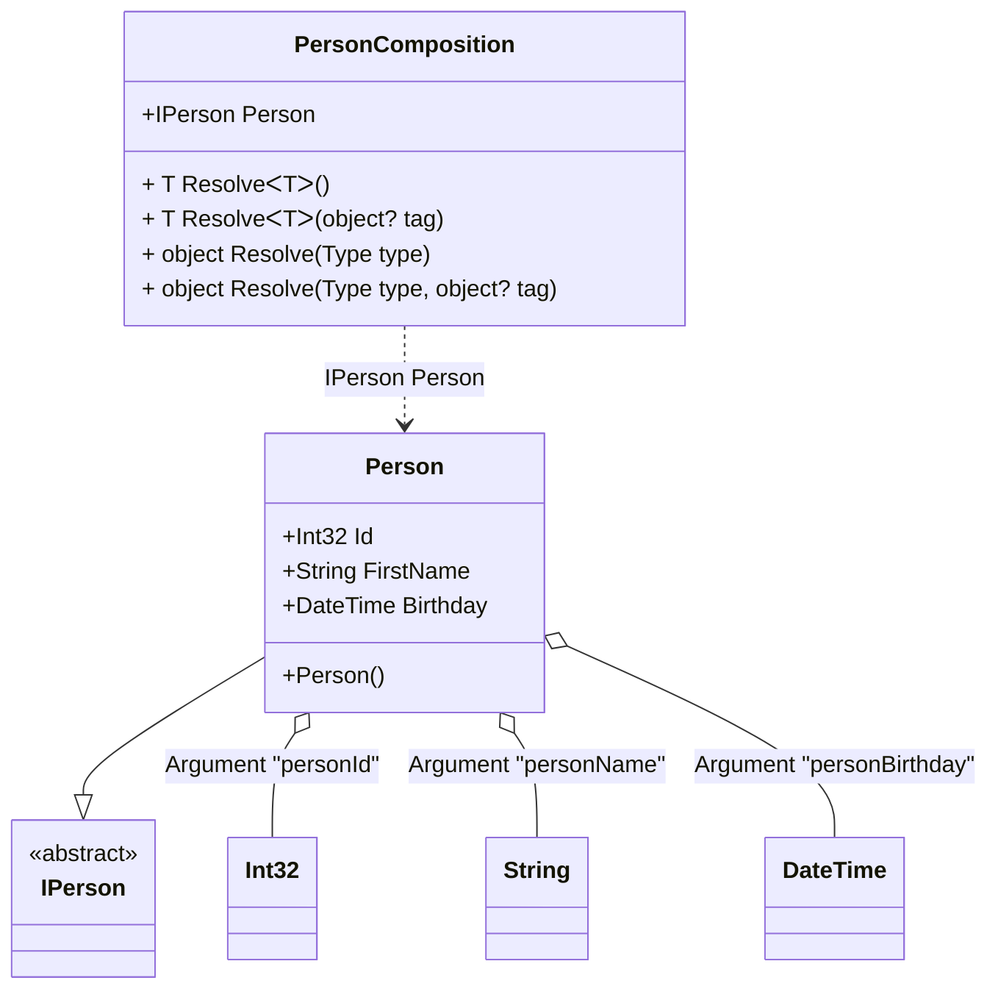

#### Member ordinal attribute

[](../tests/Pure.DI.UsageTests/Attributes/MemberOrdinalAttributeScenario.cs)

When applied to a property or field, these type members will also participate in dependency injection in the appropriate order from smallest value to largest.

```c#
interface IPerson
{
    string Name { get; }
}

class Person : IPerson
{
    private readonly StringBuilder _name = new();

    public string Name => _name.ToString();

    [Ordinal(0)]
    public int Id;

    [Ordinal(1)]
    public string FirstName
    {
        set
        {
            _name.Append(Id);
            _name.Append(' ');
            _name.Append(value);
        }
    }

    [Ordinal(2)]
    public DateTime Birthday
    {
        set
        {
            _name.Append(' ');
            _name.Append($"{value:yyyy-MM-dd}");
        }
    }
}

DI.Setup(nameof(PersonComposition))
    .Arg<int>("personId")
    .Arg<string>("personName")
    .Arg<DateTime>("personBirthday")
    .Bind<IPerson>().To<Person>().Root<IPerson>("Person");

var composition = new PersonComposition(
    personId: 123,
    personName: "Nik",
    personBirthday: new DateTime(1977, 11, 16));

var person = composition.Person;
person.Name.ShouldBe("123 Nik 1977-11-16");
```

The attribute `Ordinal` is part of the API, but you can use your own attribute at any time, and this allows you to define them in the assembly and namespace you want.

<details open>
<summary>Class Diagram</summary>



</details>

<details>
<summary>Pure.DI-generated partial class PersonComposition</summary><blockquote>

```c#
partial class PersonComposition
{
  private readonly PersonComposition _rootM03D18di;
  private readonly int _argM03D18di_personId;
  private readonly string _argM03D18di_personName;
  private readonly System.DateTime _argM03D18di_personBirthday;
  
  public PersonComposition(int personId, string personName, System.DateTime personBirthday)
  {
    _rootM03D18di = this;
    if (ReferenceEquals(personName, null))
    {
      throw new global::System.ArgumentNullException("personName");
    }
    
    _argM03D18di_personId = personId;
    _argM03D18di_personName = personName;
    _argM03D18di_personBirthday = personBirthday;
  }
  
  internal PersonComposition(PersonComposition baseComposition)
  {
    _rootM03D18di = baseComposition._rootM03D18di;
    _argM03D18di_personId = baseComposition._argM03D18di_personId;
    _argM03D18di_personName = baseComposition._argM03D18di_personName;
    _argM03D18di_personBirthday = baseComposition._argM03D18di_personBirthday;
  }
  
  public Pure.DI.UsageTests.Attributes.MemberOrdinalAttributeScenario.IPerson Person
  {
    get
    {
      Pure.DI.UsageTests.Attributes.MemberOrdinalAttributeScenario.Person transientM03D18di0_Person = new Pure.DI.UsageTests.Attributes.MemberOrdinalAttributeScenario.Person();
      transientM03D18di0_Person.Id = _argM03D18di_personId;
      transientM03D18di0_Person.FirstName = _argM03D18di_personName;
      transientM03D18di0_Person.Birthday = _argM03D18di_personBirthday;
      return transientM03D18di0_Person;
    }
  }
  
  public T Resolve<T>()
  {
    return ResolverM03D18di<T>.Value.Resolve(this);
  }
  
  public T Resolve<T>(object? tag)
  {
    return ResolverM03D18di<T>.Value.ResolveByTag(this, tag);
  }
  
  public object Resolve(global::System.Type type)
  {
    var index = (int)(_bucketSizeM03D18di * ((uint)global::System.Runtime.CompilerServices.RuntimeHelpers.GetHashCode(type) % 1));
    var finish = index + _bucketSizeM03D18di;
    do {
      ref var pair = ref _bucketsM03D18di[index];
      if (ReferenceEquals(pair.Key, type))
      {
        return pair.Value.Resolve(this);
      }
    } while (++index < finish);
    
    throw new global::System.InvalidOperationException($"Cannot resolve composition root of type {type}.");
  }
  
  public object Resolve(global::System.Type type, object? tag)
  {
    var index = (int)(_bucketSizeM03D18di * ((uint)global::System.Runtime.CompilerServices.RuntimeHelpers.GetHashCode(type) % 1));
    var finish = index + _bucketSizeM03D18di;
    do {
      ref var pair = ref _bucketsM03D18di[index];
      if (ReferenceEquals(pair.Key, type))
      {
        return pair.Value.ResolveByTag(this, tag);
      }
    } while (++index < finish);
    
    throw new global::System.InvalidOperationException($"Cannot resolve composition root \"{tag}\" of type {type}.");
  }
  
  public override string ToString()
  {
    return
      "classDiagram\n" +
        "  class PersonComposition {\n" +
          "    +IPerson Person\n" +
          "    + T ResolveᐸTᐳ()\n" +
          "    + T ResolveᐸTᐳ(object? tag)\n" +
          "    + object Resolve(Type type)\n" +
          "    + object Resolve(Type type, object? tag)\n" +
        "  }\n" +
        "  class Int32\n" +
        "  class String\n" +
        "  class DateTime\n" +
        "  Person --|> IPerson : \n" +
        "  class Person {\n" +
          "    +Person()\n" +
          "    +Int32 Id\n" +
          "    +String FirstName\n" +
          "    +DateTime Birthday\n" +
        "  }\n" +
        "  class IPerson {\n" +
          "    <<abstract>>\n" +
        "  }\n" +
        "  Person o-- Int32 : Argument \"personId\"\n" +
        "  Person o-- String : Argument \"personName\"\n" +
        "  Person o-- DateTime : Argument \"personBirthday\"\n" +
        "  PersonComposition ..> Person : IPerson Person";
  }
  
  private readonly static int _bucketSizeM03D18di;
  private readonly static global::Pure.DI.Pair<global::System.Type, global::Pure.DI.IResolver<PersonComposition, object>>[] _bucketsM03D18di;
  
  static PersonComposition()
  {
    var valResolverM03D18di_0000 = new ResolverM03D18di_0000();
    ResolverM03D18di<Pure.DI.UsageTests.Attributes.MemberOrdinalAttributeScenario.IPerson>.Value = valResolverM03D18di_0000;
    _bucketsM03D18di = global::Pure.DI.Buckets<global::System.Type, global::Pure.DI.IResolver<PersonComposition, object>>.Create(
      1,
      out _bucketSizeM03D18di,
      new global::Pure.DI.Pair<global::System.Type, global::Pure.DI.IResolver<PersonComposition, object>>[1]
      {
         new global::Pure.DI.Pair<global::System.Type, global::Pure.DI.IResolver<PersonComposition, object>>(typeof(Pure.DI.UsageTests.Attributes.MemberOrdinalAttributeScenario.IPerson), valResolverM03D18di_0000)
      });
  }
  
  private sealed class ResolverM03D18di<T>: global::Pure.DI.IResolver<PersonComposition, T>
  {
    public static global::Pure.DI.IResolver<PersonComposition, T> Value = new ResolverM03D18di<T>();
    
    public T Resolve(PersonComposition composite)
    {
      throw new global::System.InvalidOperationException($"Cannot resolve composition root of type {typeof(T)}.");
    }
    
    public T ResolveByTag(PersonComposition composite, object tag)
    {
      throw new global::System.InvalidOperationException($"Cannot resolve composition root \"{tag}\" of type {typeof(T)}.");
    }
  }
  
  private sealed class ResolverM03D18di_0000: global::Pure.DI.IResolver<PersonComposition, Pure.DI.UsageTests.Attributes.MemberOrdinalAttributeScenario.IPerson>
  {
    public Pure.DI.UsageTests.Attributes.MemberOrdinalAttributeScenario.IPerson Resolve(PersonComposition composition)
    {
      return composition.Person;
    }
    
    public Pure.DI.UsageTests.Attributes.MemberOrdinalAttributeScenario.IPerson ResolveByTag(PersonComposition composition, object tag)
    {
      switch (tag)
      {
        case null:
          return composition.Person;
      }
      throw new global::System.InvalidOperationException($"Cannot resolve composition root \"{tag}\" of type Pure.DI.UsageTests.Attributes.MemberOrdinalAttributeScenario.IPerson.");
    }
  }
}
```

</blockquote></details>

