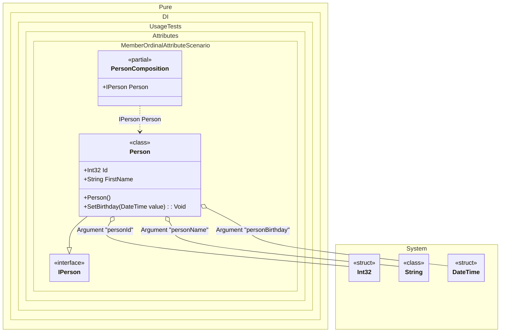

#### Member ordinal attribute

When applied to a field, property, method, or method parameter, the member participates in DI, ordered by ordinal (ascending).


```c#
using Shouldly;
using Pure.DI;
using System.Text;

DI.Setup(nameof(PersonComposition))
    .Arg<int>("personId")
    .Arg<string>("personName")
    .Arg<DateTime>("personBirthday")
    .Bind().To<Person>()

    // Composition root
    .Root<IPerson>("Person");

var composition = new PersonComposition(
    personId: 123,
    personName: "Nik",
    personBirthday: new DateTime(1977, 11, 16));

var person = composition.Person;
person.Name.ShouldBe("123 Nik 1977-11-16");

interface IPerson
{
    string Name { get; }
}

class Person : IPerson
{
    private readonly StringBuilder _name = new();

    public string Name => _name.ToString();

    // The Ordinal attribute specifies to perform an injection,
    // the integer value in the argument specifies
    // the ordinal of injection
    [Ordinal(0)] public int Id;

    [Ordinal(1)]
    public string FirstName
    {
        set
        {
            _name.Append(Id);
            _name.Append(' ');
            _name.Append(value);
        }
    }

    public void SetBirthday([Ordinal(2)] DateTime value)
    {
        _name.Append(' ');
        _name.Append($"{value:yyyy-MM-dd}");
    }
}
```

<details>
<summary>Running this code sample locally</summary>

- Make sure you have the [.NET SDK 10.0](https://dotnet.microsoft.com/en-us/download/dotnet/10.0) or later installed
```bash
dotnet --list-sdk
```
- Create a net10.0 (or later) console application
```bash
dotnet new console -n Sample
```
- Add references to the NuGet packages
  - [Pure.DI](https://www.nuget.org/packages/Pure.DI)
  - [Shouldly](https://www.nuget.org/packages/Shouldly)
```bash
dotnet add package Pure.DI
dotnet add package Shouldly
```
- Copy the example code into the _Program.cs_ file

You are ready to run the example 🚀
```bash
dotnet run
```

</details>

The `Ordinal` attribute is part of the API, but you can define your own in any assembly or namespace.
For an injection method, `Ordinal` can be placed on the method or its parameters. A method-level ordinal takes precedence; otherwise, the lowest parameter ordinal determines the method's execution order.
Required fields and required or selected `init` properties are assigned in the object initializer before regular member injection. Within regular member injection, lower ordinals run first; equal ordinals are ordered by field, property, and method, then by declaration order within each kind.
Negative ordinal values are supported. Use distinct values whenever business behavior depends on an exact order, especially across inherited members.

<details>
<summary>The following partial class will be generated</summary>

```c#
partial class PersonComposition
{
  private readonly int _argPersonId;
  private readonly string _argPersonName;
  private readonly DateTime _argPersonBirthday;

  [OrdinalAttribute(128)]
  public PersonComposition(int personId, string personName, DateTime personBirthday)
  {
    _argPersonId = personId;
    _argPersonName = personName ?? throw new ArgumentNullException(nameof(personName));
    _argPersonBirthday = personBirthday;
  }

  public IPerson Person
  {
    [MethodImpl(MethodImplOptions.AggressiveInlining)]
    get
    {
      var transientPerson = new Person();
      transientPerson.Id = _argPersonId;
      transientPerson.FirstName = _argPersonName;
      transientPerson.SetBirthday(_argPersonBirthday);
      return transientPerson;
    }
  }
}
```

</details>

Class diagram:


```mermaid
---
 config:
  class:
   hideEmptyMembersBox: true
---
classDiagram
	Person --|> IPerson
	PersonComposition ..> Person : IPerson Person
	Person o-- Int32 : Argument "personId"
	Person o-- String : Argument "personName"
	Person o-- DateTime : Argument "personBirthday"
	namespace Pure.DI.UsageTests.Attributes.MemberOrdinalAttributeScenario {
		class IPerson {
			<<interface>>
		}
		class Person {
				<<class>>
			+Person()
			+Int32 Id
			+String FirstName
			+SetBirthday(DateTime value) : Void
		}
		class PersonComposition {
		<<partial>>
		+IPerson Person
		}
	}
	namespace System {
		class DateTime {
				<<struct>>
		}
		class Int32 {
				<<struct>>
		}
		class String {
				<<class>>
		}
	}
```

See also:

- [Constructor ordinal attribute](constructor-ordinal-attribute.md)
- [Dependency attribute](dependency-attribute.md)

