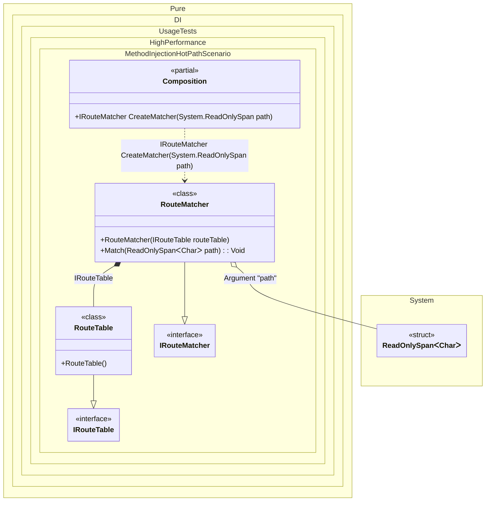

#### Method injection for a hot path

Method injection is useful when a service has stable dependencies but the hot-path input changes on every call. Instead of storing request state in a heap object, pass the per-call value as a root argument and consume it immediately in an initialization method.
The route matcher below has a singleton-like route table and receives a `ReadOnlySpan<char>` request path for each call. The generated root method passes the span into `Match(...)`, so the stack-only value stays inside the current call frame and is not stored in a field or property.


```c#
using Shouldly;
using Pure.DI;
using System;

DI.Setup(nameof(Composition))
    .Bind<IRouteTable>().To<RouteTable>()
    .Bind<IRouteMatcher>().To<RouteMatcher>()
    .RootArg<ReadOnlySpan<char>>("path")
    .Root<IRouteMatcher>("CreateMatcher");

var composition = new Composition();

var matcher = composition.CreateMatcher("/orders/42".AsSpan());
matcher.Route.ShouldBe("orders");

interface IRouteTable
{
    string Find(ReadOnlySpan<char> path);
}

sealed class RouteTable : IRouteTable
{
    public string Find(ReadOnlySpan<char> path) =>
        path.StartsWith("/orders/".AsSpan(), StringComparison.Ordinal)
            ? "orders"
            : "not-found";
}

interface IRouteMatcher
{
    string Route { get; }
}

sealed class RouteMatcher(IRouteTable routeTable) : IRouteMatcher
{
    public string Route { get; private set; } = "";

    [Ordinal(0)]
    public void Match(ReadOnlySpan<char> path) =>
        Route = routeTable.Find(path);
}
```

<details>
<summary>Running this code sample locally</summary>

- Make sure you have the [.NET SDK 10.0](https://dotnet.microsoft.com/en-us/download/dotnet/10.0) or later installed
```bash
dotnet --list-sdk
```
- Create a net10.0 (or later) console application
```bash
dotnet new console -n Sample
```
- Add references to the NuGet packages
  - [Pure.DI](https://www.nuget.org/packages/Pure.DI)
  - [Shouldly](https://www.nuget.org/packages/Shouldly)
```bash
dotnet add package Pure.DI
dotnet add package Shouldly
```
- Copy the example code into the _Program.cs_ file

You are ready to run the example 🚀
```bash
dotnet run
```

</details>

This is a good shape for parsers, routers, protocol decoders, validation pipelines, and other code that reads request data immediately. Keep the method side-effect small and do not store `Span<T>`/`ReadOnlySpan<T>` in the created object; Pure.DI reports diagnostics when stack-only values are routed to storage-like injection sites.

<details>
<summary>The following partial class will be generated</summary>

```c#
partial class Composition
{
  [MethodImpl(MethodImplOptions.AggressiveInlining)]
  public IRouteMatcher CreateMatcher(scoped ReadOnlySpan<char> path)
  {
    var transientRouteMatcher = new RouteMatcher(new RouteTable());
    transientRouteMatcher.Match(path);
    return transientRouteMatcher;
  }
}
```

</details>

Class diagram:



See also:

- [Span and ReadOnlySpan](span-and-readonlyspan.md)
- [Root arguments](root-arguments.md)
- [Method injection](method-injection.md)

