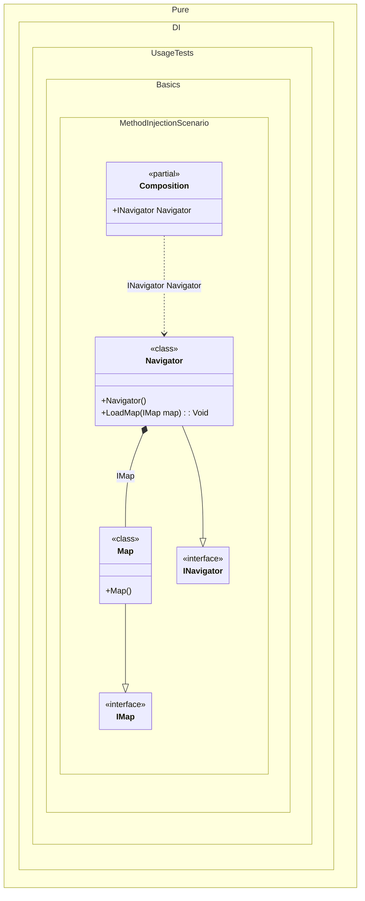

#### Method injection

To use dependency implementation for a method, simply add the _Ordinal_ attribute to that method, specifying the sequence number that will be used to define the call to that method:


```c#
using Shouldly;
using Pure.DI;

DI.Setup(nameof(Composition))
    .Bind<IMap>().To<Map>()
    .Bind<INavigator>().To<Navigator>()

    // Composition root
    .Root<INavigator>("Navigator");

var composition = new Composition();
var navigator = composition.Navigator;
navigator.CurrentMap.ShouldBeOfType<Map>();

interface IMap;

class Map : IMap;

interface INavigator
{
    IMap? CurrentMap { get; }
}

class Navigator : INavigator
{
    // The Dependency attribute specifies that the container should call this method
    // to inject the dependency.
    [Dependency]
    public void LoadMap(IMap map) =>
        CurrentMap = map;

    public IMap? CurrentMap { get; private set; }
}
```

<details>
<summary>Running this code sample locally</summary>

- Make sure you have the [.NET SDK 10.0](https://dotnet.microsoft.com/en-us/download/dotnet/10.0) or later is installed
```bash
dotnet --list-sdk
```
- Create a net10.0 (or later) console application
```bash
dotnet new console -n Sample
```
- Add references to NuGet packages
  - [Pure.DI](https://www.nuget.org/packages/Pure.DI)
  - [Shouldly](https://www.nuget.org/packages/Shouldly)
```bash
dotnet add package Pure.DI
dotnet add package Shouldly
```
- Copy the example code into the _Program.cs_ file

You are ready to run the example 🚀
```bash
dotnet run
```

</details>

The key points are:
- The method must be available to be called from a composition class
- The `Dependency` (or `Ordinal`) attribute is used to mark the method for injection
- The container automatically calls the method to inject dependencies

The following partial class will be generated:

```c#
partial class Composition
{
  [OrdinalAttribute(256)]
  public Composition()
  {
  }

  internal Composition(Composition parentScope)
  {
  }

  public INavigator Navigator
  {
    [MethodImpl(MethodImplOptions.AggressiveInlining)]
    get
    {
      var transientNavigator = new Navigator();
      transientNavigator.LoadMap(new Map());
      return transientNavigator;
    }
  }
}
```

Class diagram:



