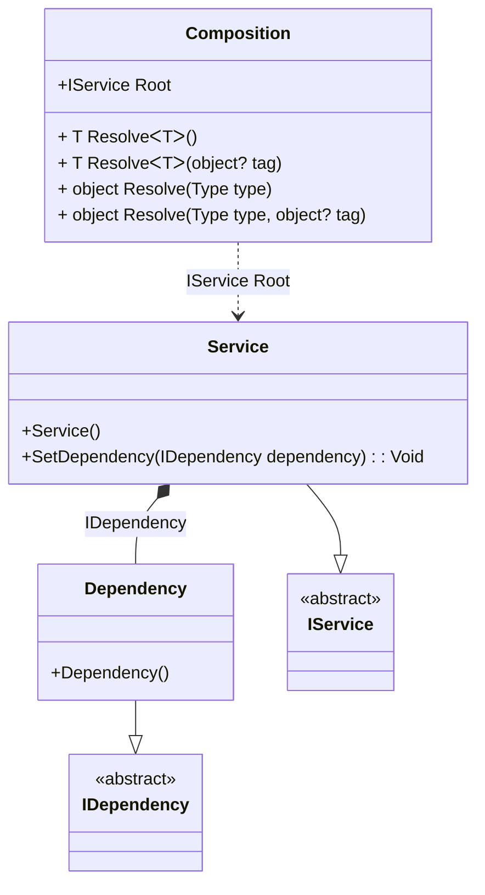

#### Method injection

[](../tests/Pure.DI.UsageTests/Basics/MethodInjectionScenario.cs)

To use dependency implementation for a method, simply add the _Ordinal_ attribute to that method, specifying the sequence number that will be used to define the call to that method:

```c#
interface IDependency;

class Dependency : IDependency;

interface IService
{
    IDependency? Dependency { get; }
}

class Service : IService
{
    [Ordinal(0)]
    public void SetDependency(IDependency dependency) =>
        Dependency = dependency;

    public IDependency? Dependency { get; private set; }
}

DI.Setup(nameof(Composition))
    .Bind<IDependency>().To<Dependency>()
    .Bind<IService>().To<Service>()

    // Composition root
    .Root<IService>("Root");

var composition = new Composition();
var service = composition.Root;
service.Dependency.ShouldBeOfType<Dependency>();
```

<details open>
<summary>Class Diagram</summary>



</details>

<details>
<summary>Pure.DI-generated partial class Composition</summary><blockquote>

```c#
partial class Composition
{
  private readonly Composition _rootM04D03di;
  
  public Composition()
  {
    _rootM04D03di = this;
  }
  
  internal Composition(Composition baseComposition)
  {
    _rootM04D03di = baseComposition._rootM04D03di;
  }
  
  public Pure.DI.UsageTests.Basics.MethodInjectionScenario.IService Root
  {
    get
    {
      Pure.DI.UsageTests.Basics.MethodInjectionScenario.Service transientM04D03di0_Service = new Pure.DI.UsageTests.Basics.MethodInjectionScenario.Service();
      transientM04D03di0_Service.SetDependency(new Pure.DI.UsageTests.Basics.MethodInjectionScenario.Dependency());
      return transientM04D03di0_Service;
    }
  }
  
  public T Resolve<T>()
  {
    return ResolverM04D03di<T>.Value.Resolve(this);
  }
  
  public T Resolve<T>(object? tag)
  {
    return ResolverM04D03di<T>.Value.ResolveByTag(this, tag);
  }
  
  public object Resolve(global::System.Type type)
  {
    var index = (int)(_bucketSizeM04D03di * ((uint)global::System.Runtime.CompilerServices.RuntimeHelpers.GetHashCode(type) % 1));
    var finish = index + _bucketSizeM04D03di;
    do {
      ref var pair = ref _bucketsM04D03di[index];
      if (pair.Key == type)
      {
        return pair.Value.Resolve(this);
      }
    } while (++index < finish);
    
    throw new global::System.InvalidOperationException($"Cannot resolve composition root of type {type}.");
  }
  
  public object Resolve(global::System.Type type, object? tag)
  {
    var index = (int)(_bucketSizeM04D03di * ((uint)global::System.Runtime.CompilerServices.RuntimeHelpers.GetHashCode(type) % 1));
    var finish = index + _bucketSizeM04D03di;
    do {
      ref var pair = ref _bucketsM04D03di[index];
      if (pair.Key == type)
      {
        return pair.Value.ResolveByTag(this, tag);
      }
    } while (++index < finish);
    
    throw new global::System.InvalidOperationException($"Cannot resolve composition root \"{tag}\" of type {type}.");
  }
  
  public override string ToString()
  {
    return
      "classDiagram\n" +
        "  class Composition {\n" +
          "    +IService Root\n" +
          "    + T ResolveᐸTᐳ()\n" +
          "    + T ResolveᐸTᐳ(object? tag)\n" +
          "    + object Resolve(Type type)\n" +
          "    + object Resolve(Type type, object? tag)\n" +
        "  }\n" +
        "  Dependency --|> IDependency : \n" +
        "  class Dependency {\n" +
          "    +Dependency()\n" +
        "  }\n" +
        "  Service --|> IService : \n" +
        "  class Service {\n" +
          "    +Service()\n" +
          "    +SetDependency(IDependency dependency) : Void\n" +
        "  }\n" +
        "  class IDependency {\n" +
          "    <<abstract>>\n" +
        "  }\n" +
        "  class IService {\n" +
          "    <<abstract>>\n" +
        "  }\n" +
        "  Service *--  Dependency : IDependency\n" +
        "  Composition ..> Service : IService Root";
  }
  
  private readonly static int _bucketSizeM04D03di;
  private readonly static global::Pure.DI.Pair<global::System.Type, global::Pure.DI.IResolver<Composition, object>>[] _bucketsM04D03di;
  
  static Composition()
  {
    var valResolverM04D03di_0000 = new ResolverM04D03di_0000();
    ResolverM04D03di<Pure.DI.UsageTests.Basics.MethodInjectionScenario.IService>.Value = valResolverM04D03di_0000;
    _bucketsM04D03di = global::Pure.DI.Buckets<global::System.Type, global::Pure.DI.IResolver<Composition, object>>.Create(
      1,
      out _bucketSizeM04D03di,
      new global::Pure.DI.Pair<global::System.Type, global::Pure.DI.IResolver<Composition, object>>[1]
      {
         new global::Pure.DI.Pair<global::System.Type, global::Pure.DI.IResolver<Composition, object>>(typeof(Pure.DI.UsageTests.Basics.MethodInjectionScenario.IService), valResolverM04D03di_0000)
      });
  }
  
  private sealed class ResolverM04D03di<T>: global::Pure.DI.IResolver<Composition, T>
  {
    public static global::Pure.DI.IResolver<Composition, T> Value = new ResolverM04D03di<T>();
    
    public T Resolve(Composition composite)
    {
      throw new global::System.InvalidOperationException($"Cannot resolve composition root of type {typeof(T)}.");
    }
    
    public T ResolveByTag(Composition composite, object tag)
    {
      throw new global::System.InvalidOperationException($"Cannot resolve composition root \"{tag}\" of type {typeof(T)}.");
    }
  }
  
  private sealed class ResolverM04D03di_0000: global::Pure.DI.IResolver<Composition, Pure.DI.UsageTests.Basics.MethodInjectionScenario.IService>
  {
    public Pure.DI.UsageTests.Basics.MethodInjectionScenario.IService Resolve(Composition composition)
    {
      return composition.Root;
    }
    
    public Pure.DI.UsageTests.Basics.MethodInjectionScenario.IService ResolveByTag(Composition composition, object tag)
    {
      switch (tag)
      {
        case null:
          return composition.Root;
      }
      throw new global::System.InvalidOperationException($"Cannot resolve composition root \"{tag}\" of type Pure.DI.UsageTests.Basics.MethodInjectionScenario.IService.");
    }
  }
}
```

</blockquote></details>

