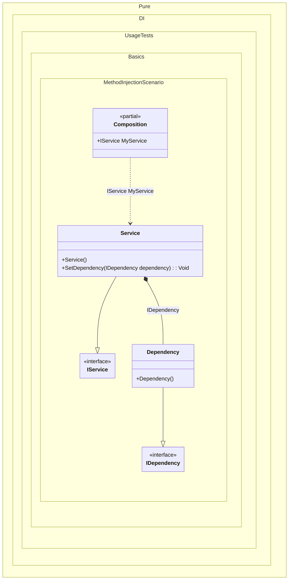

#### Method injection

[](../tests/Pure.DI.UsageTests/Basics/MethodInjectionScenario.cs)

To use dependency implementation for a method, simply add the _Ordinal_ attribute to that method, specifying the sequence number that will be used to define the call to that method:


```c#
using Pure.DI;
using Shouldly;

DI.Setup(nameof(Composition))
    .Bind<IDependency>().To<Dependency>()
    .Bind<IService>().To<Service>()

    // Composition root
    .Root<IService>("MyService");

var composition = new Composition();
var service = composition.MyService;
service.Dependency.ShouldBeOfType<Dependency>();

interface IDependency;

class Dependency : IDependency;

interface IService
{
    IDependency? Dependency { get; }
}

class Service : IService
{
    // The Ordinal attribute specifies to perform an injection,
    // the integer value in the argument specifies
    // the ordinal of injection
    [Ordinal(0)]
    public void SetDependency(IDependency dependency) =>
        Dependency = dependency;

    public IDependency? Dependency { get; private set; }
}
```


Class diagram:



