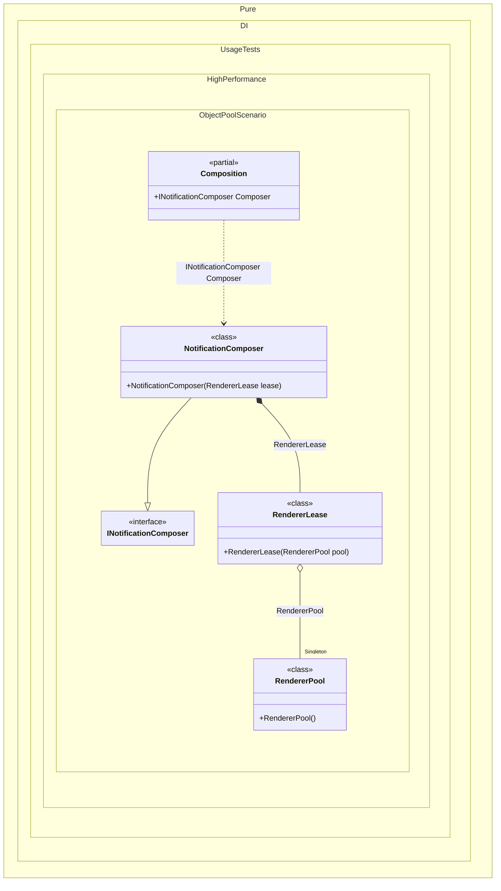

#### Object pool

Object pools help when a service is expensive to allocate but can be reset and reused safely. A pool keeps a small set of warm objects and gives each request a short-lived lease that returns the instance when disposed.
Here a notification pipeline rents an `EmailTemplateRenderer` for every message. The renderer owns reusable buffers that are cleared before it goes back to the pool, so the hot path avoids repeatedly allocating the renderer and its internal state.


```c#
using Shouldly;
using Pure.DI;
using static Pure.DI.Lifetime;

DI.Setup(nameof(Composition))
    .Bind().As(Singleton).To<RendererPool>()
    .Bind().To<RendererLease>()
    .Bind<INotificationComposer>().To<NotificationComposer>()
    .Root<INotificationComposer>("Composer");

var composition = new Composition();
var composer1 = composition.Composer;
using var composer2 = composition.Composer;

composer1.Compose("Ada", "Ready").ShouldBe("Hello Ada, Ready");
composer2.Compose("Linus", "Done").ShouldBe("Hello Linus, Done");

composer1.Lease.Renderer.ShouldNotBe(composer2.Lease.Renderer);

interface INotificationComposer : IDisposable
{
    RendererLease Lease { get; }

    string Compose(string userName, string message);
}

sealed class NotificationComposer(RendererLease lease) : INotificationComposer
{
    public RendererLease Lease => lease;

    public string Compose(string userName, string message) =>
        lease.Renderer.Render(userName, message);

    public void Dispose() => lease.Dispose();
}

sealed class RendererLease(RendererPool pool) : IDisposable
{
    public EmailTemplateRenderer Renderer { get; } = pool.Rent();

    public void Dispose()
    {
        Renderer.Reset();
        pool.Return(Renderer);
    }
}

sealed class RendererPool
{
    private readonly Stack<EmailTemplateRenderer> _renderers = [];

    public EmailTemplateRenderer Rent() =>
        _renderers.Count > 0 ? _renderers.Pop() : new EmailTemplateRenderer();

    public void Return(EmailTemplateRenderer renderer) =>
        _renderers.Push(renderer);
}

sealed class EmailTemplateRenderer
{
    private readonly List<string> _parts = [];

    public string Render(string userName, string message)
    {
        _parts.Add("Hello ");
        _parts.Add(userName);
        _parts.Add(", ");
        _parts.Add(message);
        return string.Concat(_parts);
    }

    public void Reset() => _parts.Clear();
}
```

<details>
<summary>Running this code sample locally</summary>

- Make sure you have the [.NET SDK 10.0](https://dotnet.microsoft.com/en-us/download/dotnet/10.0) or later installed
```bash
dotnet --list-sdk
```
- Create a net10.0 (or later) console application
```bash
dotnet new console -n Sample
```
- Add references to the NuGet packages
  - [Pure.DI](https://www.nuget.org/packages/Pure.DI)
  - [Shouldly](https://www.nuget.org/packages/Shouldly)
```bash
dotnet add package Pure.DI
dotnet add package Shouldly
```
- Copy the example code into the _Program.cs_ file

You are ready to run the example 🚀
```bash
dotnet run
```

</details>

This pattern fits serializers, encoders, template renderers, parsers, and compression helpers. It is not a replacement for regular DI lifetimes: only pool objects that have a clear reset rule, are not used concurrently while leased, and do not keep request-specific references after `Reset()`.
The composition owns the pool as a singleton, while each root call creates a lightweight lease. That keeps reuse explicit and avoids leaking pooled instances outside the operation scope.

<details>
<summary>The following partial class will be generated</summary>

```c#
partial class Composition
{
#if NET9_0_OR_GREATER
  private readonly Lock _lock = new Lock();
#else
  private readonly Object _lock = new Object();
#endif

  private RendererPool? _singletonCompositionInOtherProject;

  public INotificationComposer Composer
  {
    [MethodImpl(MethodImplOptions.AggressiveInlining)]
    get
    {
      if (_singletonCompositionInOtherProject is null)
        lock (_lock)
          if (_singletonCompositionInOtherProject is null)
          {
            _singletonCompositionInOtherProject = new RendererPool();
          }

      return new NotificationComposer(new RendererLease(_singletonCompositionInOtherProject));
    }
  }
}
```

</details>

Class diagram:



See also:

- [ArrayPool buffer](arraypool-buffer.md)
- [Factory](factory.md)

