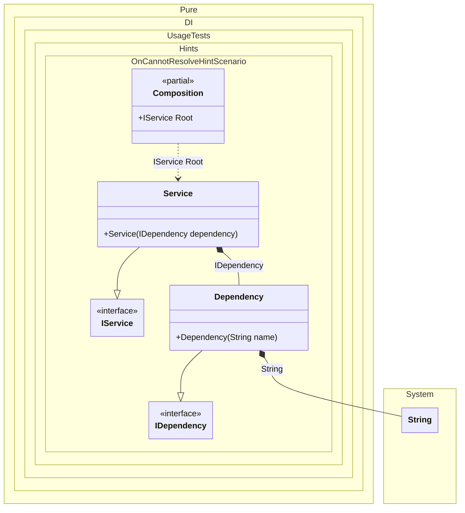

#### OnCannotResolve hint

[](../tests/Pure.DI.UsageTests/Hints/OnCannotResolveHintScenario.cs)

Hints are used to fine-tune code generation. The _OnCannotResolve_ hint determines whether to generate a partial `OnCannotResolve<T>(...)` method to handle a scenario where an instance which cannot be resolved.
In addition, setup hints can be comments before the _Setup_ method in the form ```hint = value```, for example: `// OnCannotResolveContractTypeNameRegularExpression = string`.


```c#
using Pure.DI;
using static Pure.DI.Hint;
using Shouldly;

// OnCannotResolveContractTypeNameRegularExpression = string
DI.Setup(nameof(Composition))
    .Hint(OnCannotResolve, "On")
    .Bind().To<Dependency>()
    .Bind().To<Service>()
    .Root<IService>("Root");

var composition = new Composition();
var service = composition.Root;
service.Dependency.ToString().ShouldBe("My name");


interface IDependency;

class Dependency(string name) : IDependency
{
    public override string ToString() => name;
}

interface IService
{
    IDependency Dependency { get; }
}

class Service(IDependency dependency) : IService
{
    public IDependency Dependency { get; } = dependency;
}

partial class Composition
{
    private partial T OnCannotResolve<T>(
        object? tag,
        Lifetime lifetime)
    {
        if (typeof(T) == typeof(string))
        {
            return (T)(object)"My name";
        }

        throw new InvalidOperationException("Cannot resolve.");
    }
}
```

The `OnCannotResolveContractTypeNameRegularExpression` hint helps define the set of types that require manual dependency resolution. You can use it to specify a regular expression to filter the full type name.
For more hints, see [this](README.md#setup-hints) page.


Class diagram:



