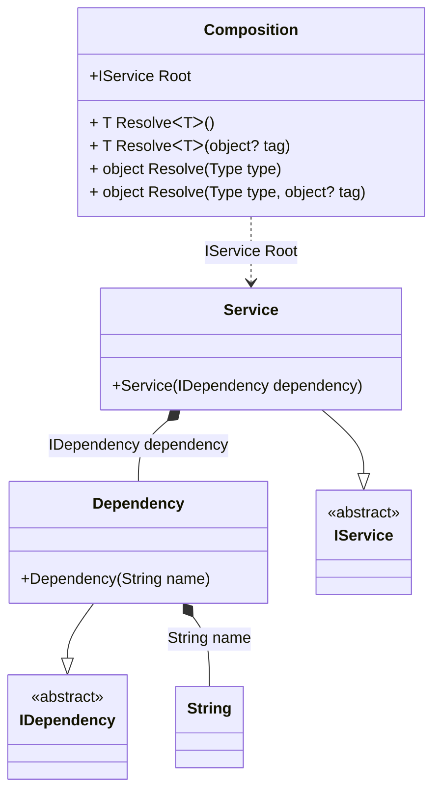

#### OnCannotResolve hint

[](../tests/Pure.DI.UsageTests/Hints/OnCannotResolveHintScenario.cs)

Hints are used to fine-tune code generation. The _OnCannotResolve_ hint determines whether to generate a partial `OnCannotResolve<T>(...)` method to handle a scenario where an instance which cannot be resolved.
In addition, setup hints can be comments before the _Setup_ method in the form ```hint = value```, for example: `// OnCannotResolveContractTypeNameRegularExpression = string`.

```c#
using static Hint;

interface IDependency
{
}

class Dependency : IDependency
{
    private readonly string _name;

    public Dependency(string name) => _name = name;

    public override string ToString() => _name;
}

interface IService
{
    IDependency Dependency { get; }
}

class Service : IService
{
    public Service(IDependency dependency) =>
        Dependency = dependency;

    public IDependency Dependency { get; }

}

partial class Composition
{
    [SuppressMessage("Performance", "CA1822:Mark members as static")]
    private partial T OnCannotResolve<T>(
        object? tag,
        Lifetime lifetime)
    {
        if (typeof(T) == typeof(string))
        {
            return (T)(object)"Dependency with name";
        }

        throw new InvalidOperationException("Cannot resolve.");
    }
}

// OnCannotResolveContractTypeNameRegularExpression = string
DI.Setup("Composition")
    .Hint(OnCannotResolve, "On")
    .Bind<IDependency>().To<Dependency>()
    .Bind<IService>().Tags().To<Service>().Root<IService>("Root");

var composition = new Composition();
var service = composition.Root;
service.Dependency.ToString().ShouldBe("Dependency with name");
        
```

<details open>
<summary>Class Diagram</summary>



</details>

<details>
<summary>Pure.DI-generated partial class Composition</summary><blockquote>

```c#
partial class Composition
{
  public Composition()
  {
  }
  
  internal Composition(Composition parent)
  {
  }
  
  #region Composition Roots
  public Pure.DI.UsageTests.Hints.OnCannotResolveHintScenario.IService Root
  {
    [global::System.Runtime.CompilerServices.MethodImpl((global::System.Runtime.CompilerServices.MethodImplOptions)0x300)]
    get
    {
      string transientM08D01di_0002 = OnCannotResolve<string>(null, Pure.DI.Lifetime.Transient);
      Pure.DI.UsageTests.Hints.OnCannotResolveHintScenario.Dependency transientM08D01di_0001 = new Pure.DI.UsageTests.Hints.OnCannotResolveHintScenario.Dependency(transientM08D01di_0002);
      Pure.DI.UsageTests.Hints.OnCannotResolveHintScenario.Service transientM08D01di_0000 = new Pure.DI.UsageTests.Hints.OnCannotResolveHintScenario.Service(transientM08D01di_0001);
      return transientM08D01di_0000;
    }
  }
  #endregion
  
  #region API
  #if NETSTANDARD2_0_OR_GREATER || NETCOREAPP || NET40_OR_GREATER
  [global::System.Diagnostics.Contracts.Pure]
  #endif
  [global::System.Runtime.CompilerServices.MethodImpl((global::System.Runtime.CompilerServices.MethodImplOptions)0x300)]
  public T Resolve<T>()
  {
    return ResolverM08D01di<T>.Value.Resolve(this);
  }
  
  #if NETSTANDARD2_0_OR_GREATER || NETCOREAPP || NET40_OR_GREATER
  [global::System.Diagnostics.Contracts.Pure]
  #endif
  [global::System.Runtime.CompilerServices.MethodImpl((global::System.Runtime.CompilerServices.MethodImplOptions)0x300)]
  public T Resolve<T>(object? tag)
  {
    return ResolverM08D01di<T>.Value.ResolveByTag(this, tag);
  }
  
  #if NETSTANDARD2_0_OR_GREATER || NETCOREAPP || NET40_OR_GREATER
  [global::System.Diagnostics.Contracts.Pure]
  #endif
  [global::System.Runtime.CompilerServices.MethodImpl((global::System.Runtime.CompilerServices.MethodImplOptions)0x300)]
  public object Resolve(global::System.Type type)
  {
    var index = (int)(_bucketSizeM08D01di * ((uint)global::System.Runtime.CompilerServices.RuntimeHelpers.GetHashCode(type) % 1));
    var finish = index + _bucketSizeM08D01di;
    do {
      ref var pair = ref _bucketsM08D01di[index];
      if (ReferenceEquals(pair.Key, type))
      {
        return pair.Value.Resolve(this);
      }
    } while (++index < finish);
    
    throw new global::System.InvalidOperationException($"Cannot resolve composition root of type {type}.");
  }
  
  #if NETSTANDARD2_0_OR_GREATER || NETCOREAPP || NET40_OR_GREATER
  [global::System.Diagnostics.Contracts.Pure]
  #endif
  [global::System.Runtime.CompilerServices.MethodImpl((global::System.Runtime.CompilerServices.MethodImplOptions)0x300)]
  public object Resolve(global::System.Type type, object? tag)
  {
    var index = (int)(_bucketSizeM08D01di * ((uint)global::System.Runtime.CompilerServices.RuntimeHelpers.GetHashCode(type) % 1));
    var finish = index + _bucketSizeM08D01di;
    do {
      ref var pair = ref _bucketsM08D01di[index];
      if (ReferenceEquals(pair.Key, type))
      {
        return pair.Value.ResolveByTag(this, tag);
      }
    } while (++index < finish);
    
    throw new global::System.InvalidOperationException($"Cannot resolve composition root \"{tag}\" of type {type}.");
  }
  
  [global::System.Runtime.CompilerServices.MethodImpl((global::System.Runtime.CompilerServices.MethodImplOptions)0x300)]
  private partial T OnCannotResolve<T>(object? tag, global::Pure.DI.Lifetime lifetime);
  #endregion
  
  public override string ToString()
  {
    return
      "classDiagram\n" +
        "  class Composition {\n" +
          "    +IService Root\n" +
          "    + T ResolveᐸTᐳ()\n" +
          "    + T ResolveᐸTᐳ(object? tag)\n" +
          "    + object Resolve(Type type)\n" +
          "    + object Resolve(Type type, object? tag)\n" +
        "  }\n" +
        "  class String\n" +
        "  Dependency --|> IDependency : \n" +
        "  class Dependency {\n" +
          "    +Dependency(String name)\n" +
        "  }\n" +
        "  Service --|> IService : \n" +
        "  class Service {\n" +
          "    +Service(IDependency dependency)\n" +
        "  }\n" +
        "  class IDependency {\n" +
          "    <<abstract>>\n" +
        "  }\n" +
        "  class IService {\n" +
          "    <<abstract>>\n" +
        "  }\n" +
        "  Dependency *--  String : String name\n" +
        "  Service *--  Dependency : IDependency dependency\n" +
        "  Composition ..> Service : IService Root";
  }
  
  private readonly static int _bucketSizeM08D01di;
  private readonly static global::Pure.DI.Pair<global::System.Type, global::Pure.DI.IResolver<Composition, object>>[] _bucketsM08D01di;
  
  static Composition()
  {
    ResolverM08D01di_0000 valResolverM08D01di_0000 = new ResolverM08D01di_0000();
    ResolverM08D01di<Pure.DI.UsageTests.Hints.OnCannotResolveHintScenario.IService>.Value = valResolverM08D01di_0000;
    _bucketsM08D01di = global::Pure.DI.Buckets<global::System.Type, global::Pure.DI.IResolver<Composition, object>>.Create(
      1,
      out _bucketSizeM08D01di,
      new global::Pure.DI.Pair<global::System.Type, global::Pure.DI.IResolver<Composition, object>>[1]
      {
         new global::Pure.DI.Pair<global::System.Type, global::Pure.DI.IResolver<Composition, object>>(typeof(Pure.DI.UsageTests.Hints.OnCannotResolveHintScenario.IService), valResolverM08D01di_0000)
      });
  }
  
  #region Resolvers
  private sealed class ResolverM08D01di<T>: global::Pure.DI.IResolver<Composition, T>
  {
    public static global::Pure.DI.IResolver<Composition, T> Value = new ResolverM08D01di<T>();
    
    public T Resolve(Composition composite)
    {
      throw new global::System.InvalidOperationException($"Cannot resolve composition root of type {typeof(T)}.");
    }
    
    public T ResolveByTag(Composition composite, object tag)
    {
      throw new global::System.InvalidOperationException($"Cannot resolve composition root \"{tag}\" of type {typeof(T)}.");
    }
  }
  
  private sealed class ResolverM08D01di_0000: global::Pure.DI.IResolver<Composition, Pure.DI.UsageTests.Hints.OnCannotResolveHintScenario.IService>
  {
    [global::System.Runtime.CompilerServices.MethodImpl((global::System.Runtime.CompilerServices.MethodImplOptions)0x300)]
    public Pure.DI.UsageTests.Hints.OnCannotResolveHintScenario.IService Resolve(Composition composition)
    {
      return composition.Root;
    }
    
    [global::System.Runtime.CompilerServices.MethodImpl((global::System.Runtime.CompilerServices.MethodImplOptions)0x300)]
    public Pure.DI.UsageTests.Hints.OnCannotResolveHintScenario.IService ResolveByTag(Composition composition, object tag)
    {
      if (Equals(tag, null)) return composition.Root;
      throw new global::System.InvalidOperationException($"Cannot resolve composition root \"{tag}\" of type Pure.DI.UsageTests.Hints.OnCannotResolveHintScenario.IService.");
    }
  }
  #endregion
}
```

</blockquote></details>


The `OnCannotResolveContractTypeNameRegularExpression` hint helps define the set of types that require manual dependency resolution. You can use it to specify a regular expression to filter the full type name.
For more hints, see [this](https://github.com/DevTeam/Pure.DI/blob/master/README.md#setup-hints) page.
