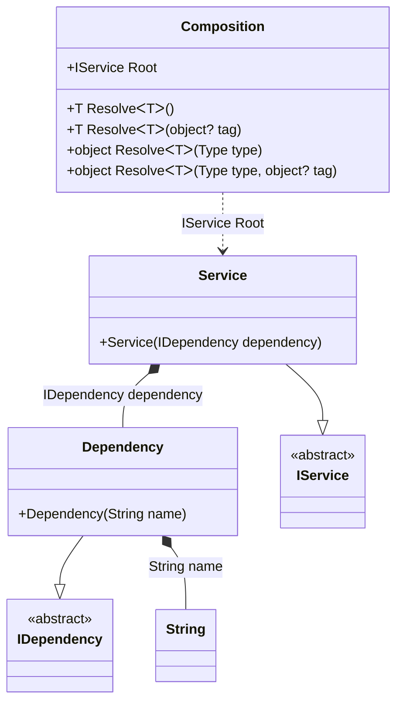

#### OnCannotResolve Hint

[](../tests/Pure.DI.UsageTests/Hints/OnCannotResolveHintScenario.cs)

The _OnCannotResolve_ hint determines whether to generate a partial `OnCannotResolve<T>(...)` method to handle a scenario where an instance which cannot be resolved.

```c#
public interface IDependency
{
}

public class Dependency : IDependency
{
    private readonly string _name;

    public Dependency(string name)
    {
        _name = name;
    }

    public override string ToString() => _name;
}

public interface IService
{
    IDependency Dependency { get; }
}

public class Service : IService
{
    public Service(IDependency dependency)
    {
        Dependency = dependency;
    }

    public IDependency Dependency { get; }

}

internal partial class Composition
{
    [SuppressMessage("Performance", "CA1822:Mark members as static")]
    private partial T OnCannotResolve<T>(object? tag, Lifetime lifetime)
    {
        if (typeof(T) == typeof(string))
        {
            return (T)(object)"Dependency with name";
        }

        throw new InvalidOperationException("Cannot resolve.");
    }
}

DI.Setup("Composition")
    .Hint(Hint.OnCannotResolve, "On")
    .Hint(Hint.OnCannotResolveContractTypeNameRegularExpression, "string")
    .Bind<IDependency>().To<Dependency>()
    .Bind<IService>().Tags().To<Service>().Root<IService>("Root");

var composition = new Composition();
var service = composition.Root;
service.Dependency.ToString().ShouldBe("Dependency with name");
        
```

<details open>
<summary>Class Diagram</summary>



</details>

<details>
<summary>Generated Code</summary>

```c#
partial class Composition
{
  public Composition()
  {
  }
  
  internal Composition(Composition parent)
  {
  }
  
  #region Composition Roots
  public Pure.DI.UsageTests.Hints.OnCannotResolveHintScenario.IService Root
  {
    [global::System.Runtime.CompilerServices.MethodImpl((global::System.Runtime.CompilerServices.MethodImplOptions)0x300)]
    get
    {
      string v78Local3F4E1C = OnCannotResolve<string>(null, Pure.DI.Lifetime.Transient);
      Pure.DI.UsageTests.Hints.OnCannotResolveHintScenario.Dependency v77Local3F4E1C = new Pure.DI.UsageTests.Hints.OnCannotResolveHintScenario.Dependency(v78Local3F4E1C);
      Pure.DI.UsageTests.Hints.OnCannotResolveHintScenario.Service v76Local3F4E1C = new Pure.DI.UsageTests.Hints.OnCannotResolveHintScenario.Service(v77Local3F4E1C);
      return v76Local3F4E1C;
    }
  }
  #endregion
  
  #region API
  #if NETSTANDARD2_0_OR_GREATER || NETCOREAPP || NET40_OR_GREATER
  [global::System.Diagnostics.Contracts.Pure]
  #endif
  [global::System.Runtime.CompilerServices.MethodImpl((global::System.Runtime.CompilerServices.MethodImplOptions)0x300)]
  public T Resolve<T>()
  {
    return Resolver3F4E1C<T>.Value.Resolve(this);
  }
  
  #if NETSTANDARD2_0_OR_GREATER || NETCOREAPP || NET40_OR_GREATER
  [global::System.Diagnostics.Contracts.Pure]
  #endif
  [global::System.Runtime.CompilerServices.MethodImpl((global::System.Runtime.CompilerServices.MethodImplOptions)0x300)]
  public T Resolve<T>(object? tag)
  {
    return Resolver3F4E1C<T>.Value.ResolveByTag(this, tag);
  }
  
  #if NETSTANDARD2_0_OR_GREATER || NETCOREAPP || NET40_OR_GREATER
  [global::System.Diagnostics.Contracts.Pure]
  #endif
  [global::System.Runtime.CompilerServices.MethodImpl((global::System.Runtime.CompilerServices.MethodImplOptions)0x300)]
  public object Resolve(global::System.Type type)
  {
    int index = (int)(_bucketSize3F4E1C * ((uint)global::System.Runtime.CompilerServices.RuntimeHelpers.GetHashCode(type) % 1));
    ref var pair = ref _buckets3F4E1C[index];
    if (ReferenceEquals(pair.Key, type))
    {
      return pair.Value.Resolve(this);
    }
    
    int maxIndex = index + _bucketSize3F4E1C;
    for (int i = index + 1; i < maxIndex; i++)
    {
      pair = ref _buckets3F4E1C[i];
      if (ReferenceEquals(pair.Key, type))
      {
        return pair.Value.Resolve(this);
      }
    }
    
    throw new global::System.InvalidOperationException($"Cannot resolve composition root of type {type}.");
  }
  
  #if NETSTANDARD2_0_OR_GREATER || NETCOREAPP || NET40_OR_GREATER
  [global::System.Diagnostics.Contracts.Pure]
  #endif
  [global::System.Runtime.CompilerServices.MethodImpl((global::System.Runtime.CompilerServices.MethodImplOptions)0x300)]
  public object Resolve(global::System.Type type, object? tag)
  {
    int index = (int)(_bucketSize3F4E1C * ((uint)global::System.Runtime.CompilerServices.RuntimeHelpers.GetHashCode(type) % 1));
    ref var pair = ref _buckets3F4E1C[index];
    if (ReferenceEquals(pair.Key, type))
    {
      return pair.Value.ResolveByTag(this, tag);
    }
    
    int maxIndex = index + _bucketSize3F4E1C;
    for (int i = index + 1; i < maxIndex; i++)
    {
      pair = ref _buckets3F4E1C[i];
      if (ReferenceEquals(pair.Key, type))
      {
        return pair.Value.ResolveByTag(this, tag);
      }
    }
    
    throw new global::System.InvalidOperationException($"Cannot resolve composition root of type {type}.");
  }
  
  [global::System.Runtime.CompilerServices.MethodImpl((global::System.Runtime.CompilerServices.MethodImplOptions)0x300)]
  private partial T OnCannotResolve<T>(object? tag, global::Pure.DI.Lifetime lifetime);
  #endregion
  
  public override string ToString()
  {
    return
      "classDiagram\n" +
        "  class Composition {\n" +
          "    +IService Root\n" +
          "    +T ResolveᐸTᐳ()\n" +
          "    +T ResolveᐸTᐳ(object? tag)\n" +
          "    +object ResolveᐸTᐳ(Type type)\n" +
          "    +object ResolveᐸTᐳ(Type type, object? tag)\n" +
        "  }\n" +
        "  class String\n" +
        "  Dependency --|> IDependency : \n" +
        "  class Dependency {\n" +
          "    +Dependency(String name)\n" +
        "  }\n" +
        "  Service --|> IService : \n" +
        "  class Service {\n" +
          "    +Service(IDependency dependency)\n" +
        "  }\n" +
        "  class IDependency {\n" +
          "    <<abstract>>\n" +
        "  }\n" +
        "  class IService {\n" +
          "    <<abstract>>\n" +
        "  }\n" +
        "  Dependency *--  String : String name\n" +
        "  Service *--  Dependency : IDependency dependency\n" +
        "  Composition ..> Service : IService Root";
  }
  
  private readonly static int _bucketSize3F4E1C;
  private readonly static global::Pure.DI.Pair<global::System.Type, global::Pure.DI.IResolver<Composition, object>>[] _buckets3F4E1C;
  
  static Composition()
  {
    Resolver3F4E1C0 valResolver3F4E1C0 = new Resolver3F4E1C0();
    Resolver3F4E1C<Pure.DI.UsageTests.Hints.OnCannotResolveHintScenario.IService>.Value = valResolver3F4E1C0;
    _buckets3F4E1C = global::Pure.DI.Buckets<global::System.Type, global::Pure.DI.IResolver<Composition, object>>.Create(
      1,
      out _bucketSize3F4E1C,
      new global::Pure.DI.Pair<global::System.Type, global::Pure.DI.IResolver<Composition, object>>[1]
      {
         new global::Pure.DI.Pair<global::System.Type, global::Pure.DI.IResolver<Composition, object>>(typeof(Pure.DI.UsageTests.Hints.OnCannotResolveHintScenario.IService), valResolver3F4E1C0)
      });
  }
  
  #region Resolvers
  #pragma warning disable CS0649
  private class Resolver3F4E1C<T>
  {
    public static global::Pure.DI.IResolver<Composition, T> Value;
  }
  
  private sealed class Resolver3F4E1C0: global::Pure.DI.IResolver<Composition, Pure.DI.UsageTests.Hints.OnCannotResolveHintScenario.IService>
  {
    [global::System.Runtime.CompilerServices.MethodImpl((global::System.Runtime.CompilerServices.MethodImplOptions)0x300)]
    public Pure.DI.UsageTests.Hints.OnCannotResolveHintScenario.IService Resolve(Composition composition)
    {
      return composition.Root;
    }
    
    [global::System.Runtime.CompilerServices.MethodImpl((global::System.Runtime.CompilerServices.MethodImplOptions)0x300)]
    public Pure.DI.UsageTests.Hints.OnCannotResolveHintScenario.IService ResolveByTag(Composition composition, object tag)
    {
      if (Equals(tag, null)) return composition.Root;
      throw new global::System.InvalidOperationException($"Cannot resolve composition root \"{tag}\" of type Pure.DI.UsageTests.Hints.OnCannotResolveHintScenario.IService.");
    }
  }
  #pragma warning restore CS0649
  #endregion
}
```

</details>

