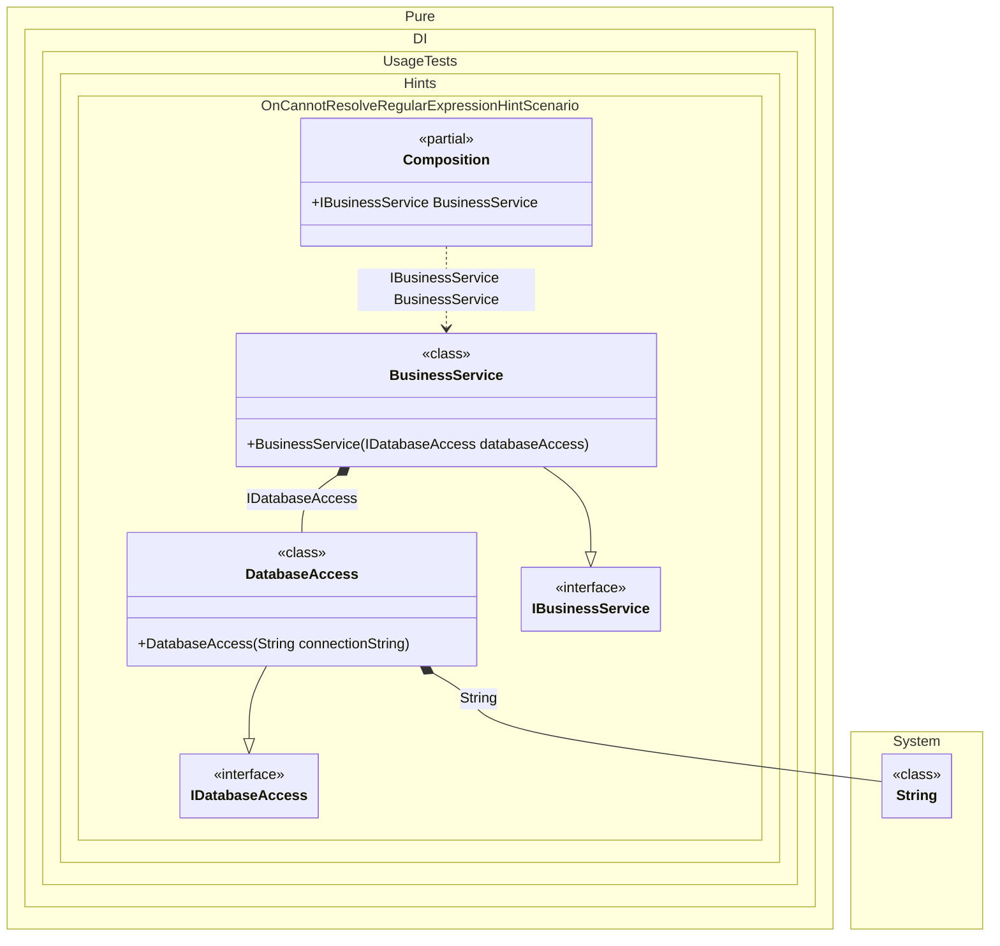

#### OnCannotResolve regular expression hint

Hints are used to fine-tune code generation. The _OnCannotResolve_ hint determines whether to generate a partial `OnCannotResolve<T>(...)` method to handle a scenario where an instance which cannot be resolved.
In addition, setup hints can be comments before the _Setup_ method in the form ```hint = value```, for example: `// OnCannotResolveContractTypeNameRegularExpression = string`.


```c#
using Shouldly;
using Pure.DI;
using static Pure.DI.Hint;

// The "OnCannotResolveContractTypeNameRegularExpression" hint defines a regular expression
// to filter the full type name of unresolved dependencies.
// In this case, we want to manually handle only "string" types.
// OnCannotResolveContractTypeNameRegularExpression = string
DI.Setup(nameof(Composition))
    .Hint(OnCannotResolve, "On")
    .Bind().To<DatabaseAccess>()
    .Bind().To<BusinessService>()
    .Root<IBusinessService>("BusinessService");

var composition = new Composition();
var businessService = composition.BusinessService;

// Check that the connection string was successfully injected via OnCannotResolve
businessService.DatabaseAccess.ConnectionString.ShouldBe("Server=localhost;Database=MyDb;");


interface IDatabaseAccess
{
    string ConnectionString { get; }
}

// A service requiring a connection string.
// The connection string is a primitive type 'string' that is not bound in the DI setup.
// It will be resolved via the 'OnCannotResolve' fallback method.
class DatabaseAccess(string connectionString) : IDatabaseAccess
{
    public string ConnectionString { get; } = connectionString;
}

interface IBusinessService
{
    IDatabaseAccess DatabaseAccess { get; }
}

class BusinessService(IDatabaseAccess databaseAccess) : IBusinessService
{
    public IDatabaseAccess DatabaseAccess { get; } = databaseAccess;
}

partial class Composition
{
    // This method is called when a dependency cannot be resolved by the standard DI container.
    // It serves as a fallback mechanism.
    private partial T OnCannotResolve<T>(
        object? tag,
        Lifetime lifetime)
    {
        // Check if the requested type is a string (according to the hint filter)
        if (typeof(T) == typeof(string))
        {
            // Provide the configuration value (e.g., loaded from a file)
            return (T)(object)"Server=localhost;Database=MyDb;";
        }

        throw new InvalidOperationException("Cannot resolve " + typeof(T));
    }
}
```

<details>
<summary>Running this code sample locally</summary>

- Make sure you have the [.NET SDK 10.0](https://dotnet.microsoft.com/en-us/download/dotnet/10.0) or later is installed
```bash
dotnet --list-sdk
```
- Create a net10.0 (or later) console application
```bash
dotnet new console -n Sample
```
- Add references to NuGet packages
  - [Pure.DI](https://www.nuget.org/packages/Pure.DI)
  - [Shouldly](https://www.nuget.org/packages/Shouldly)
```bash
dotnet add package Pure.DI
dotnet add package Shouldly
```
- Copy the example code into the _Program.cs_ file

You are ready to run the example 🚀
```bash
dotnet run
```

</details>

The `OnCannotResolveContractTypeNameRegularExpression` hint helps define the set of types that require manual dependency resolution. You can use it to specify a regular expression to filter the full type name.
For more hints, see [this](README.md#setup-hints) page.

The following partial class will be generated:

```c#
partial class Composition
{
  [OrdinalAttribute(256)]
  public Composition()
  {
  }

  internal Composition(Composition parentScope)
  {
  }

  public IBusinessService BusinessService
  {
    [MethodImpl(MethodImplOptions.AggressiveInlining)]
    get
    {
      return new BusinessService(new DatabaseAccess(OnCannotResolve<string>(null, Lifetime.Transient)));
    }
  }


  private partial T OnCannotResolve<T>(object? tag, Lifetime lifetime);
}
```

Class diagram:



