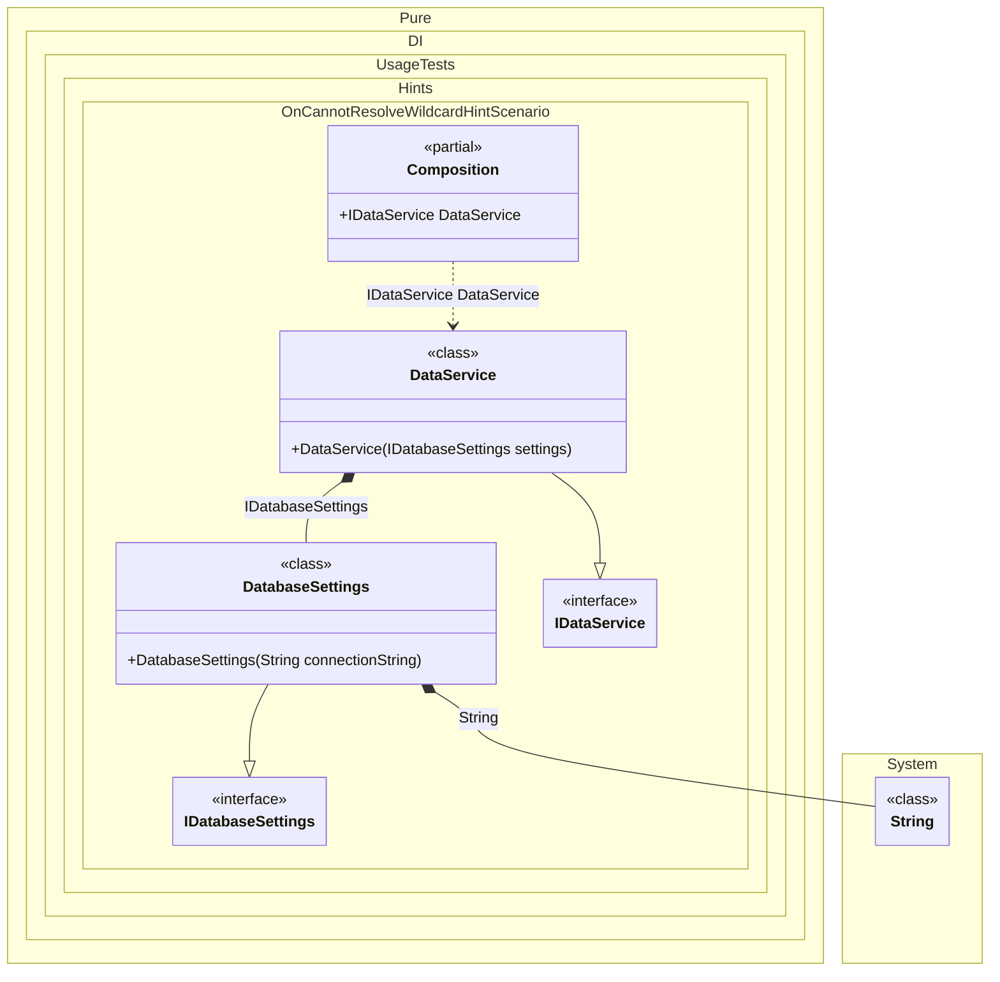

#### OnCannotResolve wildcard hint

Hints are used to fine-tune code generation. The _OnCannotResolve_ hint determines whether to generate a partial `OnCannotResolve<T>(...)` method to handle a scenario where an instance which cannot be resolved.
In addition, setup hints can be comments before the _Setup_ method in the form ```hint = value```, for example: `// OnCannotResolveContractTypeNameWildcard = string`.


```c#
using Shouldly;
using Pure.DI;
using static Pure.DI.Hint;

// OnCannotResolveContractTypeNameWildcard = string
DI.Setup(nameof(Composition))
    .Hint(OnCannotResolve, "On")
    .Bind().To<DatabaseSettings>()
    .Bind().To<DataService>()
    .Root<IDataService>("DataService");

var composition = new Composition();
var dataService = composition.DataService;
dataService.Settings.ConnectionString.ShouldBe("Server=localhost;");


interface IDatabaseSettings
{
    string ConnectionString { get; }
}

class DatabaseSettings(string connectionString) : IDatabaseSettings
{
    public string ConnectionString { get; } = connectionString;
}

interface IDataService
{
    IDatabaseSettings Settings { get; }
}

class DataService(IDatabaseSettings settings) : IDataService
{
    public IDatabaseSettings Settings { get; } = settings;
}

partial class Composition
{
    private partial T OnCannotResolve<T>(
        object? tag,
        Lifetime lifetime)
    {
        // Emulates obtaining a configuration value
        if (typeof(T) == typeof(string))
        {
            return (T)(object)"Server=localhost;";
        }

        throw new InvalidOperationException("Cannot resolve.");
    }
}
```

<details>
<summary>Running this code sample locally</summary>

- Make sure you have the [.NET SDK 10.0](https://dotnet.microsoft.com/en-us/download/dotnet/10.0) or later is installed
```bash
dotnet --list-sdk
```
- Create a net10.0 (or later) console application
```bash
dotnet new console -n Sample
```
- Add references to NuGet packages
  - [Pure.DI](https://www.nuget.org/packages/Pure.DI)
  - [Shouldly](https://www.nuget.org/packages/Shouldly)
```bash
dotnet add package Pure.DI
dotnet add package Shouldly
```
- Copy the example code into the _Program.cs_ file

You are ready to run the example 🚀
```bash
dotnet run
```

</details>

The `OnCannotResolveContractTypeNameWildcard` hint helps define the set of types that require manual dependency resolution. You can use it to specify a wildcard to filter the full type name.
For more hints, see [this](README.md#setup-hints) page.

The following partial class will be generated:

```c#
partial class Composition
{
  public IDataService DataService
  {
    [MethodImpl(MethodImplOptions.AggressiveInlining)]
    get
    {
      return new DataService(new DatabaseSettings(OnCannotResolve<string>(null, Lifetime.Transient)));
    }
  }


  private partial T OnCannotResolve<T>(object? tag, Lifetime lifetime);
}
```

Class diagram:



