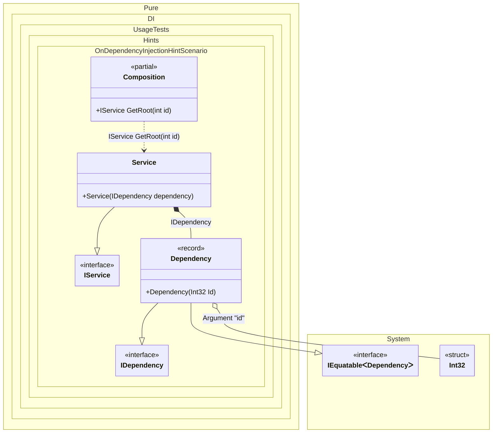

#### OnDependencyInjection hint

[](../tests/Pure.DI.UsageTests/Hints/OnDependencyInjectionHintScenario.cs)

Hints are used to fine-tune code generation. The _OnDependencyInjection_ hint determines whether to generate partial _OnDependencyInjection_ method to control of dependency injection.
In addition, setup hints can be comments before the _Setup_ method in the form ```hint = value```, for example: `// OnDependencyInjection = On`.


```c#
using static Hint;

interface IDependency;

record Dependency(int Id) : IDependency;

interface IService
{
    IDependency Dependency { get; }
}

class Service(IDependency dependency) : IService
{
    public IDependency Dependency { get; } = dependency;
}

partial class Composition
{
    private readonly List<string> _log = [];

    public Composition(List<string> log) : this() =>
        _log = log;

    private partial T OnDependencyInjection<T>(
        in T value,
        object? tag,
        Lifetime lifetime)
    {
        _log.Add($"{value?.GetType().Name} injected");
        return value;
    }
}

// OnDependencyInjection = On
DI.Setup(nameof(Composition))
    .Hint(OnDependencyInjectionContractTypeNameRegularExpression, "(.*IDependency|int)$")
    .RootArg<int>("id")
    .Bind().To<Dependency>()
    .Bind().To<Service>()
    .Root<IService>("GetRoot");

var log = new List<string>();
var composition = new Composition(log);
var service = composition.GetRoot(33);

log.ShouldBe([
    "Int32 injected",
    "Dependency injected"
]);
```

The `OnDependencyInjectionContractTypeNameRegularExpression` hint helps identify the set of types that require injection control. You can use it to specify a regular expression to filter the full name of a type.
For more hints, see [this](README.md#setup-hints) page.

The following partial class will be generated:

```c#
partial class Composition
{
  private readonly Composition _root;

  [OrdinalAttribute(128)]
  public Composition()
  {
    _root = this;
  }

  internal Composition(Composition parentScope)
  {
    _root = (parentScope ?? throw new ArgumentNullException(nameof(parentScope)))._root;
  }

  [MethodImpl(MethodImplOptions.AggressiveInlining)]
  public IService GetRoot(int id)
  {
    return new Service(OnDependencyInjection<IDependency>(new Dependency(OnDependencyInjection<int>(id, null, Lifetime.Transient)), null, Lifetime.Transient));
  }


  private partial T OnDependencyInjection<T>(in T value, object? tag, Lifetime lifetime);
}
```

Class diagram:



