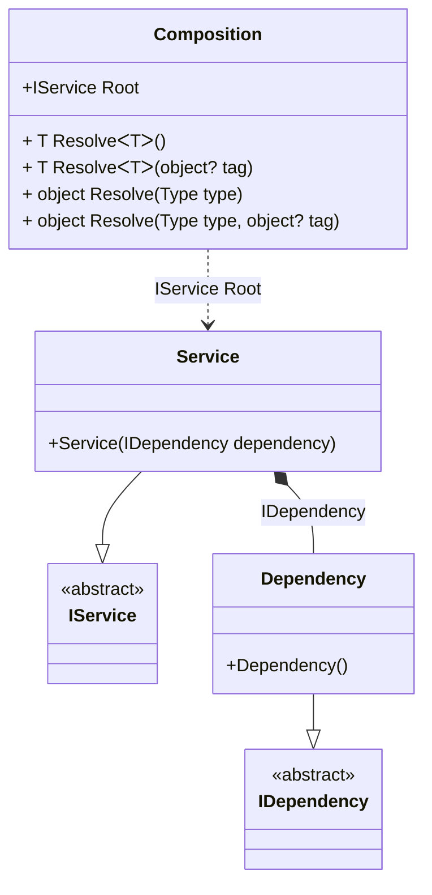

#### OnDependencyInjection hint

[](../tests/Pure.DI.UsageTests/Hints/OnDependencyInjectionHintScenario.cs)

Hints are used to fine-tune code generation. The _OnDependencyInjection_ hint determines whether to generate partial _OnDependencyInjection_ method to control of dependency injection.
In addition, setup hints can be comments before the _Setup_ method in the form ```hint = value```, for example: `// OnDependencyInjection = On`.

```c#
using static Hint;

interface IDependency;

class Dependency : IDependency;

interface IService
{
    IDependency Dependency { get; }
}

class Service(IDependency dependency) : IService
{
    public IDependency Dependency { get; } = dependency;
}

partial class Composition
{
    private readonly List<string> _log;

    public Composition(List<string> log) : this() =>
        _log = log;

    private partial T OnDependencyInjection<T>(
        in T value,
        object? tag,
        Lifetime lifetime)
    {
        _log.Add($"{value?.GetType().Name} injected");
        return value;
    }
}

// OnDependencyInjection = On
DI.Setup("Composition")
    .Hint(OnDependencyInjectionContractTypeNameRegularExpression, nameof(IDependency))
    .Bind<IDependency>().To<Dependency>()
    .Bind<IService>().Tags().To<Service>().Root<IService>("Root");

var log = new List<string>();
var composition = new Composition(log);
var service = composition.Root;
        
log.ShouldBe(ImmutableArray.Create("Dependency injected"));
```

<details open>
<summary>Class Diagram</summary>



</details>

<details>
<summary>Pure.DI-generated partial class Composition</summary><blockquote>

```c#
partial class Composition
{
  private readonly global::System.IDisposable[] _disposableSingletonsM01D01di;
  
  public Composition()
  {
    _disposableSingletonsM01D01di = new global::System.IDisposable[0];
  }
  
  internal Composition(Composition parent)
  {
    _disposableSingletonsM01D01di = new global::System.IDisposable[0];
  }
  
  #region Composition Roots
  public Pure.DI.UsageTests.Hints.OnDependencyInjectionHintScenario.IService Root
  {
    #if NETSTANDARD2_0_OR_GREATER || NETCOREAPP || NET40_OR_GREATER || NET
    [global::System.Diagnostics.Contracts.Pure]
    #endif
    get
    {
      return new Pure.DI.UsageTests.Hints.OnDependencyInjectionHintScenario.Service(OnDependencyInjection<Pure.DI.UsageTests.Hints.OnDependencyInjectionHintScenario.IDependency>(new Pure.DI.UsageTests.Hints.OnDependencyInjectionHintScenario.Dependency(), null, Pure.DI.Lifetime.Transient));
    }
  }
  #endregion
  
  #region API
  #if NETSTANDARD2_0_OR_GREATER || NETCOREAPP || NET40_OR_GREATER || NET
  [global::System.Diagnostics.Contracts.Pure]
  #endif
  public T Resolve<T>()
  {
    return ResolverM01D01di<T>.Value.Resolve(this);
  }
  
  #if NETSTANDARD2_0_OR_GREATER || NETCOREAPP || NET40_OR_GREATER || NET
  [global::System.Diagnostics.Contracts.Pure]
  #endif
  public T Resolve<T>(object? tag)
  {
    return ResolverM01D01di<T>.Value.ResolveByTag(this, tag);
  }
  
  #if NETSTANDARD2_0_OR_GREATER || NETCOREAPP || NET40_OR_GREATER || NET
  [global::System.Diagnostics.Contracts.Pure]
  #endif
  public object Resolve(global::System.Type type)
  {
    var index = (int)(_bucketSizeM01D01di * ((uint)global::System.Runtime.CompilerServices.RuntimeHelpers.GetHashCode(type) % 1));
    var finish = index + _bucketSizeM01D01di;
    do {
      ref var pair = ref _bucketsM01D01di[index];
      if (ReferenceEquals(pair.Key, type))
      {
        return pair.Value.Resolve(this);
      }
    } while (++index < finish);
    
    throw new global::System.InvalidOperationException($"Cannot resolve composition root of type {type}.");
  }
  
  #if NETSTANDARD2_0_OR_GREATER || NETCOREAPP || NET40_OR_GREATER || NET
  [global::System.Diagnostics.Contracts.Pure]
  #endif
  public object Resolve(global::System.Type type, object? tag)
  {
    var index = (int)(_bucketSizeM01D01di * ((uint)global::System.Runtime.CompilerServices.RuntimeHelpers.GetHashCode(type) % 1));
    var finish = index + _bucketSizeM01D01di;
    do {
      ref var pair = ref _bucketsM01D01di[index];
      if (ReferenceEquals(pair.Key, type))
      {
        return pair.Value.ResolveByTag(this, tag);
      }
    } while (++index < finish);
    
    throw new global::System.InvalidOperationException($"Cannot resolve composition root \"{tag}\" of type {type}.");
  }
  
  private partial T OnDependencyInjection<T>(in T value, object? tag, global::Pure.DI.Lifetime lifetime);
  #endregion
  
  public override string ToString()
  {
    return
      "classDiagram\n" +
        "  class Composition {\n" +
          "    +IService Root\n" +
          "    + T ResolveᐸTᐳ()\n" +
          "    + T ResolveᐸTᐳ(object? tag)\n" +
          "    + object Resolve(Type type)\n" +
          "    + object Resolve(Type type, object? tag)\n" +
        "  }\n" +
        "  Service --|> IService : \n" +
        "  class Service {\n" +
          "    +Service(IDependency dependency)\n" +
        "  }\n" +
        "  Dependency --|> IDependency : \n" +
        "  class Dependency {\n" +
          "    +Dependency()\n" +
        "  }\n" +
        "  class IService {\n" +
          "    <<abstract>>\n" +
        "  }\n" +
        "  class IDependency {\n" +
          "    <<abstract>>\n" +
        "  }\n" +
        "  Service *--  Dependency : IDependency\n" +
        "  Composition ..> Service : IService Root";
  }
  
  private readonly static int _bucketSizeM01D01di;
  private readonly static global::Pure.DI.Pair<global::System.Type, global::Pure.DI.IResolver<Composition, object>>[] _bucketsM01D01di;
  
  static Composition()
  {
    var valResolverM01D01di_0000 = new ResolverM01D01di_0000();
    ResolverM01D01di<Pure.DI.UsageTests.Hints.OnDependencyInjectionHintScenario.IService>.Value = valResolverM01D01di_0000;
    _bucketsM01D01di = global::Pure.DI.Buckets<global::System.Type, global::Pure.DI.IResolver<Composition, object>>.Create(
      1,
      out _bucketSizeM01D01di,
      new global::Pure.DI.Pair<global::System.Type, global::Pure.DI.IResolver<Composition, object>>[1]
      {
         new global::Pure.DI.Pair<global::System.Type, global::Pure.DI.IResolver<Composition, object>>(typeof(Pure.DI.UsageTests.Hints.OnDependencyInjectionHintScenario.IService), valResolverM01D01di_0000)
      });
  }
  
  #region Resolvers
  private sealed class ResolverM01D01di<T>: global::Pure.DI.IResolver<Composition, T>
  {
    public static global::Pure.DI.IResolver<Composition, T> Value = new ResolverM01D01di<T>();
    
    public T Resolve(Composition composite)
    {
      throw new global::System.InvalidOperationException($"Cannot resolve composition root of type {typeof(T)}.");
    }
    
    public T ResolveByTag(Composition composite, object tag)
    {
      throw new global::System.InvalidOperationException($"Cannot resolve composition root \"{tag}\" of type {typeof(T)}.");
    }
  }
  
  private sealed class ResolverM01D01di_0000: global::Pure.DI.IResolver<Composition, Pure.DI.UsageTests.Hints.OnDependencyInjectionHintScenario.IService>
  {
    public Pure.DI.UsageTests.Hints.OnDependencyInjectionHintScenario.IService Resolve(Composition composition)
    {
      return composition.Root;
    }
    
    public Pure.DI.UsageTests.Hints.OnDependencyInjectionHintScenario.IService ResolveByTag(Composition composition, object tag)
    {
      switch (tag)
      {
        case null:
          return composition.Root;
      }
      throw new global::System.InvalidOperationException($"Cannot resolve composition root \"{tag}\" of type Pure.DI.UsageTests.Hints.OnDependencyInjectionHintScenario.IService.");
    }
  }
  #endregion
}
```

</blockquote></details>


The `OnDependencyInjectionContractTypeNameRegularExpression` hint helps identify the set of types that require injection control. You can use it to specify a regular expression to filter the full name of a type.
For more hints, see [this](https://github.com/DevTeam/Pure.DI/blob/master/README.md#setup-hints) page.
