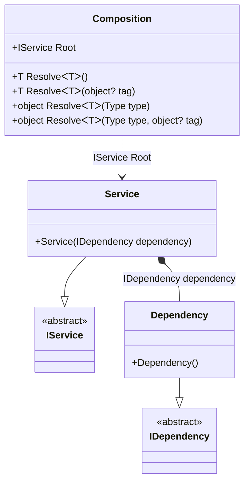

#### OnDependencyInjection Hint

[](../tests/Pure.DI.UsageTests/Hints/OnDependencyInjectionHintScenario.cs)

The _OnDependencyInjection_ hint determines whether to generate partial _OnDependencyInjection_ method to control of dependency injection.

```c#
public interface IDependency
{
}

public class Dependency : IDependency
{
}

public interface IService
{
    IDependency Dependency { get; }
}

public class Service : IService
{
    public Service(IDependency dependency)
    {
        Dependency = dependency;
    }

    public IDependency Dependency { get; }
}

internal partial class Composition
{
    private readonly List<string> _log;

    public Composition(List<string> log)
        : this()
    {
        _log = log;
    }

    private partial T OnDependencyInjection<T>(in T value, object? tag, Lifetime lifetime)
    {
        _log.Add($"{value?.GetType().Name} injected");
        return value;
    }
}

DI.Setup("Composition")
    .Hint(Hint.OnDependencyInjection, "On")
    .Hint(Hint.OnDependencyInjectionContractTypeNameRegularExpression, nameof(IDependency))
    .Bind<IDependency>().To<Dependency>()
    .Bind<IService>().Tags().To<Service>().Root<IService>("Root");

var log = new List<string>();
var composition = new Composition(log);
var service = composition.Root;
        
log.ShouldBe(ImmutableArray.Create("Dependency injected"));
```

<details open>
<summary>Class Diagram</summary>



</details>

<details>
<summary>Generated Code</summary>

```c#
partial class Composition
{
  public Composition()
  {
  }
  
  internal Composition(Composition parent)
  {
  }
  
  #region Composition Roots
  public Pure.DI.UsageTests.Hints.OnDependencyInjectionHintScenario.IService Root
  {
    [global::System.Runtime.CompilerServices.MethodImpl((global::System.Runtime.CompilerServices.MethodImplOptions)0x300)]
    get
    {
      Pure.DI.UsageTests.Hints.OnDependencyInjectionHintScenario.Dependency v82LocalAC4CF3 = new Pure.DI.UsageTests.Hints.OnDependencyInjectionHintScenario.Dependency();
      Pure.DI.UsageTests.Hints.OnDependencyInjectionHintScenario.Service v81LocalAC4CF3 = new Pure.DI.UsageTests.Hints.OnDependencyInjectionHintScenario.Service(OnDependencyInjection<Pure.DI.UsageTests.Hints.OnDependencyInjectionHintScenario.IDependency>(v82LocalAC4CF3, null, Pure.DI.Lifetime.Transient));
      return v81LocalAC4CF3;
    }
  }
  #endregion
  
  #region API
  #if NETSTANDARD2_0_OR_GREATER || NETCOREAPP || NET40_OR_GREATER
  [global::System.Diagnostics.Contracts.Pure]
  #endif
  [global::System.Runtime.CompilerServices.MethodImpl((global::System.Runtime.CompilerServices.MethodImplOptions)0x300)]
  public T Resolve<T>()
  {
    return ResolverAC4CF3<T>.Value.Resolve(this);
  }
  
  #if NETSTANDARD2_0_OR_GREATER || NETCOREAPP || NET40_OR_GREATER
  [global::System.Diagnostics.Contracts.Pure]
  #endif
  [global::System.Runtime.CompilerServices.MethodImpl((global::System.Runtime.CompilerServices.MethodImplOptions)0x300)]
  public T Resolve<T>(object? tag)
  {
    return ResolverAC4CF3<T>.Value.ResolveByTag(this, tag);
  }
  
  #if NETSTANDARD2_0_OR_GREATER || NETCOREAPP || NET40_OR_GREATER
  [global::System.Diagnostics.Contracts.Pure]
  #endif
  [global::System.Runtime.CompilerServices.MethodImpl((global::System.Runtime.CompilerServices.MethodImplOptions)0x300)]
  public object Resolve(global::System.Type type)
  {
    int index = (int)(_bucketSizeAC4CF3 * ((uint)global::System.Runtime.CompilerServices.RuntimeHelpers.GetHashCode(type) % 1));
    ref var pair = ref _bucketsAC4CF3[index];
    if (ReferenceEquals(pair.Key, type))
    {
      return pair.Value.Resolve(this);
    }
    
    int maxIndex = index + _bucketSizeAC4CF3;
    for (int i = index + 1; i < maxIndex; i++)
    {
      pair = ref _bucketsAC4CF3[i];
      if (ReferenceEquals(pair.Key, type))
      {
        return pair.Value.Resolve(this);
      }
    }
    
    throw new global::System.InvalidOperationException($"Cannot resolve composition root of type {type}.");
  }
  
  #if NETSTANDARD2_0_OR_GREATER || NETCOREAPP || NET40_OR_GREATER
  [global::System.Diagnostics.Contracts.Pure]
  #endif
  [global::System.Runtime.CompilerServices.MethodImpl((global::System.Runtime.CompilerServices.MethodImplOptions)0x300)]
  public object Resolve(global::System.Type type, object? tag)
  {
    int index = (int)(_bucketSizeAC4CF3 * ((uint)global::System.Runtime.CompilerServices.RuntimeHelpers.GetHashCode(type) % 1));
    ref var pair = ref _bucketsAC4CF3[index];
    if (ReferenceEquals(pair.Key, type))
    {
      return pair.Value.ResolveByTag(this, tag);
    }
    
    int maxIndex = index + _bucketSizeAC4CF3;
    for (int i = index + 1; i < maxIndex; i++)
    {
      pair = ref _bucketsAC4CF3[i];
      if (ReferenceEquals(pair.Key, type))
      {
        return pair.Value.ResolveByTag(this, tag);
      }
    }
    
    throw new global::System.InvalidOperationException($"Cannot resolve composition root of type {type}.");
  }
  
  [global::System.Runtime.CompilerServices.MethodImpl((global::System.Runtime.CompilerServices.MethodImplOptions)0x300)]
  private partial T OnDependencyInjection<T>(in T value, object? tag, global::Pure.DI.Lifetime lifetime);
  #endregion
  
  public override string ToString()
  {
    return
      "classDiagram\n" +
        "  class Composition {\n" +
          "    +IService Root\n" +
          "    +T ResolveᐸTᐳ()\n" +
          "    +T ResolveᐸTᐳ(object? tag)\n" +
          "    +object ResolveᐸTᐳ(Type type)\n" +
          "    +object ResolveᐸTᐳ(Type type, object? tag)\n" +
        "  }\n" +
        "  Service --|> IService : \n" +
        "  class Service {\n" +
          "    +Service(IDependency dependency)\n" +
        "  }\n" +
        "  Dependency --|> IDependency : \n" +
        "  class Dependency {\n" +
          "    +Dependency()\n" +
        "  }\n" +
        "  class IService {\n" +
          "    <<abstract>>\n" +
        "  }\n" +
        "  class IDependency {\n" +
          "    <<abstract>>\n" +
        "  }\n" +
        "  Service *--  Dependency : IDependency dependency\n" +
        "  Composition ..> Service : IService Root";
  }
  
  private readonly static int _bucketSizeAC4CF3;
  private readonly static global::Pure.DI.Pair<global::System.Type, global::Pure.DI.IResolver<Composition, object>>[] _bucketsAC4CF3;
  
  static Composition()
  {
    ResolverAC4CF30 valResolverAC4CF30 = new ResolverAC4CF30();
    ResolverAC4CF3<Pure.DI.UsageTests.Hints.OnDependencyInjectionHintScenario.IService>.Value = valResolverAC4CF30;
    _bucketsAC4CF3 = global::Pure.DI.Buckets<global::System.Type, global::Pure.DI.IResolver<Composition, object>>.Create(
      1,
      out _bucketSizeAC4CF3,
      new global::Pure.DI.Pair<global::System.Type, global::Pure.DI.IResolver<Composition, object>>[1]
      {
         new global::Pure.DI.Pair<global::System.Type, global::Pure.DI.IResolver<Composition, object>>(typeof(Pure.DI.UsageTests.Hints.OnDependencyInjectionHintScenario.IService), valResolverAC4CF30)
      });
  }
  
  #region Resolvers
  #pragma warning disable CS0649
  private class ResolverAC4CF3<T>
  {
    public static global::Pure.DI.IResolver<Composition, T> Value;
  }
  
  private sealed class ResolverAC4CF30: global::Pure.DI.IResolver<Composition, Pure.DI.UsageTests.Hints.OnDependencyInjectionHintScenario.IService>
  {
    [global::System.Runtime.CompilerServices.MethodImpl((global::System.Runtime.CompilerServices.MethodImplOptions)0x300)]
    public Pure.DI.UsageTests.Hints.OnDependencyInjectionHintScenario.IService Resolve(Composition composition)
    {
      return composition.Root;
    }
    
    [global::System.Runtime.CompilerServices.MethodImpl((global::System.Runtime.CompilerServices.MethodImplOptions)0x300)]
    public Pure.DI.UsageTests.Hints.OnDependencyInjectionHintScenario.IService ResolveByTag(Composition composition, object tag)
    {
      if (Equals(tag, null)) return composition.Root;
      throw new global::System.InvalidOperationException($"Cannot resolve composition root \"{tag}\" of type Pure.DI.UsageTests.Hints.OnDependencyInjectionHintScenario.IService.");
    }
  }
  #pragma warning restore CS0649
  #endregion
}
```

</details>

