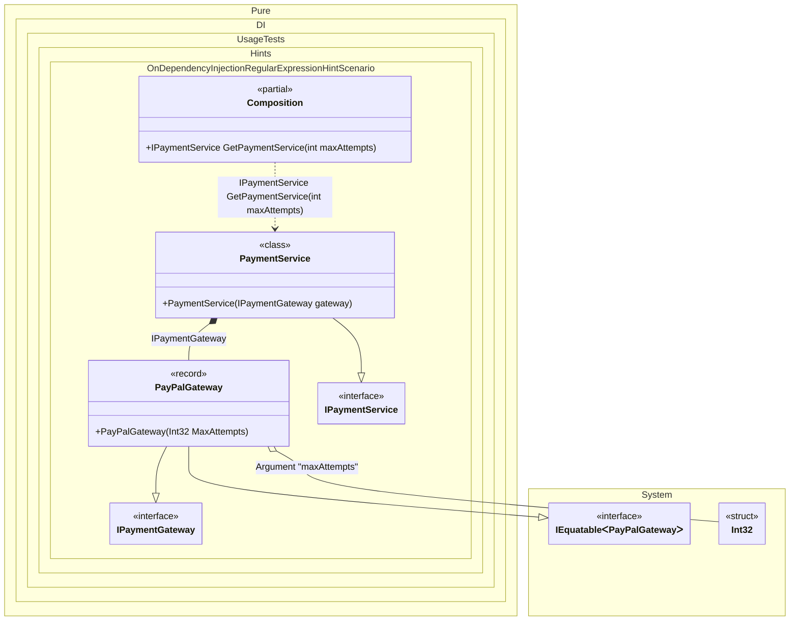

#### OnDependencyInjection regular expression hint

Hints are used to fine-tune code generation. The _OnDependencyInjection_ hint determines whether to generate partial _OnDependencyInjection_ method to control of dependency injection.
In addition, setup hints can be comments before the _Setup_ method in the form ```hint = value```, for example: `// OnDependencyInjection = On`.


```c#
using Shouldly;
using Pure.DI;
using static Pure.DI.Hint;

// OnDependencyInjection = On
DI.Setup(nameof(Composition))
    // Filters types by regular expression to control which types trigger the OnDependencyInjection method.
    // In this case, we want to intercept the injection of any "Gateway" (like IPaymentGateway)
    // and integer configuration values.
    .Hint(OnDependencyInjectionContractTypeNameRegularExpression, "(.*Gateway|int)$")
    .RootArg<int>("maxAttempts")
    .Bind().To<PayPalGateway>()
    .Bind().To<PaymentService>()
    .Root<IPaymentService>("GetPaymentService");

var log = new List<string>();
var composition = new Composition(log);

// Resolving the root service triggers the injection chain.
// 1. int maxAttempts is injected into PayPalGateway.
// 2. PayPalGateway is injected into PaymentService.
// PaymentService itself is not logged because "IPaymentService" does not match the regex.
var service = composition.GetPaymentService(3);

log.ShouldBe([
    "Int32 injected",
    "PayPalGateway injected"
]);

interface IPaymentGateway;

record PayPalGateway(int MaxAttempts) : IPaymentGateway;

interface IPaymentService
{
    IPaymentGateway Gateway { get; }
}

class PaymentService(IPaymentGateway gateway) : IPaymentService
{
    public IPaymentGateway Gateway { get; } = gateway;
}

partial class Composition(List<string> log)
{
    private partial T OnDependencyInjection<T>(
        in T value,
        object? tag,
        Lifetime lifetime)
    {
        // Logs the actual runtime type of the injected instance
        log.Add($"{value?.GetType().Name} injected");
        return value;
    }
}
```

<details>
<summary>Running this code sample locally</summary>

- Make sure you have the [.NET SDK 10.0](https://dotnet.microsoft.com/en-us/download/dotnet/10.0) or later is installed
```bash
dotnet --list-sdk
```
- Create a net10.0 (or later) console application
```bash
dotnet new console -n Sample
```
- Add references to NuGet packages
  - [Pure.DI](https://www.nuget.org/packages/Pure.DI)
  - [Shouldly](https://www.nuget.org/packages/Shouldly)
```bash
dotnet add package Pure.DI
dotnet add package Shouldly
```
- Copy the example code into the _Program.cs_ file

You are ready to run the example 🚀
```bash
dotnet run
```

</details>

The `OnDependencyInjectionContractTypeNameRegularExpression` hint helps identify the set of types that require injection control. You can use it to specify a regular expression to filter the full name of a type.
For more hints, see [this](README.md#setup-hints) page.

The following partial class will be generated:

```c#
partial class Composition
{
#if NET9_0_OR_GREATER
  private readonly Lock _lock = new Lock();
#else
  private readonly Object _lock = new Object();
#endif

  [MethodImpl(MethodImplOptions.AggressiveInlining)]
  public IPaymentService GetPaymentService(int maxAttempts)
  {
    return new PaymentService(OnDependencyInjection<IPaymentGateway>(new PayPalGateway(OnDependencyInjection<int>(maxAttempts, null, Lifetime.Transient)), null, Lifetime.Transient));
  }


  private partial T OnDependencyInjection<T>(in T value, object? tag, Lifetime lifetime);
}
```

Class diagram:



