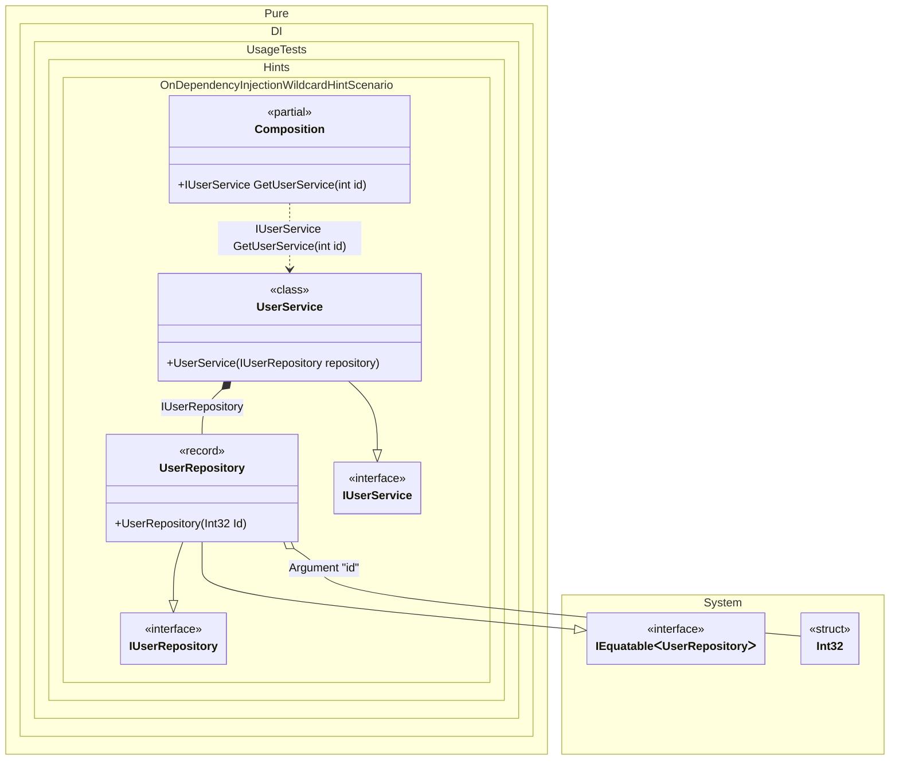

#### OnDependencyInjection wildcard hint

Hints are used to fine-tune code generation. The _OnDependencyInjection_ hint determines whether to generate partial _OnDependencyInjection_ method to control of dependency injection.
In addition, setup hints can be comments before the _Setup_ method in the form ```hint = value```, for example: `// OnDependencyInjection = On`.


```c#
using Shouldly;
using Pure.DI;
using static Pure.DI.Hint;

// OnDependencyInjection = On
DI.Setup(nameof(Composition))
    .Hint(OnDependencyInjectionContractTypeNameWildcard, "*IUserRepository")
    .Hint(OnDependencyInjectionContractTypeNameWildcard, "*IUserService")
    .RootArg<int>("id")
    .Bind().To<UserRepository>()
    .Bind().To<UserService>()
    .Root<IUserService>("GetUserService");

var log = new List<string>();
var composition = new Composition(log);
var service = composition.GetUserService(33);

log.ShouldBe([
    "UserRepository injected",
    "UserService injected"
]);

interface IUserRepository;

record UserRepository(int Id) : IUserRepository;

interface IUserService
{
    IUserRepository Repository { get; }
}

class UserService(IUserRepository repository) : IUserService
{
    public IUserRepository Repository { get; } = repository;
}

partial class Composition
{
    private readonly List<string> _log = [];

    public Composition(List<string> log) : this() =>
        _log = log;

    private partial T OnDependencyInjection<T>(
        in T value,
        object? tag,
        Lifetime lifetime)
    {
        _log.Add($"{value?.GetType().Name} injected");
        return value;
    }
}
```

<details>
<summary>Running this code sample locally</summary>

- Make sure you have the [.NET SDK 10.0](https://dotnet.microsoft.com/en-us/download/dotnet/10.0) or later is installed
```bash
dotnet --list-sdk
```
- Create a net10.0 (or later) console application
```bash
dotnet new console -n Sample
```
- Add references to NuGet packages
  - [Pure.DI](https://www.nuget.org/packages/Pure.DI)
  - [Shouldly](https://www.nuget.org/packages/Shouldly)
```bash
dotnet add package Pure.DI
dotnet add package Shouldly
```
- Copy the example code into the _Program.cs_ file

You are ready to run the example 🚀
```bash
dotnet run
```

</details>

The `OnDependencyInjectionContractTypeNameWildcard` hint helps identify the set of types that require injection control. You can use it to specify a wildcard to filter the full name of a type.
For more hints, see [this](README.md#setup-hints) page.

The following partial class will be generated:

```c#
partial class Composition
{
#if NET9_0_OR_GREATER
  private readonly Lock _lock;
#else
  private readonly Object _lock;
#endif

  [OrdinalAttribute(256)]
  public Composition()
  {
#if NET9_0_OR_GREATER
    _lock = new Lock();
#else
    _lock = new Object();
#endif
  }

  internal Composition(Composition parentScope)
  {
    _lock = parentScope._lock;
  }

  [MethodImpl(MethodImplOptions.AggressiveInlining)]
  public IUserService GetUserService(int id)
  {
    return OnDependencyInjection<IUserService>(new UserService(OnDependencyInjection<IUserRepository>(new UserRepository(id), null, Lifetime.Transient)), null, Lifetime.Transient);
  }


  private partial T OnDependencyInjection<T>(in T value, object? tag, Lifetime lifetime);
}
```

Class diagram:



