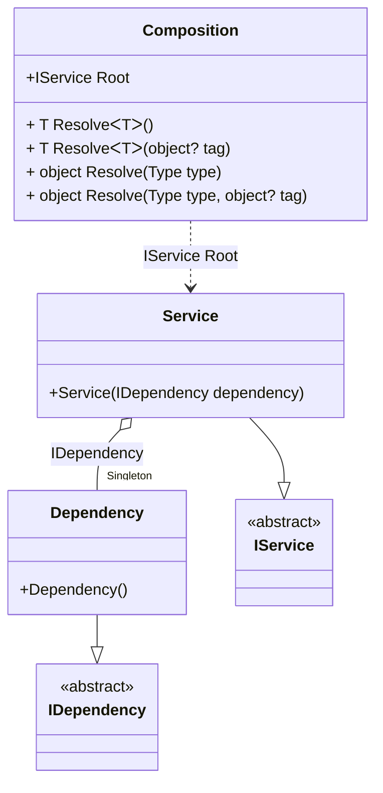

#### OnNewInstance hint

[](../tests/Pure.DI.UsageTests/Hints/OnNewInstanceHintScenario.cs)

Hints are used to fine-tune code generation. The _OnNewInstance_ hint determines whether to generate partial _OnNewInstance_ method.
In addition, setup hints can be comments before the _Setup_ method in the form ```hint = value```, for example: `// OnNewInstance = On`.

```c#
using static Hint;

interface IDependency;

class Dependency : IDependency
{
    public override string ToString() => "Dependency";
}

interface IService
{
    IDependency Dependency { get; }
}

class Service(IDependency dependency) : IService
{
    public IDependency Dependency { get; } = dependency;

    public override string ToString() => "Service";
}

internal partial class Composition
{
    private readonly List<string> _log;

    public Composition(List<string> log) : this() =>
        _log = log;

    partial void OnNewInstance<T>(
        ref T value,
        object? tag,
        Lifetime lifetime) =>
        _log.Add(typeof(T).Name);
}

DI.Setup(nameof(Composition))
    .Hint(OnNewInstance, "On")
    .Bind().As(Lifetime.Singleton).To<Dependency>()
    .RootBind<IService>("Root").To<Service>();

var log = new List<string>();
var composition = new Composition(log);
var service1 = composition.Root;
var service2 = composition.Root;
        
log.ShouldBe(ImmutableArray.Create("Dependency", "Service", "Service"));
```

The `OnNewInstanceLifetimeRegularExpression` hint helps you define a set of lifetimes that require instance creation control. You can use it to specify a regular expression to filter bindings by lifetime name.
For more hints, see [this](https://github.com/DevTeam/Pure.DI/blob/master/README.md#setup-hints) page.

<details open>
<summary>Class Diagram</summary>



</details>

<details>
<summary>Pure.DI-generated partial class Composition</summary><blockquote>

```c#
partial class Composition
{
  private readonly Composition _rootM04D27di;
  private readonly object _lockM04D27di;
  private Dependency _singletonM04D27di36_Dependency;

  public Composition()
  {
    _rootM04D27di = this;
    _lockM04D27di = new object();
  }

  internal Composition(Composition baseComposition)
  {
    _rootM04D27di = baseComposition._rootM04D27di;
    _lockM04D27di = _rootM04D27di._lockM04D27di;
  }

  public IService Root
  {
    [MethodImpl((MethodImplOptions)0x100)]
    get
    {
      if (_rootM04D27di._singletonM04D27di36_Dependency == null)
      {
          lock (_lockM04D27di)
          {
              if (_rootM04D27di._singletonM04D27di36_Dependency == null)
              {
                  Dependency _singletonM04D27di36_DependencyTemp;
                  _singletonM04D27di36_DependencyTemp = new Dependency();
                  OnNewInstance<Dependency>(ref _singletonM04D27di36_DependencyTemp, null, Pure.DI.Lifetime.Singleton);
                  Threading.Thread.MemoryBarrier();
                  _singletonM04D27di36_Dependency = _singletonM04D27di36_DependencyTemp;
                  _rootM04D27di._singletonM04D27di36_Dependency = _singletonM04D27di36_Dependency;
              }
          }
      }
      Service transientM04D27di0_Service = new Service(_rootM04D27di._singletonM04D27di36_Dependency);
      OnNewInstance<Service>(ref transientM04D27di0_Service, null, Pure.DI.Lifetime.Transient);
      return transientM04D27di0_Service;
    }
  }

  [MethodImpl((MethodImplOptions)0x100)]
  public T Resolve<T>()
  {
    return ResolverM04D27di<T>.Value.Resolve(this);
  }

  [MethodImpl((MethodImplOptions)0x100)]
  public T Resolve<T>(object? tag)
  {
    return ResolverM04D27di<T>.Value.ResolveByTag(this, tag);
  }

  [MethodImpl((MethodImplOptions)0x100)]
  public object Resolve(Type type)
  {
    var index = (int)(_bucketSizeM04D27di * ((uint)RuntimeHelpers.GetHashCode(type) % 1));
    ref var pair = ref _bucketsM04D27di[index];
    return pair.Key == type ? pair.Value.Resolve(this) : ResolveM04D27di(type, index);
  }

  [MethodImpl((MethodImplOptions)0x8)]
  private object ResolveM04D27di(Type type, int index)
  {
    var finish = index + _bucketSizeM04D27di;
    while (++index < finish)
    {
      ref var pair = ref _bucketsM04D27di[index];
      if (pair.Key == type)
      {
        return pair.Value.Resolve(this);
      }
    }

    throw new InvalidOperationException($"Cannot resolve composition root of type {type}.");
  }

  [MethodImpl((MethodImplOptions)0x100)]
  public object Resolve(Type type, object? tag)
  {
    var index = (int)(_bucketSizeM04D27di * ((uint)RuntimeHelpers.GetHashCode(type) % 1));
    ref var pair = ref _bucketsM04D27di[index];
    return pair.Key == type ? pair.Value.ResolveByTag(this, tag) : ResolveM04D27di(type, tag, index);
  }

  [MethodImpl((MethodImplOptions)0x8)]
  private object ResolveM04D27di(Type type, object? tag, int index)
  {
    var finish = index + _bucketSizeM04D27di;
    while (++index < finish)
    {
      ref var pair = ref _bucketsM04D27di[index];
      if (pair.Key == type)
      {
        return pair.Value.ResolveByTag(this, tag);
      }
    }

    throw new InvalidOperationException($"Cannot resolve composition root \"{tag}\" of type {type}.");
  }

  partial void OnNewInstance<T>(ref T value, object? tag, Lifetime lifetime);

  public override string ToString()
  {
    return
      "classDiagram\n" +
        "  class Composition {\n" +
          "    +IService Root\n" +
          "    + T ResolveᐸTᐳ()\n" +
          "    + T ResolveᐸTᐳ(object? tag)\n" +
          "    + object Resolve(Type type)\n" +
          "    + object Resolve(Type type, object? tag)\n" +
        "  }\n" +
        "  Dependency --|> IDependency : \n" +
        "  class Dependency {\n" +
          "    +Dependency()\n" +
        "  }\n" +
        "  Service --|> IService : \n" +
        "  class Service {\n" +
          "    +Service(IDependency dependency)\n" +
        "  }\n" +
        "  class IDependency {\n" +
          "    <<abstract>>\n" +
        "  }\n" +
        "  class IService {\n" +
          "    <<abstract>>\n" +
        "  }\n" +
        "  Service o--  \"Singleton\" Dependency : IDependency\n" +
        "  Composition ..> Service : IService Root";
  }

  private readonly static int _bucketSizeM04D27di;
  private readonly static Pair<Type, IResolver<Composition, object>>[] _bucketsM04D27di;

  static Composition()
  {
    var valResolverM04D27di_0000 = new ResolverM04D27di_0000();
    ResolverM04D27di<IService>.Value = valResolverM04D27di_0000;
    _bucketsM04D27di = Buckets<Type, IResolver<Composition, object>>.Create(
      1,
      out _bucketSizeM04D27di,
      new Pair<Type, IResolver<Composition, object>>[1]
      {
         new Pair<Type, IResolver<Composition, object>>(typeof(IService), valResolverM04D27di_0000)
      });
  }

  private sealed class ResolverM04D27di<T>: IResolver<Composition, T>
  {
    public static IResolver<Composition, T> Value = new ResolverM04D27di<T>();

    public T Resolve(Composition composite)
    {
      throw new InvalidOperationException($"Cannot resolve composition root of type {typeof(T)}.");
    }

    public T ResolveByTag(Composition composite, object tag)
    {
      throw new InvalidOperationException($"Cannot resolve composition root \"{tag}\" of type {typeof(T)}.");
    }
  }

  private sealed class ResolverM04D27di_0000: IResolver<Composition, IService>
  {
    public IService Resolve(Composition composition)
    {
      return composition.Root;
    }

    public IService ResolveByTag(Composition composition, object tag)
    {
      switch (tag)
      {
        case null:
          return composition.Root;
        default:
          throw new InvalidOperationException($"Cannot resolve composition root \"{tag}\" of type IService.");
      }
    }
  }
}
```

</blockquote></details>

