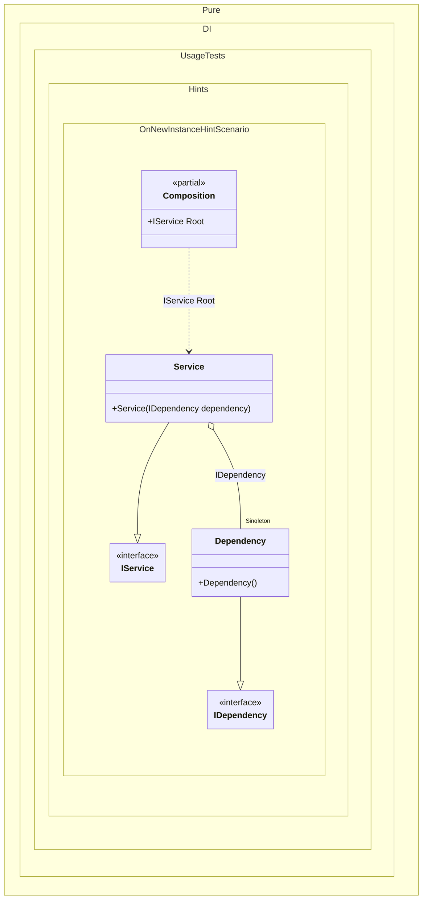

#### OnNewInstance hint

[](../tests/Pure.DI.UsageTests/Hints/OnNewInstanceHintScenario.cs)

Hints are used to fine-tune code generation. The _OnNewInstance_ hint determines whether to generate partial _OnNewInstance_ method.
In addition, setup hints can be comments before the _Setup_ method in the form ```hint = value```, for example: `// OnNewInstance = On`.


```c#
using Pure.DI;
using static Pure.DI.Hint;
using Shouldly;

DI.Setup(nameof(Composition))
    .Hint(OnNewInstance, "On")
    .Bind().As(Lifetime.Singleton).To<Dependency>()
    .Bind().To<Service>()
    .Root<IService>("Root");

var log = new List<string>();
var composition = new Composition(log);
var service1 = composition.Root;
var service2 = composition.Root;

log.ShouldBe([
    "Dependency created",
    "Service created",
    "Service created"]);

interface IDependency;

class Dependency : IDependency
{
    public override string ToString() => nameof(Dependency);
}

interface IService
{
    IDependency Dependency { get; }
}

class Service(IDependency dependency) : IService
{
    public IDependency Dependency { get; } = dependency;

    public override string ToString() => nameof(Service);
}

internal partial class Composition
{
    private readonly List<string> _log = [];

    public Composition(List<string> log) : this() =>
        _log = log;

    partial void OnNewInstance<T>(
        ref T value,
        object? tag,
        Lifetime lifetime) =>
        _log.Add($"{typeof(T).Name} created");
}
```

The `OnNewInstanceLifetimeRegularExpression` hint helps you define a set of lifetimes that require instance creation control. You can use it to specify a regular expression to filter bindings by lifetime name.
For more hints, see [this](README.md#setup-hints) page.


Class diagram:



