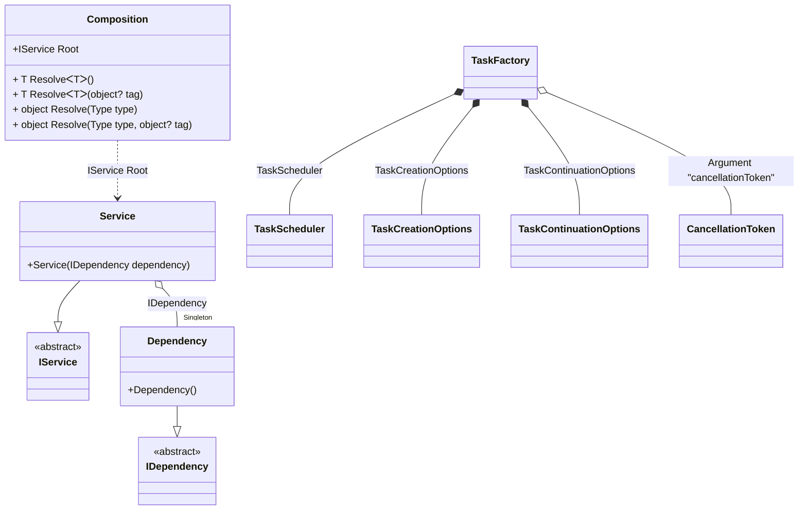

#### OnNewInstance hint

[](../tests/Pure.DI.UsageTests/Hints/OnNewInstanceHintScenario.cs)

Hints are used to fine-tune code generation. The _OnNewInstance_ hint determines whether to generate partial _OnNewInstance_ method.
In addition, setup hints can be comments before the _Setup_ method in the form ```hint = value```, for example: `// OnNewInstance = On`.

```c#
using static Hint;

interface IDependency;

class Dependency : IDependency
{
    public override string ToString() => "Dependency";
}

interface IService
{
    IDependency Dependency { get; }
}

class Service(IDependency dependency) : IService
{
    public IDependency Dependency { get; } = dependency;

    public override string ToString() => "Service";
}

internal partial class Composition
{
    private readonly List<string> _log;

    public Composition(List<string> log) : this() =>
        _log = log;

    partial void OnNewInstance<T>(
        ref T value,
        object? tag,
        Lifetime lifetime) =>
        _log.Add(typeof(T).Name);
}

DI.Setup("Composition")
    .Hint(OnNewInstance, "On")
    .Bind<IDependency>().As(Lifetime.Singleton).To<Dependency>()
    .Bind<IService>().To<Service>().Root<IService>("Root");

var log = new List<string>();
var composition = new Composition(log);
var service1 = composition.Root;
var service2 = composition.Root;
        
log.ShouldBe(ImmutableArray.Create("Dependency", "Service", "Service"));
```

<details open>
<summary>Class Diagram</summary>



</details>

<details>
<summary>Pure.DI-generated partial class Composition</summary><blockquote>

```c#
partial class Composition
{
  private readonly global::System.IDisposable[] _disposableSingletonsM01D15di;
  private Pure.DI.UsageTests.Hints.OnNewInstanceHintScenario.Dependency _singletonM01D15di28_Dependency;
  
  public Composition()
  {
    _disposableSingletonsM01D15di = new global::System.IDisposable[0];
  }
  
  internal Composition(Composition parent)
  {
    _disposableSingletonsM01D15di = new global::System.IDisposable[0];
    lock (parent._disposableSingletonsM01D15di)
    {
      _singletonM01D15di28_Dependency = parent._singletonM01D15di28_Dependency;
    }
  }
  
  #region Composition Roots
  public Pure.DI.UsageTests.Hints.OnNewInstanceHintScenario.IService Root
  {
    #if NETSTANDARD2_0_OR_GREATER || NETCOREAPP || NET40_OR_GREATER || NET
    [global::System.Diagnostics.Contracts.Pure]
    #endif
    get
    {
      if (object.ReferenceEquals(_singletonM01D15di28_Dependency, null))
      {
          lock (_disposableSingletonsM01D15di)
          {
              if (object.ReferenceEquals(_singletonM01D15di28_Dependency, null))
              {
                  Pure.DI.UsageTests.Hints.OnNewInstanceHintScenario.Dependency _singletonM01D15di28_DependencyTemp;
                  _singletonM01D15di28_DependencyTemp = new Pure.DI.UsageTests.Hints.OnNewInstanceHintScenario.Dependency();
                  OnNewInstance<Pure.DI.UsageTests.Hints.OnNewInstanceHintScenario.Dependency>(ref _singletonM01D15di28_DependencyTemp, null, Pure.DI.Lifetime.Singleton);
                  global::System.Threading.Thread.MemoryBarrier();
                  _singletonM01D15di28_Dependency = _singletonM01D15di28_DependencyTemp;
              }
          }
      }
      var transientM01D15di0_Service = new Pure.DI.UsageTests.Hints.OnNewInstanceHintScenario.Service(_singletonM01D15di28_Dependency);
      OnNewInstance<Pure.DI.UsageTests.Hints.OnNewInstanceHintScenario.Service>(ref transientM01D15di0_Service, null, Pure.DI.Lifetime.Transient);
      return transientM01D15di0_Service;
    }
  }
  #endregion
  
  #region API
  #if NETSTANDARD2_0_OR_GREATER || NETCOREAPP || NET40_OR_GREATER || NET
  [global::System.Diagnostics.Contracts.Pure]
  #endif
  public T Resolve<T>()
  {
    return ResolverM01D15di<T>.Value.Resolve(this);
  }
  
  #if NETSTANDARD2_0_OR_GREATER || NETCOREAPP || NET40_OR_GREATER || NET
  [global::System.Diagnostics.Contracts.Pure]
  #endif
  public T Resolve<T>(object? tag)
  {
    return ResolverM01D15di<T>.Value.ResolveByTag(this, tag);
  }
  
  #if NETSTANDARD2_0_OR_GREATER || NETCOREAPP || NET40_OR_GREATER || NET
  [global::System.Diagnostics.Contracts.Pure]
  #endif
  public object Resolve(global::System.Type type)
  {
    var index = (int)(_bucketSizeM01D15di * ((uint)global::System.Runtime.CompilerServices.RuntimeHelpers.GetHashCode(type) % 1));
    var finish = index + _bucketSizeM01D15di;
    do {
      ref var pair = ref _bucketsM01D15di[index];
      if (ReferenceEquals(pair.Key, type))
      {
        return pair.Value.Resolve(this);
      }
    } while (++index < finish);
    
    throw new global::System.InvalidOperationException($"Cannot resolve composition root of type {type}.");
  }
  
  #if NETSTANDARD2_0_OR_GREATER || NETCOREAPP || NET40_OR_GREATER || NET
  [global::System.Diagnostics.Contracts.Pure]
  #endif
  public object Resolve(global::System.Type type, object? tag)
  {
    var index = (int)(_bucketSizeM01D15di * ((uint)global::System.Runtime.CompilerServices.RuntimeHelpers.GetHashCode(type) % 1));
    var finish = index + _bucketSizeM01D15di;
    do {
      ref var pair = ref _bucketsM01D15di[index];
      if (ReferenceEquals(pair.Key, type))
      {
        return pair.Value.ResolveByTag(this, tag);
      }
    } while (++index < finish);
    
    throw new global::System.InvalidOperationException($"Cannot resolve composition root \"{tag}\" of type {type}.");
  }
  
  partial void OnNewInstance<T>(ref T value, object? tag, global::Pure.DI.Lifetime lifetime);
  #endregion
  
  public override string ToString()
  {
    return
      "classDiagram\n" +
        "  class Composition {\n" +
          "    +IService Root\n" +
          "    + T ResolveᐸTᐳ()\n" +
          "    + T ResolveᐸTᐳ(object? tag)\n" +
          "    + object Resolve(Type type)\n" +
          "    + object Resolve(Type type, object? tag)\n" +
        "  }\n" +
        "  Service --|> IService : \n" +
        "  class Service {\n" +
          "    +Service(IDependency dependency)\n" +
        "  }\n" +
        "  Dependency --|> IDependency : \n" +
        "  class Dependency {\n" +
          "    +Dependency()\n" +
        "  }\n" +
        "  class TaskScheduler\n" +
        "  class TaskCreationOptions\n" +
        "  class TaskContinuationOptions\n" +
        "  class TaskFactory\n" +
        "  class CancellationToken\n" +
        "  class IService {\n" +
          "    <<abstract>>\n" +
        "  }\n" +
        "  class IDependency {\n" +
          "    <<abstract>>\n" +
        "  }\n" +
        "  Service o--  \"Singleton\" Dependency : IDependency\n" +
        "  TaskFactory o-- CancellationToken : Argument \"cancellationToken\"\n" +
        "  TaskFactory *--  TaskCreationOptions : TaskCreationOptions\n" +
        "  TaskFactory *--  TaskContinuationOptions : TaskContinuationOptions\n" +
        "  TaskFactory *--  TaskScheduler : TaskScheduler\n" +
        "  Composition ..> Service : IService Root";
  }
  
  private readonly static int _bucketSizeM01D15di;
  private readonly static global::Pure.DI.Pair<global::System.Type, global::Pure.DI.IResolver<Composition, object>>[] _bucketsM01D15di;
  
  static Composition()
  {
    var valResolverM01D15di_0000 = new ResolverM01D15di_0000();
    ResolverM01D15di<Pure.DI.UsageTests.Hints.OnNewInstanceHintScenario.IService>.Value = valResolverM01D15di_0000;
    _bucketsM01D15di = global::Pure.DI.Buckets<global::System.Type, global::Pure.DI.IResolver<Composition, object>>.Create(
      1,
      out _bucketSizeM01D15di,
      new global::Pure.DI.Pair<global::System.Type, global::Pure.DI.IResolver<Composition, object>>[1]
      {
         new global::Pure.DI.Pair<global::System.Type, global::Pure.DI.IResolver<Composition, object>>(typeof(Pure.DI.UsageTests.Hints.OnNewInstanceHintScenario.IService), valResolverM01D15di_0000)
      });
  }
  
  #region Resolvers
  private sealed class ResolverM01D15di<T>: global::Pure.DI.IResolver<Composition, T>
  {
    public static global::Pure.DI.IResolver<Composition, T> Value = new ResolverM01D15di<T>();
    
    public T Resolve(Composition composite)
    {
      throw new global::System.InvalidOperationException($"Cannot resolve composition root of type {typeof(T)}.");
    }
    
    public T ResolveByTag(Composition composite, object tag)
    {
      throw new global::System.InvalidOperationException($"Cannot resolve composition root \"{tag}\" of type {typeof(T)}.");
    }
  }
  
  private sealed class ResolverM01D15di_0000: global::Pure.DI.IResolver<Composition, Pure.DI.UsageTests.Hints.OnNewInstanceHintScenario.IService>
  {
    public Pure.DI.UsageTests.Hints.OnNewInstanceHintScenario.IService Resolve(Composition composition)
    {
      return composition.Root;
    }
    
    public Pure.DI.UsageTests.Hints.OnNewInstanceHintScenario.IService ResolveByTag(Composition composition, object tag)
    {
      switch (tag)
      {
        case null:
          return composition.Root;
      }
      throw new global::System.InvalidOperationException($"Cannot resolve composition root \"{tag}\" of type Pure.DI.UsageTests.Hints.OnNewInstanceHintScenario.IService.");
    }
  }
  #endregion
}
```

</blockquote></details>


The `OnNewInstanceLifetimeRegularExpression` hint helps you define a set of lifetimes that require instance creation control. You can use it to specify a regular expression to filter bindings by lifetime name.
For more hints, see [this](https://github.com/DevTeam/Pure.DI/blob/master/README.md#setup-hints) page.
