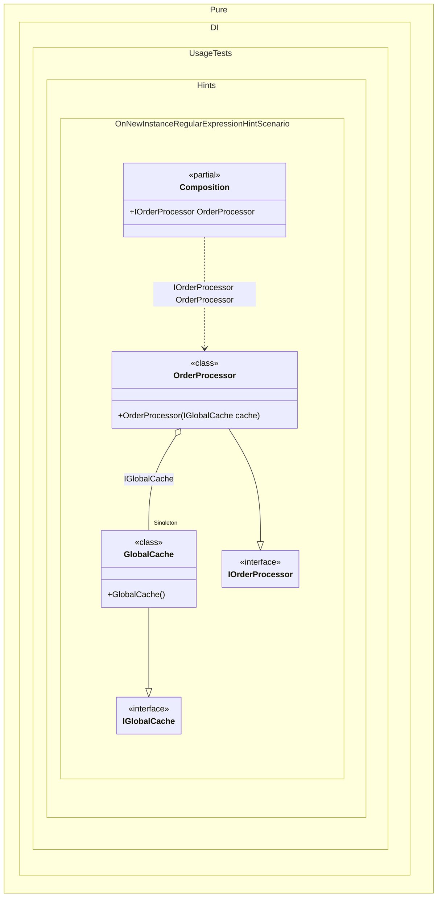

#### OnNewInstance regular expression hint

Hints are used to fine-tune code generation. The _OnNewInstance_ hint determines whether to generate partial _OnNewInstance_ method.
In addition, setup hints can be comments before the _Setup_ method in the form ```hint = value```, for example: `// OnNewInstance = On`.


```c#
using Shouldly;
using Pure.DI;
using static Pure.DI.Hint;

DI.Setup(nameof(Composition))
    .Hint(OnNewInstance, "On")
    .Hint(OnNewInstanceLifetimeRegularExpression, "(Singleton|PerBlock)")
    .Bind().As(Lifetime.Singleton).To<GlobalCache>()
    .Bind().As(Lifetime.PerBlock).To<OrderProcessor>()
    .Root<IOrderProcessor>("OrderProcessor");

var log = new List<string>();
var composition = new Composition(log);

// Create the OrderProcessor twice
var processor1 = composition.OrderProcessor;
var processor2 = composition.OrderProcessor;

log.ShouldBe([
    "GlobalCache created",
    "OrderProcessor created",
    "OrderProcessor created"
]);

interface IGlobalCache;

class GlobalCache : IGlobalCache;

interface IOrderProcessor
{
    IGlobalCache Cache { get; }
}

class OrderProcessor(IGlobalCache cache) : IOrderProcessor
{
    public IGlobalCache Cache { get; } = cache;
}

internal partial class Composition(List<string> log)
{
    partial void OnNewInstance<T>(
        ref T value,
        object? tag,
        Lifetime lifetime) =>
        log.Add($"{typeof(T).Name} created");
}
```

<details>
<summary>Running this code sample locally</summary>

- Make sure you have the [.NET SDK 10.0](https://dotnet.microsoft.com/en-us/download/dotnet/10.0) or later is installed
```bash
dotnet --list-sdk
```
- Create a net10.0 (or later) console application
```bash
dotnet new console -n Sample
```
- Add references to NuGet packages
  - [Pure.DI](https://www.nuget.org/packages/Pure.DI)
  - [Shouldly](https://www.nuget.org/packages/Shouldly)
```bash
dotnet add package Pure.DI
dotnet add package Shouldly
```
- Copy the example code into the _Program.cs_ file

You are ready to run the example 🚀
```bash
dotnet run
```

</details>

The `OnNewInstanceLifetimeRegularExpression` hint helps you define a set of lifetimes that require instance creation control. You can use it to specify a regular expression to filter bindings by lifetime name.
For more hints, see [this](README.md#setup-hints) page.

The following partial class will be generated:

```c#
partial class Composition
{
#if NET9_0_OR_GREATER
  private readonly Lock _lock = new Lock();
#else
  private readonly Object _lock = new Object();
#endif

  private GlobalCache? _singletonGlobalCache51;

  public IOrderProcessor OrderProcessor
  {
    [MethodImpl(MethodImplOptions.AggressiveInlining)]
    get
    {
      if (_singletonGlobalCache51 is null)
        lock (_lock)
          if (_singletonGlobalCache51 is null)
          {
            GlobalCache _singletonGlobalCache51Temp;
            _singletonGlobalCache51Temp = new GlobalCache();
            OnNewInstance<GlobalCache>(ref _singletonGlobalCache51Temp, null, Lifetime.Singleton);
            Thread.MemoryBarrier();
            _singletonGlobalCache51 = _singletonGlobalCache51Temp;
          }

      var transientOrderProcessor = new OrderProcessor(_singletonGlobalCache51);
      OnNewInstance<OrderProcessor>(ref transientOrderProcessor, null, Lifetime.PerBlock);
      return transientOrderProcessor;
    }
  }


  partial void OnNewInstance<T>(ref T value, object? tag, Lifetime lifetime);
}
```

Class diagram:



