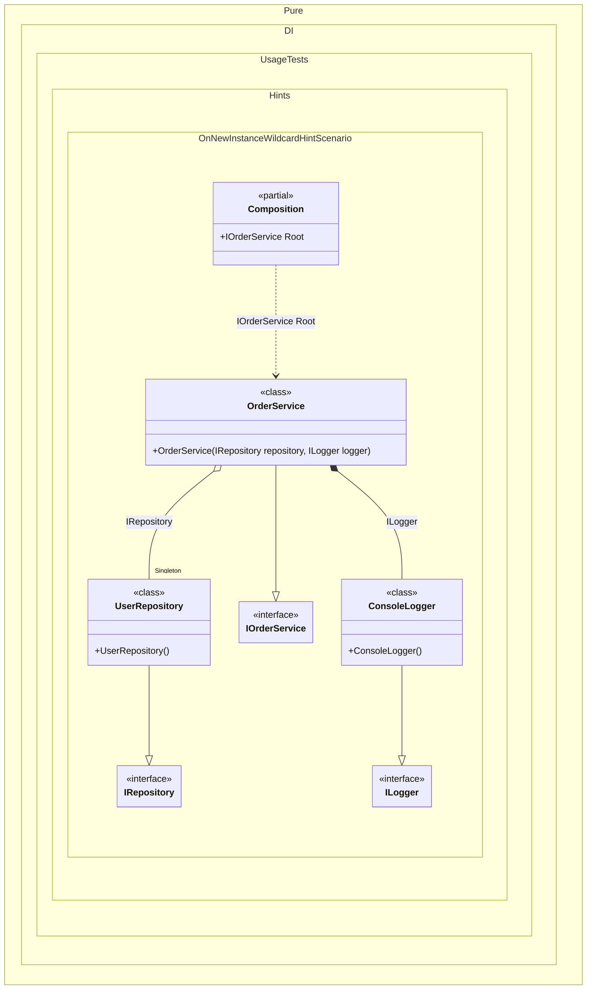

#### OnNewInstance wildcard hint

Hints are used to fine-tune code generation. The _OnNewInstance_ hint determines whether to generate partial _OnNewInstance_ method.
In addition, setup hints can be comments before the _Setup_ method in the form ```hint = value```, for example: `// OnNewInstance = On`.


```c#
using Shouldly;
using Pure.DI;
using static Pure.DI.Hint;

DI.Setup(nameof(Composition))
    .Hint(OnNewInstance, "On")
    // Hints restrict the generation of the partial OnNewInstance method
    // to only those types whose names match the specified wildcards.
    // In this case, we want to track the creation of repositories and services.
    .Hint(OnNewInstanceImplementationTypeNameWildcard, "*Repository")
    .Hint(OnNewInstanceImplementationTypeNameWildcard, "*Service")
    .Bind().As(Lifetime.Singleton).To<UserRepository>()
    .Bind().To<OrderService>()
    // This type will not be tracked because its name
    // does not match the wildcards
    .Bind().To<ConsoleLogger>()
    .Root<IOrderService>("Root");

var log = new List<string>();
var composition = new Composition(log);

var service1 = composition.Root;
var service2 = composition.Root;

log.ShouldBe([
    "UserRepository created",
    "OrderService created",
    "OrderService created"
]);

interface IRepository;

class UserRepository : IRepository
{
    public override string ToString() => nameof(UserRepository);
}

interface ILogger;

class ConsoleLogger : ILogger
{
    public override string ToString() => nameof(ConsoleLogger);
}

interface IOrderService
{
    IRepository Repository { get; }
}

class OrderService(IRepository repository, ILogger logger) : IOrderService
{
    public IRepository Repository { get; } = repository;

    public ILogger Logger { get; } = logger;

    public override string ToString() => nameof(OrderService);
}

internal partial class Composition(List<string> log)
{
    partial void OnNewInstance<T>(
        ref T value,
        object? tag,
        Lifetime lifetime) =>
        log.Add($"{typeof(T).Name} created");
}
```

<details>
<summary>Running this code sample locally</summary>

- Make sure you have the [.NET SDK 10.0](https://dotnet.microsoft.com/en-us/download/dotnet/10.0) or later is installed
```bash
dotnet --list-sdk
```
- Create a net10.0 (or later) console application
```bash
dotnet new console -n Sample
```
- Add references to NuGet packages
  - [Pure.DI](https://www.nuget.org/packages/Pure.DI)
  - [Shouldly](https://www.nuget.org/packages/Shouldly)
```bash
dotnet add package Pure.DI
dotnet add package Shouldly
```
- Copy the example code into the _Program.cs_ file

You are ready to run the example 🚀
```bash
dotnet run
```

</details>

The `OnNewInstanceImplementationTypeNameWildcard` hint helps you define a set of implementation types that require instance creation control. You can use it to specify a wildcard to filter bindings by implementation name.
For more hints, see [this](README.md#setup-hints) page.

The following partial class will be generated:

```c#
partial class Composition
{
#if NET9_0_OR_GREATER
  private readonly Lock _lock = new Lock();
#else
  private readonly Object _lock = new Object();
#endif

  private UserRepository? _singletonUserRepository51;

  public IOrderService Root
  {
    [MethodImpl(MethodImplOptions.AggressiveInlining)]
    get
    {
      if (_singletonUserRepository51 is null)
        lock (_lock)
          if (_singletonUserRepository51 is null)
          {
            UserRepository _singletonUserRepository51Temp;
            _singletonUserRepository51Temp = new UserRepository();
            OnNewInstance<UserRepository>(ref _singletonUserRepository51Temp, null, Lifetime.Singleton);
            Thread.MemoryBarrier();
            _singletonUserRepository51 = _singletonUserRepository51Temp;
          }

      var transientOrderService = new OrderService(_singletonUserRepository51, new ConsoleLogger());
      OnNewInstance<OrderService>(ref transientOrderService, null, Lifetime.Transient);
      return transientOrderService;
    }
  }


  partial void OnNewInstance<T>(ref T value, object? tag, Lifetime lifetime);
}
```

Class diagram:



