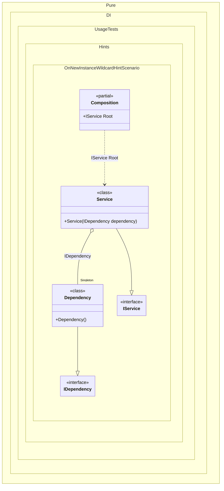

#### OnNewInstance wildcard hint

Hints are used to fine-tune code generation. The _OnNewInstance_ hint determines whether to generate partial _OnNewInstance_ method.
In addition, setup hints can be comments before the _Setup_ method in the form ```hint = value```, for example: `// OnNewInstance = On`.


```c#
using Shouldly;
using Pure.DI;
using static Pure.DI.Hint;

DI.Setup(nameof(Composition))
    .Hint(OnNewInstance, "On")
    .Hint(OnNewInstanceImplementationTypeNameWildcard, "*Dependency")
    .Hint(OnNewInstanceImplementationTypeNameWildcard, "*Service")
    .Bind().As(Lifetime.Singleton).To<Dependency>()
    .Bind().To<Service>()
    .Root<IService>("Root");

var log = new List<string>();
var composition = new Composition(log);
var service1 = composition.Root;
var service2 = composition.Root;

log.ShouldBe([
    "Dependency created",
    "Service created",
    "Service created"]);

interface IDependency;

class Dependency : IDependency
{
    public override string ToString() => nameof(Dependency);
}

interface IService
{
    IDependency Dependency { get; }
}

class Service(IDependency dependency) : IService
{
    public IDependency Dependency { get; } = dependency;

    public override string ToString() => nameof(Service);
}

internal partial class Composition
{
    private readonly List<string> _log = [];

    public Composition(List<string> log) : this() =>
        _log = log;

    partial void OnNewInstance<T>(
        ref T value,
        object? tag,
        Lifetime lifetime) =>
        _log.Add($"{typeof(T).Name} created");
}
```

<details>
<summary>Running this code sample locally</summary>

- Make sure you have the [.NET SDK 9.0](https://dotnet.microsoft.com/en-us/download/dotnet/9.0) or later is installed
```bash
dotnet --list-sdk
```
- Create a net9.0 (or later) console application
```bash
dotnet new console -n Sample
```
- Add references to NuGet packages
  - [Pure.DI](https://www.nuget.org/packages/Pure.DI)
  - [Shouldly](https://www.nuget.org/packages/Shouldly)
```bash
dotnet add package Pure.DI
dotnet add package Shouldly
```
- Copy the example code into the _Program.cs_ file

You are ready to run the example 🚀
```bash
dotnet run
```

</details>

The `OnNewInstanceImplementationTypeNameWildcard` hint helps you define a set of implementation types that require instance creation control. You can use it to specify a wildcard to filter bindings by implementation name.
For more hints, see [this](README.md#setup-hints) page.

The following partial class will be generated:

```c#
partial class Composition
{
  private readonly Composition _root;
#if NET9_0_OR_GREATER
  private readonly Lock _lock;
#else
  private readonly Object _lock;
#endif

  private Dependency? _singleDependency52;

  [OrdinalAttribute(256)]
  public Composition()
  {
    _root = this;
#if NET9_0_OR_GREATER
    _lock = new Lock();
#else
    _lock = new Object();
#endif
  }

  internal Composition(Composition parentScope)
  {
    _root = (parentScope ?? throw new ArgumentNullException(nameof(parentScope)))._root;
    _lock = parentScope._lock;
  }

  public IService Root
  {
    [MethodImpl(MethodImplOptions.AggressiveInlining)]
    get
    {
      if (_root._singleDependency52 is null)
        lock (_lock)
          if (_root._singleDependency52 is null)
          {
            Dependency _singleDependency52Temp;
            _singleDependency52Temp = new Dependency();
            OnNewInstance<Dependency>(ref _singleDependency52Temp, null, Lifetime.Singleton);
            Thread.MemoryBarrier();
            _root._singleDependency52 = _singleDependency52Temp;
          }

      var transService = new Service(_root._singleDependency52);
      OnNewInstance<Service>(ref transService, null, Lifetime.Transient);
      return transService;
    }
  }


  partial void OnNewInstance<T>(ref T value, object? tag, Lifetime lifetime);
}
```

Class diagram:



