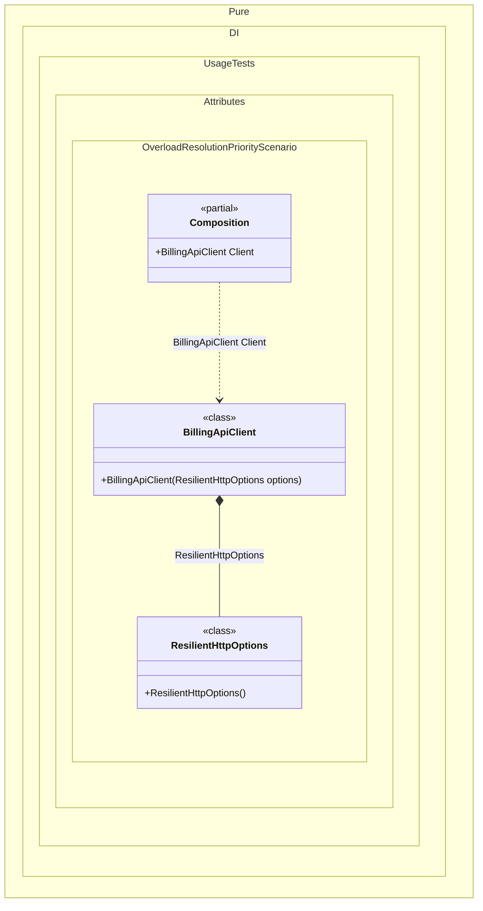

#### Overload resolution priority

Library types sometimes keep an older constructor for compatibility while introducing a better overload for newly compiled applications. Starting with C# 13, `OverloadResolutionPriorityAttribute` tells the compiler which overload should be preferred. Pure.DI follows the same priority when it chooses a constructor and builds its dependency graph.


```c#
using Shouldly;
using Pure.DI;
using System.Runtime.CompilerServices;

DI.Setup(nameof(Composition))
    // Both constructor dependencies can be created automatically.
    // The constructor attribute determines which graph is preferred.
    .Root<BillingApiClient>("Client");

var composition = new Composition();
var client = composition.Client;

client.Transport.ShouldBe("resilient-http");

class LegacyHttpOptions;

class ResilientHttpOptions;

class BillingApiClient
{
    // Kept so existing callers compiled against the old API continue to work.
    public BillingApiClient(LegacyHttpOptions options) =>
        Transport = "legacy-http";

    // New compilations, including generated Pure.DI code, prefer this overload.
    [OverloadResolutionPriority(1)]
    public BillingApiClient(ResilientHttpOptions options) =>
        Transport = "resilient-http";

    public string Transport { get; }
}
```

<details>
<summary>Running this code sample locally</summary>

- Make sure you have the [.NET SDK 10.0](https://dotnet.microsoft.com/en-us/download/dotnet/10.0) or later installed
```bash
dotnet --list-sdk
```
- Create a net10.0 (or later) console application
```bash
dotnet new console -n Sample
```
- Add references to the NuGet packages
  - [Pure.DI](https://www.nuget.org/packages/Pure.DI)
  - [Shouldly](https://www.nuget.org/packages/Shouldly)
```bash
dotnet add package Pure.DI
dotnet add package Shouldly
```
- Copy the example code into the _Program.cs_ file

You are ready to run the example 🚀
```bash
dotnet run
```

</details>

Higher integer values are preferred; unannotated constructors have priority `0`, and negative values can de-prioritize legacy overloads. If the preferred constructor cannot be resolved, Pure.DI continues with the next applicable constructor.
`OrdinalAttribute` remains the explicit Pure.DI override. When any accessible constructor is marked with `Ordinal`, only marked constructors participate and their ordinal order takes precedence over `OverloadResolutionPriorityAttribute`.

<details>
<summary>The following partial class will be generated</summary>

```c#
partial class Composition
{
  public BillingApiClient Client
  {
    [MethodImpl(MethodImplOptions.AggressiveInlining)]
    get
    {
      return new BillingApiClient(new ResilientHttpOptions());
    }
  }
}
```

</details>

Class diagram:



See also:

- [Constructor ordinal attribute](constructor-ordinal-attribute.md)
- [Auto-bindings](auto-bindings.md)

