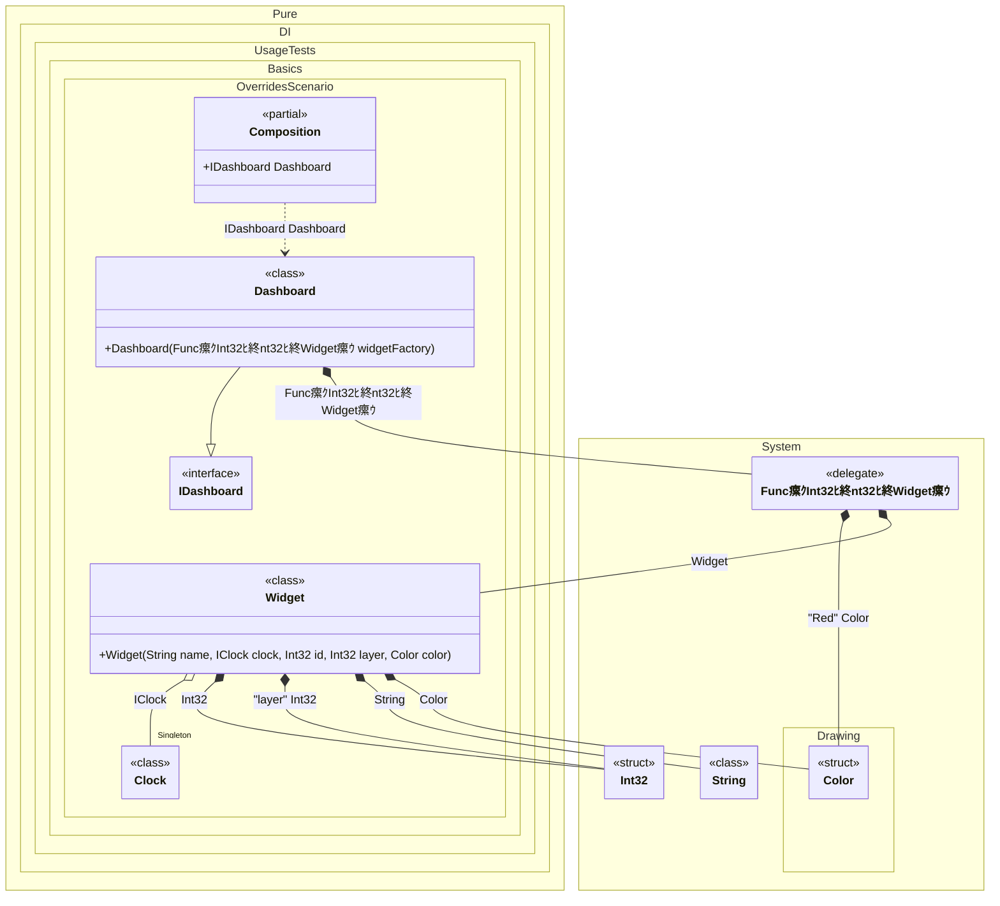

#### Overrides

This example demonstrates advanced dependency injection techniques using Pure.DI's override mechanism to customize dependency instantiation with runtime arguments and tagged parameters. The implementation creates multiple `IDependency` instances with values manipulated through explicit overrides.


```c#
using Shouldly;
using Pure.DI;
using System.Collections.Immutable;
using System.Drawing;

DI.Setup(nameof(Composition))
    .Bind(Tag.Red).To(_ => Color.Red)
    .Bind().As(Lifetime.Singleton).To<Clock>()
    // The factory accepts the widget ID and the layer index
    .Bind().To<Func<int, int, IWidget>>(ctx =>
        (widgetId, layerIndex) => {
            // Overrides the 'id' argument of the constructor with the first lambda argument
            ctx.Override(widgetId);

            // Overrides the 'layer' tagged argument of the constructor with the second lambda argument
            ctx.Override(layerIndex, "layer");

            // Overrides the 'name' argument with a formatted string
            ctx.Override($"Widget {widgetId} on layer {layerIndex}");

            // Resolves the 'Color' dependency tagged with 'Red'
            ctx.Inject(Tag.Red, out Color color);
            // Overrides the 'color' argument with the resolved value
            ctx.Override(color);

            // Creates the instance using the overridden values
            ctx.Inject<Widget>(out var widget);
            return widget;
        })
    .Bind().To<Dashboard>()

    // Composition root
    .Root<IDashboard>("Dashboard");

var composition = new Composition();
var dashboard = composition.Dashboard;
dashboard.Widgets.Length.ShouldBe(3);

dashboard.Widgets[0].Id.ShouldBe(0);
dashboard.Widgets[0].Layer.ShouldBe(99);
dashboard.Widgets[0].Name.ShouldBe("Widget 0 on layer 99");

dashboard.Widgets[1].Id.ShouldBe(1);
dashboard.Widgets[1].Name.ShouldBe("Widget 1 on layer 99");

dashboard.Widgets[2].Id.ShouldBe(2);
dashboard.Widgets[2].Name.ShouldBe("Widget 2 on layer 99");

interface IClock
{
    DateTimeOffset Now { get; }
}

class Clock : IClock
{
    public DateTimeOffset Now => DateTimeOffset.Now;
}

interface IWidget
{
    string Name { get; }

    int Id { get; }

    int Layer { get; }
}

class Widget(
    string name,
    IClock clock,
    int id,
    [Tag("layer")] int layer,
    Color color)
    : IWidget
{
    public string Name => name;

    public int Id => id;

    public int Layer => layer;
}

interface IDashboard
{
    ImmutableArray<IWidget> Widgets { get; }
}

class Dashboard(Func<int, int, IWidget> widgetFactory) : IDashboard
{
    public ImmutableArray<IWidget> Widgets { get; } =
    [
        widgetFactory(0, 99),
        widgetFactory(1, 99),
        widgetFactory(2, 99)
    ];
}
```

<details>
<summary>Running this code sample locally</summary>

- Make sure you have the [.NET SDK 10.0](https://dotnet.microsoft.com/en-us/download/dotnet/10.0) or later is installed
```bash
dotnet --list-sdk
```
- Create a net10.0 (or later) console application
```bash
dotnet new console -n Sample
```
- Add references to NuGet packages
  - [Pure.DI](https://www.nuget.org/packages/Pure.DI)
  - [Shouldly](https://www.nuget.org/packages/Shouldly)
```bash
dotnet add package Pure.DI
dotnet add package Shouldly
```
- Copy the example code into the _Program.cs_ file

You are ready to run the example 🚀
```bash
dotnet run
```

</details>

The following partial class will be generated:

```c#
partial class Composition
{
  private readonly Composition _root;
#if NET9_0_OR_GREATER
  private readonly Lock _lock;
#else
  private readonly Object _lock;
#endif

  private Clock? _singletonClock52;

  [OrdinalAttribute(256)]
  public Composition()
  {
    _root = this;
#if NET9_0_OR_GREATER
    _lock = new Lock();
#else
    _lock = new Object();
#endif
  }

  internal Composition(Composition parentScope)
  {
    _root = (parentScope ?? throw new ArgumentNullException(nameof(parentScope)))._root;
    _lock = parentScope._lock;
  }

  public IDashboard Dashboard
  {
    [MethodImpl(MethodImplOptions.AggressiveInlining)]
    get
    {
      Func<int, int, IWidget> transientFunc1 =
      [MethodImpl(MethodImplOptions.AggressiveInlining)]
      (localWidgetId, localLayerIndex) =>
      {
        // Overrides the 'id' argument of the constructor with the first lambda argument
        // Overrides the 'layer' tagged argument of the constructor with the second lambda argument
        // Overrides the 'name' argument with a formatted string
        // Resolves the 'Color' dependency tagged with 'Red'
        int overriddenInt32 = localWidgetId;
        int overriddenInt324 = localLayerIndex;
        string overriddenString2 = $"Widget {localWidgetId} on layer {localLayerIndex}";
        Drawing.Color transientColor2 = Color.Red;
        Drawing.Color localColor = transientColor2;
        // Overrides the 'color' argument with the resolved value
        // Creates the instance using the overridden values
        Drawing.Color overriddenColor5 = localColor;
        if (_root._singletonClock52 is null)
          lock (_lock)
            if (_root._singletonClock52 is null)
            {
              _root._singletonClock52 = new Clock();
            }

        Widget localWidget = new Widget(overriddenString2, _root._singletonClock52, overriddenInt32, overriddenInt324, overriddenColor5);
        return localWidget;
      };
      return new Dashboard(transientFunc1);
    }
  }
}
```

Class diagram:



