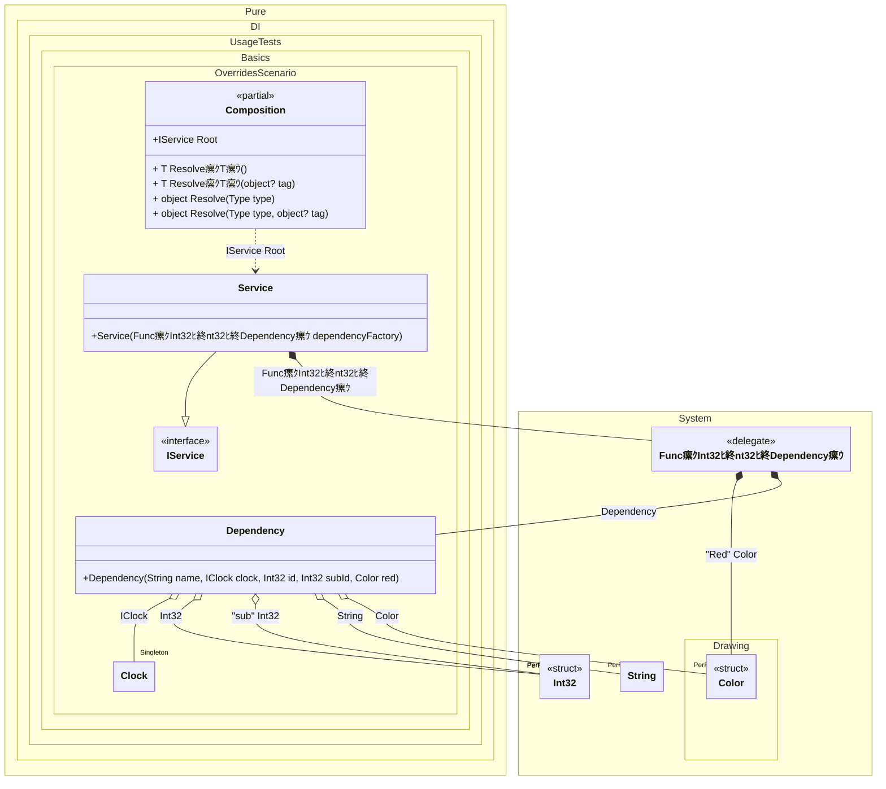

#### Overrides

This example demonstrates advanced dependency injection techniques using Pure.DI's override mechanism to customize dependency instantiation with runtime arguments and tagged parameters. The implementation creates multiple `IDependency` instances with values manipulated through explicit overrides.


```c#
using Shouldly;
using Pure.DI;
using System.Collections.Immutable;
using System.Drawing;

DI.Setup(nameof(Composition))
    .Bind(Tag.Red).To(_ => Color.Red)
    .Bind().As(Lifetime.Singleton).To<Clock>()
    .Bind().To<Func<int, int, IDependency>>(ctx =>
        (dependencyId, subId) =>
        {
            // Overrides with a lambda argument
            ctx.Override(dependencyId);

            // Overrides with tag using lambda argument
            ctx.Override(subId, "sub");

            // Overrides with some value
            ctx.Override($"Dep {dependencyId} {subId}");

            // Overrides with injected value
            ctx.Inject(Tag.Red, out Color red);
            ctx.Override(red);

            ctx.Inject<Dependency>(out var dependency);
            return dependency;
        })
    .Bind().To<Service>()

    // Composition root
    .Root<IService>("Root");

var composition = new Composition();
var service = composition.Root;
service.Dependencies.Length.ShouldBe(3);

service.Dependencies[0].Id.ShouldBe(0);
service.Dependencies[0].SubId.ShouldBe(99);
service.Dependencies[0].Name.ShouldBe("Dep 0 99");

service.Dependencies[1].Id.ShouldBe(1);
service.Dependencies[1].Name.ShouldBe("Dep 1 99");

service.Dependencies[2].Id.ShouldBe(2);
service.Dependencies[2].Name.ShouldBe("Dep 2 99");

interface IClock
{
    DateTimeOffset Now { get; }
}

class Clock : IClock
{
    public DateTimeOffset Now => DateTimeOffset.Now;
}

interface IDependency
{
    string Name { get; }

    int Id { get; }

    int SubId { get; }
}

class Dependency(
    string name,
    IClock clock,
    int id,
    [Tag("sub")] int subId,
    Color red)
    : IDependency
{
    public string Name => name;

    public int Id => id;

    public int SubId => subId;
}

interface IService
{
    ImmutableArray<IDependency> Dependencies { get; }
}

class Service(Func<int, int, IDependency> dependencyFactory): IService
{
    public ImmutableArray<IDependency> Dependencies { get; } =
    [
        dependencyFactory(0, 99),
        dependencyFactory(1, 99),
        dependencyFactory(2, 99)
    ];
}
```

<details>
<summary>Running this code sample locally</summary>

- Make sure you have the [.NET SDK 9.0](https://dotnet.microsoft.com/en-us/download/dotnet/9.0) or later is installed
```bash
dotnet --list-sdk
```
- Create a net9.0 (or later) console application
```bash
dotnet new console -n Sample
```
- Add references to NuGet packages
  - [Pure.DI](https://www.nuget.org/packages/Pure.DI)
  - [Shouldly](https://www.nuget.org/packages/Shouldly)
```bash
dotnet add package Pure.DI
dotnet add package Shouldly
```
- Copy the example code into the _Program.cs_ file

You are ready to run the example 🚀
```bash
dotnet run
```

</details>

The following partial class will be generated:

```c#
partial class Composition
{
  private readonly Composition _root;
  private readonly Lock _lock;

  private Clock? _singletonClock52;

  [OrdinalAttribute(256)]
  public Composition()
  {
    _root = this;
    _lock = new Lock();
  }

  internal Composition(Composition parentScope)
  {
    _root = (parentScope ?? throw new ArgumentNullException(nameof(parentScope)))._root;
    _lock = _root._lock;
  }

  public IService Root
  {
    [MethodImpl(MethodImplOptions.AggressiveInlining)]
    get
    {
      string overString2;
      int overInt320;
      int overInt321;
      Drawing.Color overColor3;
      Func<int, int, IDependency> transientFunc1 =
      [MethodImpl(MethodImplOptions.AggressiveInlining)]
      (localDependencyId0, localSubId1) =>
      {
        // Overrides with a lambda argument
        // Overrides with tag using lambda argument
        // Overrides with some value
        // Overrides with injected value
        overInt320 = localDependencyId0;
        overInt321 = localSubId1;
        overString2 = $"Dep {localDependencyId0} {localSubId1}";
        Drawing.Color transientColor2 = Color.Red;
        Drawing.Color localRed2 = transientColor2;
        overColor3 = localRed2;
        if (_root._singletonClock52 is null)
        {
          using (_lock.EnterScope())
          {
            if (_root._singletonClock52 is null)
            {
              _root._singletonClock52 = new Clock();
            }
          }
        }

        Dependency localDependency100 = new Dependency(overString2, _root._singletonClock52, overInt320, overInt321, overColor3);
        return localDependency100;
      };
      return new Service(transientFunc1);
    }
  }

  [MethodImpl(MethodImplOptions.AggressiveInlining)]
  public T Resolve<T>()
  {
    return Resolver<T>.Value.Resolve(this);
  }

  [MethodImpl(MethodImplOptions.AggressiveInlining)]
  public T Resolve<T>(object? tag)
  {
    return Resolver<T>.Value.ResolveByTag(this, tag);
  }

  [MethodImpl(MethodImplOptions.AggressiveInlining)]
  public object Resolve(Type type)
  {
    var index = (int)(_bucketSize * ((uint)RuntimeHelpers.GetHashCode(type) % 1));
    ref var pair = ref _buckets[index];
    return pair.Key == type ? pair.Value.Resolve(this) : Resolve(type, index);
  }

  [MethodImpl(MethodImplOptions.NoInlining)]
  private object Resolve(Type type, int index)
  {
    var finish = index + _bucketSize;
    while (++index < finish)
    {
      ref var pair = ref _buckets[index];
      if (pair.Key == type)
      {
        return pair.Value.Resolve(this);
      }
    }

    throw new InvalidOperationException($"{CannotResolveMessage} {OfTypeMessage} {type}.");
  }

  [MethodImpl(MethodImplOptions.AggressiveInlining)]
  public object Resolve(Type type, object? tag)
  {
    var index = (int)(_bucketSize * ((uint)RuntimeHelpers.GetHashCode(type) % 1));
    ref var pair = ref _buckets[index];
    return pair.Key == type ? pair.Value.ResolveByTag(this, tag) : Resolve(type, tag, index);
  }

  [MethodImpl(MethodImplOptions.NoInlining)]
  private object Resolve(Type type, object? tag, int index)
  {
    var finish = index + _bucketSize;
    while (++index < finish)
    {
      ref var pair = ref _buckets[index];
      if (pair.Key == type)
      {
        return pair.Value.ResolveByTag(this, tag);
      }
    }

    throw new InvalidOperationException($"{CannotResolveMessage} \"{tag}\" {OfTypeMessage} {type}.");
  }

  private readonly static int _bucketSize;
  private readonly static Pair<Type, IResolver<Composition, object>>[] _buckets;

  static Composition()
  {
    var valResolver_0000 = new Resolver_0000();
    Resolver<IService>.Value = valResolver_0000;
    _buckets = Buckets<Type, IResolver<Composition, object>>.Create(
      1,
      out _bucketSize,
      new Pair<Type, IResolver<Composition, object>>[1]
      {
         new Pair<Type, IResolver<Composition, object>>(typeof(IService), valResolver_0000)
      });
  }

  private const string CannotResolveMessage = "Cannot resolve composition root ";
  private const string OfTypeMessage = "of type ";

  private class Resolver<T>: IResolver<Composition, T>
  {
    public static IResolver<Composition, T> Value = new Resolver<T>();

    public virtual T Resolve(Composition composite)
    {
      throw new InvalidOperationException($"{CannotResolveMessage}{OfTypeMessage}{typeof(T)}.");
    }

    public virtual T ResolveByTag(Composition composite, object tag)
    {
      throw new InvalidOperationException($"{CannotResolveMessage}\"{tag}\" {OfTypeMessage}{typeof(T)}.");
    }
  }

  private sealed class Resolver_0000: Resolver<IService>
  {
    public override IService Resolve(Composition composition)
    {
      return composition.Root;
    }

    public override IService ResolveByTag(Composition composition, object tag)
    {
      switch (tag)
      {
        case null:
          return composition.Root;

        default:
          return base.ResolveByTag(composition, tag);
      }
    }
  }
}
```

Class diagram:



