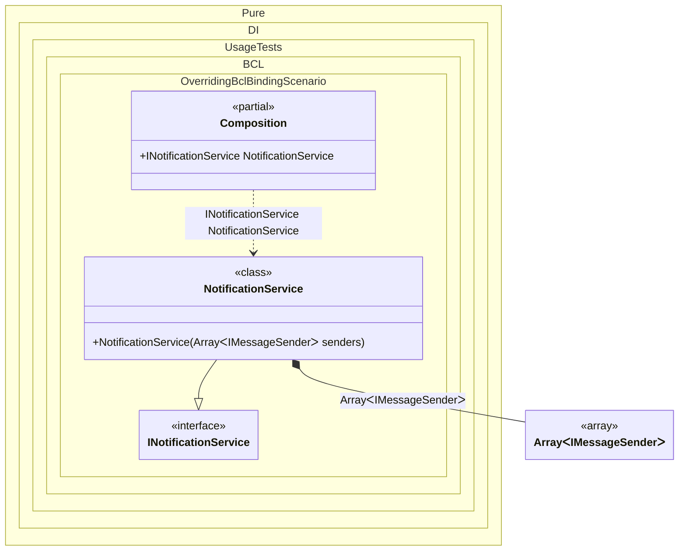

#### Overriding the BCL binding

At any time, the default binding to the BCL type can be changed to your own:


```c#
using Shouldly;
using Pure.DI;

DI.Setup(nameof(Composition))
    .Bind<IMessageSender[]>().To<IMessageSender[]>(_ =>
        [new EmailSender(), new SmsSender(), new EmailSender()]
    )
    .Bind<INotificationService>().To<NotificationService>()

    // Composition root
    .Root<INotificationService>("NotificationService");

var composition = new Composition();
var notificationService = composition.NotificationService;
notificationService.Senders.Length.ShouldBe(3);
notificationService.Senders[0].ShouldBeOfType<EmailSender>();
notificationService.Senders[1].ShouldBeOfType<SmsSender>();
notificationService.Senders[2].ShouldBeOfType<EmailSender>();

interface IMessageSender;

class EmailSender : IMessageSender;

class SmsSender : IMessageSender;

interface INotificationService
{
    IMessageSender[] Senders { get; }
}

class NotificationService(IMessageSender[] senders) : INotificationService
{
    public IMessageSender[] Senders { get; } = senders;
}
```

<details>
<summary>Running this code sample locally</summary>

- Make sure you have the [.NET SDK 10.0](https://dotnet.microsoft.com/en-us/download/dotnet/10.0) or later is installed
```bash
dotnet --list-sdk
```
- Create a net10.0 (or later) console application
```bash
dotnet new console -n Sample
```
- Add references to NuGet packages
  - [Pure.DI](https://www.nuget.org/packages/Pure.DI)
  - [Shouldly](https://www.nuget.org/packages/Shouldly)
```bash
dotnet add package Pure.DI
dotnet add package Shouldly
```
- Copy the example code into the _Program.cs_ file

You are ready to run the example 🚀
```bash
dotnet run
```

</details>

The following partial class will be generated:

```c#
partial class Composition
{
  [OrdinalAttribute(256)]
  public Composition()
  {
  }

  internal Composition(Composition parentScope)
  {
  }

  public INotificationService NotificationService
  {
    [MethodImpl(MethodImplOptions.AggressiveInlining)]
    get
    {
      IMessageSender[] transient1 = [new EmailSender(), new SmsSender(), new EmailSender()];
      return new NotificationService(transient1);
    }
  }
}
```

Class diagram:



