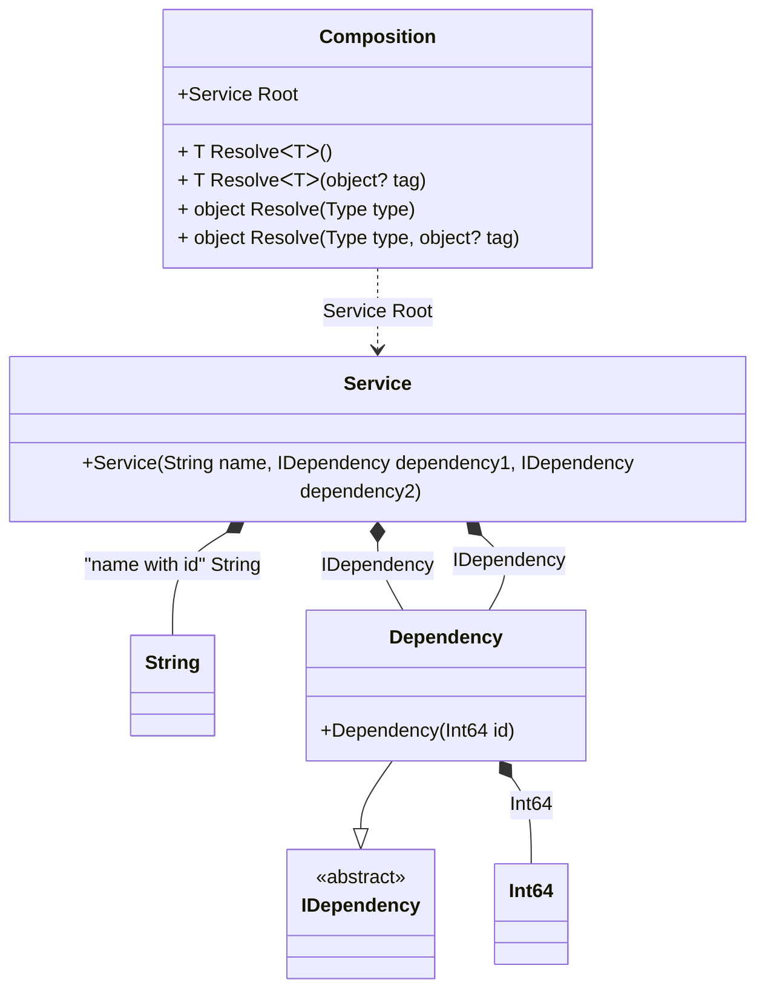

#### Partial class

[](../tests/Pure.DI.UsageTests/Advanced/PartialClassScenario.cs)

A partial class can contain setup code.

```c#
interface IDependency
{
    long Id { get; }
}

class Dependency(long id) : IDependency
{
    public long Id { get; } = id;
}

class Service(
    [Tag("name with id")] string name,
    IDependency dependency1,
    IDependency dependency2)
{
    public string Name { get; } = name;

    public IDependency Dependency1 { get; } = dependency1;

    public IDependency Dependency2 { get; } = dependency2;
}

// The partial class is also useful for specifying access modifiers to the generated class
public partial class Composition
{
    private readonly string _serviceName;
    private long _id;

    // Customizable constructor
    public Composition(string serviceName)
        : this()
    {
        _serviceName = serviceName;
    }

    private long GenerateId() => Interlocked.Increment(ref _id);

    // In fact, this method will not be called at runtime
    [Conditional("DI")]
    private void Setup() =>
        DI.Setup(nameof(Composition))
            .Bind<IDependency>().To<Dependency>()
            .Bind<long>().To(_ => GenerateId())
            .Bind<string>("name with id").To(
                _ => $"{_serviceName}_{GenerateId()}")
            .Root<Service>(
                "Root",
                kind: RootKinds.Internal);
}

var composition = new Composition("Abc");
var service = composition.Root;
        
service.Dependency1.Id.ShouldBe(1);
service.Dependency2.Id.ShouldBe(2);
service.Name.ShouldBe("Abc_3");
```

The partial class is also useful for specifying access modifiers to the generated class.

<details open>
<summary>Class Diagram</summary>



</details>

<details>
<summary>Pure.DI-generated partial class Composition</summary><blockquote>

```c#
partial class Composition
{
  private readonly Composition _rootM03D26di;
  
  public Composition()
  {
    _rootM03D26di = this;
  }
  
  internal Composition(Composition baseComposition)
  {
    _rootM03D26di = baseComposition._rootM03D26di;
  }
  
  internal Pure.DI.UsageTests.Advanced.PartialClassScenario.Service Root
  {
    get
    {
      long transientM03D26di5_Int64 = GenerateId();
      long transientM03D26di4_Int64 = GenerateId();
      string transientM03D26di1_String = $"{_serviceName}_{GenerateId()}";
      return new Pure.DI.UsageTests.Advanced.PartialClassScenario.Service(transientM03D26di1_String, new Pure.DI.UsageTests.Advanced.PartialClassScenario.Dependency(transientM03D26di5_Int64), new Pure.DI.UsageTests.Advanced.PartialClassScenario.Dependency(transientM03D26di4_Int64));
    }
  }
  
  public T Resolve<T>()
  {
    return ResolverM03D26di<T>.Value.Resolve(this);
  }
  
  public T Resolve<T>(object? tag)
  {
    return ResolverM03D26di<T>.Value.ResolveByTag(this, tag);
  }
  
  public object Resolve(global::System.Type type)
  {
    var index = (int)(_bucketSizeM03D26di * ((uint)global::System.Runtime.CompilerServices.RuntimeHelpers.GetHashCode(type) % 1));
    var finish = index + _bucketSizeM03D26di;
    do {
      ref var pair = ref _bucketsM03D26di[index];
      if (ReferenceEquals(pair.Key, type))
      {
        return pair.Value.Resolve(this);
      }
    } while (++index < finish);
    
    throw new global::System.InvalidOperationException($"Cannot resolve composition root of type {type}.");
  }
  
  public object Resolve(global::System.Type type, object? tag)
  {
    var index = (int)(_bucketSizeM03D26di * ((uint)global::System.Runtime.CompilerServices.RuntimeHelpers.GetHashCode(type) % 1));
    var finish = index + _bucketSizeM03D26di;
    do {
      ref var pair = ref _bucketsM03D26di[index];
      if (ReferenceEquals(pair.Key, type))
      {
        return pair.Value.ResolveByTag(this, tag);
      }
    } while (++index < finish);
    
    throw new global::System.InvalidOperationException($"Cannot resolve composition root \"{tag}\" of type {type}.");
  }
  
  public override string ToString()
  {
    return
      "classDiagram\n" +
        "  class Composition {\n" +
          "    +Service Root\n" +
          "    + T ResolveᐸTᐳ()\n" +
          "    + T ResolveᐸTᐳ(object? tag)\n" +
          "    + object Resolve(Type type)\n" +
          "    + object Resolve(Type type, object? tag)\n" +
        "  }\n" +
        "  class Service {\n" +
          "    +Service(String name, IDependency dependency1, IDependency dependency2)\n" +
        "  }\n" +
        "  class Int64\n" +
        "  class String\n" +
        "  Dependency --|> IDependency : \n" +
        "  class Dependency {\n" +
          "    +Dependency(Int64 id)\n" +
        "  }\n" +
        "  class IDependency {\n" +
          "    <<abstract>>\n" +
        "  }\n" +
        "  Service *--  String : \"name with id\"  String\n" +
        "  Service *--  Dependency : IDependency\n" +
        "  Service *--  Dependency : IDependency\n" +
        "  Dependency *--  Int64 : Int64\n" +
        "  Composition ..> Service : Service Root";
  }
  
  private readonly static int _bucketSizeM03D26di;
  private readonly static global::Pure.DI.Pair<global::System.Type, global::Pure.DI.IResolver<Composition, object>>[] _bucketsM03D26di;
  
  static Composition()
  {
    var valResolverM03D26di_0000 = new ResolverM03D26di_0000();
    ResolverM03D26di<Pure.DI.UsageTests.Advanced.PartialClassScenario.Service>.Value = valResolverM03D26di_0000;
    _bucketsM03D26di = global::Pure.DI.Buckets<global::System.Type, global::Pure.DI.IResolver<Composition, object>>.Create(
      1,
      out _bucketSizeM03D26di,
      new global::Pure.DI.Pair<global::System.Type, global::Pure.DI.IResolver<Composition, object>>[1]
      {
         new global::Pure.DI.Pair<global::System.Type, global::Pure.DI.IResolver<Composition, object>>(typeof(Pure.DI.UsageTests.Advanced.PartialClassScenario.Service), valResolverM03D26di_0000)
      });
  }
  
  private sealed class ResolverM03D26di<T>: global::Pure.DI.IResolver<Composition, T>
  {
    public static global::Pure.DI.IResolver<Composition, T> Value = new ResolverM03D26di<T>();
    
    public T Resolve(Composition composite)
    {
      throw new global::System.InvalidOperationException($"Cannot resolve composition root of type {typeof(T)}.");
    }
    
    public T ResolveByTag(Composition composite, object tag)
    {
      throw new global::System.InvalidOperationException($"Cannot resolve composition root \"{tag}\" of type {typeof(T)}.");
    }
  }
  
  private sealed class ResolverM03D26di_0000: global::Pure.DI.IResolver<Composition, Pure.DI.UsageTests.Advanced.PartialClassScenario.Service>
  {
    public Pure.DI.UsageTests.Advanced.PartialClassScenario.Service Resolve(Composition composition)
    {
      return composition.Root;
    }
    
    public Pure.DI.UsageTests.Advanced.PartialClassScenario.Service ResolveByTag(Composition composition, object tag)
    {
      switch (tag)
      {
        case null:
          return composition.Root;
      }
      throw new global::System.InvalidOperationException($"Cannot resolve composition root \"{tag}\" of type Pure.DI.UsageTests.Advanced.PartialClassScenario.Service.");
    }
  }
}
```

</blockquote></details>

