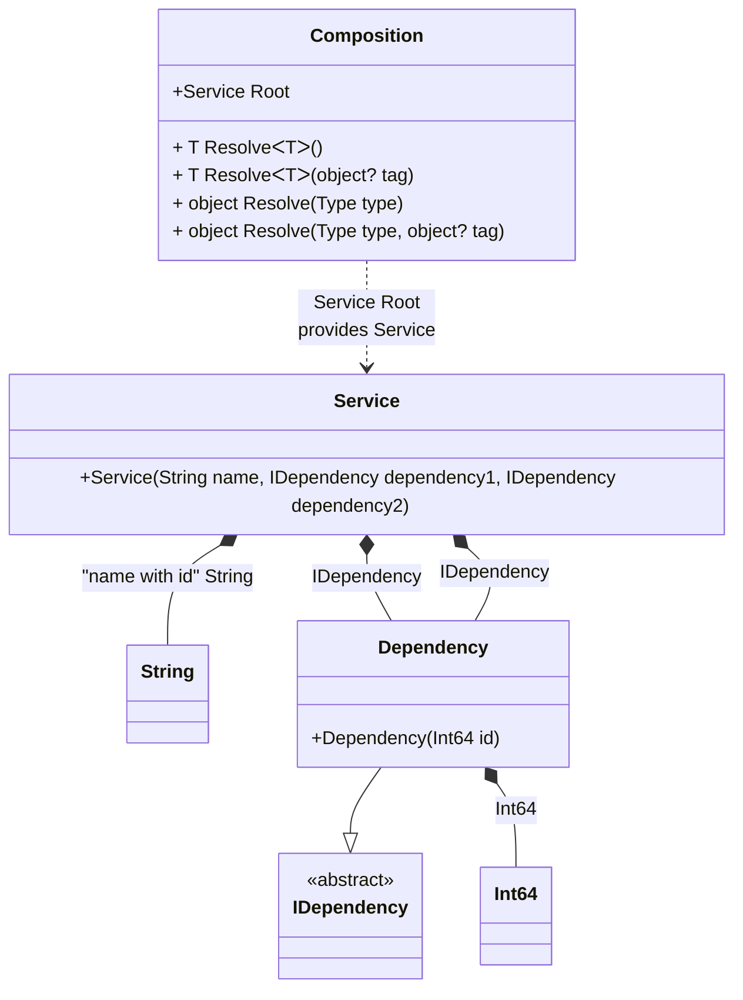

#### Partial class

[](../tests/Pure.DI.UsageTests/Basics/PartialClassScenario.cs)

A partial class can contain setup code.

```c#
interface IDependency
{
    long Id { get; }
}

class Dependency(long id) : IDependency
{
    public long Id { get; } = id;
}

class Service(
    [Tag("name with id")] string name,
    IDependency dependency1,
    IDependency dependency2)
{
    public string Name { get; } = name;

    public IDependency Dependency1 { get; } = dependency1;

    public IDependency Dependency2 { get; } = dependency2;
}

// The partial class is also useful for specifying access modifiers to the generated class
public partial class Composition
{
    private readonly string _serviceName;
    private long _id;

    // Customizable constructor
    public Composition(string serviceName)
        : this()
    {
        _serviceName = serviceName;
    }

    private long GenerateId() => Interlocked.Increment(ref _id);

    // In fact, this method will not be called at runtime
    [Conditional("DI")]
    private void Setup() =>
        DI.Setup(nameof(Composition))
            .Bind<IDependency>().To<Dependency>()
            .Bind<long>().To(_ => GenerateId())
            .Bind<string>("name with id").To(
                _ => $"{_serviceName}_{GenerateId()}")
            .Root<Service>(
                "Root",
                kind: RootKinds.Internal);
}

var composition = new Composition("Abc");
var service = composition.Root;
        
service.Dependency1.Id.ShouldBe(1);
service.Dependency2.Id.ShouldBe(2);
service.Name.ShouldBe("Abc_3");
```

The partial class is also useful for specifying access modifiers to the generated class.

<details open>
<summary>Class Diagram</summary>



</details>

<details>
<summary>Pure.DI-generated partial class Composition</summary><blockquote>

```c#
/// <para>
/// <b>Composition roots</b><br/>
/// <list type="table">
/// <listheader>
/// <term>Root</term>
/// <description>Description</description>
/// </listheader>
/// <item>
/// <term>
/// <see cref="Pure.DI.UsageTests.Basics.PartialClassScenario.Service"/> <see cref="Root"/><br/>or using <see cref="Resolve{T}()"/> method: <c>Resolve&lt;Pure.DI.UsageTests.Basics.PartialClassScenario.Service&gt;()</c>
/// </term>
/// <description>
/// Provides a composition root of type <see cref="Pure.DI.UsageTests.Basics.PartialClassScenario.Service"/>.
/// </description>
/// </item>
/// </list>
/// </para>
/// </summary>
/// <example>
/// This shows how to get an instance of type <see cref="Pure.DI.UsageTests.Basics.PartialClassScenario.Service"/> using the composition root <see cref="Root"/>:
/// <code>
/// var composition = new Composition();
/// var instance = composition.Root;
/// </code>
/// </example>
/// <a href="https://mermaid.live/view#pako:eNqlU0FuwjAQ_MrK50qloSotN0ioxBU4-mLiFZgSO3JcKoT4A3_ppd_hJ41tQpwgQGovK9u7Mzs7tnckVRxJn6RrVhSJYAvNMqqpdHuIVZarQhihJNDPTqc3tDm7ioZT1BuRIkyUMvUpzGCChVpv8Hj4mR0P3-741cW3u2VqvsLU2HX3HQxbXMB8QYX1oNk2RzBl-EN1DLdb9pLajGrgK0Z4-qnRQi5AsqxqME4wR8lRplvg5-XTzWx0XcVYmpfnQJTrZ_cBkUMndezFbr5Ro5s7GkBN1cqFI9YpP6UTAYLfkHmVrevFxGxeGM1O1o9OscEUGh4NwqHgNPd5CGINhy9hllYVqfL3WC7tCHT_G9y-kRbem1hBq2ttf7nIWeNjeYOhoBLW-ITO1rmmj74212ojOJ4frmUnDyRDnTHByz-_o8QssXyopE8JZ_qDkj3Z_wLCX19R">Class diagram</a><br/>
/// This class was created by <a href="https://github.com/DevTeam/Pure.DI">Pure.DI</a> source code generator.
/// <seealso cref="Pure.DI.DI.Setup"/>
/// <seealso cref="Pure.DI.IConfiguration.Bind(object[])"/>
/// <seealso cref="Pure.DI.IConfiguration.Bind{T}(object[])"/>
[global::System.Diagnostics.CodeAnalysis.ExcludeFromCodeCoverage]
partial class Composition
{
  private readonly Composition _rootM03D14di;
  
  /// <summary>
  /// This constructor creates a new instance of <see cref="Composition"/>.
  /// </summary>
  public Composition()
  {
    _rootM03D14di = this;
  }
  
  /// <summary>
  /// This constructor creates a new instance of <see cref="Composition"/> scope based on <paramref name="baseComposition"/>. This allows the <see cref="Lifetime.Scoped"/> life time to be applied.
  /// </summary>
  /// <param name="baseComposition">Base composition.</param>
  internal Composition(Composition baseComposition)
  {
    _rootM03D14di = baseComposition._rootM03D14di;
  }
  
  #region Composition Roots
  /// <summary>
  /// Provides a composition root of type <see cref="Pure.DI.UsageTests.Basics.PartialClassScenario.Service"/>.
  /// </summary>
  /// <example>
  /// This shows how to get an instance of type <see cref="Pure.DI.UsageTests.Basics.PartialClassScenario.Service"/>:
  /// <code>
  /// var composition = new Composition();
  /// var instance = composition.Root;
  /// </code>
  /// </example>
  internal Pure.DI.UsageTests.Basics.PartialClassScenario.Service Root
  {
    #if NETSTANDARD2_0_OR_GREATER || NETCOREAPP || NET40_OR_GREATER || NET
    [global::System.Diagnostics.Contracts.Pure]
    #endif
    get
    {
      long transientM03D14di5_Int64 = GenerateId();
      long transientM03D14di4_Int64 = GenerateId();
      string transientM03D14di1_String = $"{_serviceName}_{GenerateId()}";
      return new Pure.DI.UsageTests.Basics.PartialClassScenario.Service(transientM03D14di1_String, new Pure.DI.UsageTests.Basics.PartialClassScenario.Dependency(transientM03D14di5_Int64), new Pure.DI.UsageTests.Basics.PartialClassScenario.Dependency(transientM03D14di4_Int64));
    }
  }
  #endregion
  
  #region API
  /// <summary>
  /// Resolves the composition root.
  /// </summary>
  /// <typeparam name="T">The type of the composition root.</typeparam>
  /// <returns>A composition root.</returns>
  #if NETSTANDARD2_0_OR_GREATER || NETCOREAPP || NET40_OR_GREATER || NET
  [global::System.Diagnostics.Contracts.Pure]
  #endif
  public T Resolve<T>()
  {
    return ResolverM03D14di<T>.Value.Resolve(this);
  }
  
  /// <summary>
  /// Resolves the composition root by tag.
  /// </summary>
  /// <typeparam name="T">The type of the composition root.</typeparam>
  /// <param name="tag">The tag of a composition root.</param>
  /// <returns>A composition root.</returns>
  #if NETSTANDARD2_0_OR_GREATER || NETCOREAPP || NET40_OR_GREATER || NET
  [global::System.Diagnostics.Contracts.Pure]
  #endif
  public T Resolve<T>(object? tag)
  {
    return ResolverM03D14di<T>.Value.ResolveByTag(this, tag);
  }
  
  /// <summary>
  /// Resolves the composition root.
  /// </summary>
  /// <param name="type">The type of the composition root.</param>
  /// <returns>A composition root.</returns>
  #if NETSTANDARD2_0_OR_GREATER || NETCOREAPP || NET40_OR_GREATER || NET
  [global::System.Diagnostics.Contracts.Pure]
  #endif
  public object Resolve(global::System.Type type)
  {
    var index = (int)(_bucketSizeM03D14di * ((uint)global::System.Runtime.CompilerServices.RuntimeHelpers.GetHashCode(type) % 1));
    var finish = index + _bucketSizeM03D14di;
    do {
      ref var pair = ref _bucketsM03D14di[index];
      if (ReferenceEquals(pair.Key, type))
      {
        return pair.Value.Resolve(this);
      }
    } while (++index < finish);
    
    throw new global::System.InvalidOperationException($"Cannot resolve composition root of type {type}.");
  }
  
  /// <summary>
  /// Resolves the composition root by tag.
  /// </summary>
  /// <param name="type">The type of the composition root.</param>
  /// <param name="tag">The tag of a composition root.</param>
  /// <returns>A composition root.</returns>
  #if NETSTANDARD2_0_OR_GREATER || NETCOREAPP || NET40_OR_GREATER || NET
  [global::System.Diagnostics.Contracts.Pure]
  #endif
  public object Resolve(global::System.Type type, object? tag)
  {
    var index = (int)(_bucketSizeM03D14di * ((uint)global::System.Runtime.CompilerServices.RuntimeHelpers.GetHashCode(type) % 1));
    var finish = index + _bucketSizeM03D14di;
    do {
      ref var pair = ref _bucketsM03D14di[index];
      if (ReferenceEquals(pair.Key, type))
      {
        return pair.Value.ResolveByTag(this, tag);
      }
    } while (++index < finish);
    
    throw new global::System.InvalidOperationException($"Cannot resolve composition root \"{tag}\" of type {type}.");
  }
  #endregion
  
  /// <summary>
  /// This method provides a class diagram in mermaid format. To see this diagram, simply call the method and copy the text to this site https://mermaid.live/.
  /// </summary>
  public override string ToString()
  {
    return
      "classDiagram\n" +
        "  class Composition {\n" +
          "    +Service Root\n" +
          "    + T ResolveᐸTᐳ()\n" +
          "    + T ResolveᐸTᐳ(object? tag)\n" +
          "    + object Resolve(Type type)\n" +
          "    + object Resolve(Type type, object? tag)\n" +
        "  }\n" +
        "  class Service {\n" +
          "    +Service(String name, IDependency dependency1, IDependency dependency2)\n" +
        "  }\n" +
        "  class Int64\n" +
        "  class String\n" +
        "  Dependency --|> IDependency : \n" +
        "  class Dependency {\n" +
          "    +Dependency(Int64 id)\n" +
        "  }\n" +
        "  class IDependency {\n" +
          "    <<abstract>>\n" +
        "  }\n" +
        "  Service *--  String : \"name with id\"  String\n" +
        "  Service *--  Dependency : IDependency\n" +
        "  Service *--  Dependency : IDependency\n" +
        "  Dependency *--  Int64 : Int64\n" +
        "  Composition ..> Service : Service Root<br/>provides Service";
  }
  
  private readonly static int _bucketSizeM03D14di;
  private readonly static global::Pure.DI.Pair<global::System.Type, global::Pure.DI.IResolver<Composition, object>>[] _bucketsM03D14di;
  
  static Composition()
  {
    var valResolverM03D14di_0000 = new ResolverM03D14di_0000();
    ResolverM03D14di<Pure.DI.UsageTests.Basics.PartialClassScenario.Service>.Value = valResolverM03D14di_0000;
    _bucketsM03D14di = global::Pure.DI.Buckets<global::System.Type, global::Pure.DI.IResolver<Composition, object>>.Create(
      1,
      out _bucketSizeM03D14di,
      new global::Pure.DI.Pair<global::System.Type, global::Pure.DI.IResolver<Composition, object>>[1]
      {
         new global::Pure.DI.Pair<global::System.Type, global::Pure.DI.IResolver<Composition, object>>(typeof(Pure.DI.UsageTests.Basics.PartialClassScenario.Service), valResolverM03D14di_0000)
      });
  }
  
  #region Resolvers
  private sealed class ResolverM03D14di<T>: global::Pure.DI.IResolver<Composition, T>
  {
    public static global::Pure.DI.IResolver<Composition, T> Value = new ResolverM03D14di<T>();
    
    public T Resolve(Composition composite)
    {
      throw new global::System.InvalidOperationException($"Cannot resolve composition root of type {typeof(T)}.");
    }
    
    public T ResolveByTag(Composition composite, object tag)
    {
      throw new global::System.InvalidOperationException($"Cannot resolve composition root \"{tag}\" of type {typeof(T)}.");
    }
  }
  
  private sealed class ResolverM03D14di_0000: global::Pure.DI.IResolver<Composition, Pure.DI.UsageTests.Basics.PartialClassScenario.Service>
  {
    public Pure.DI.UsageTests.Basics.PartialClassScenario.Service Resolve(Composition composition)
    {
      return composition.Root;
    }
    
    public Pure.DI.UsageTests.Basics.PartialClassScenario.Service ResolveByTag(Composition composition, object tag)
    {
      switch (tag)
      {
        case null:
          return composition.Root;
      }
      throw new global::System.InvalidOperationException($"Cannot resolve composition root \"{tag}\" of type Pure.DI.UsageTests.Basics.PartialClassScenario.Service.");
    }
  }
  #endregion
}
```

</blockquote></details>

