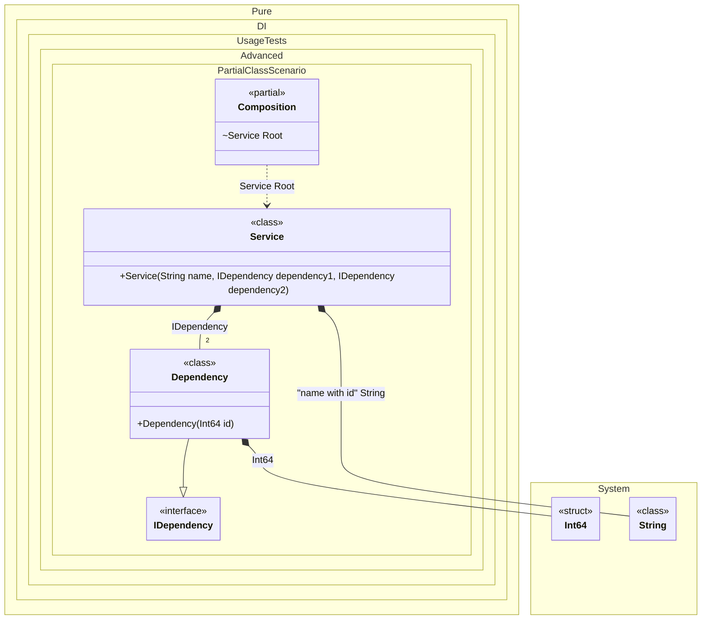

#### Partial class

A partial class can contain setup code.


```c#
using Shouldly;
using Pure.DI;
using static Pure.DI.RootKinds;
using System.Diagnostics;

var composition = new Composition("Abc");
var service = composition.Root;

service.Name.ShouldBe("Abc_3");
service.Dependency1.Id.ShouldBe(1);
service.Dependency2.Id.ShouldBe(2);

interface IDependency
{
    long Id { get; }
}

class Dependency(long id) : IDependency
{
    public long Id { get; } = id;
}

class Service(
    [Tag("name with id")] string name,
    IDependency dependency1,
    IDependency dependency2)
{
    public string Name { get; } = name;

    public IDependency Dependency1 { get; } = dependency1;

    public IDependency Dependency2 { get; } = dependency2;
}

// The partial class is also useful for specifying access modifiers to the generated class
public partial class Composition
{
    private readonly string _serviceName = "";
    private long _id;

    // Customizable constructor
    public Composition(string serviceName)
        : this()
    {
        _serviceName = serviceName;
    }

    private long GenerateId() => Interlocked.Increment(ref _id);

    // In fact, this method will not be called at runtime
    [Conditional("DI")]
    void Setup() =>

        DI.Setup()
            .Bind<IDependency>().To<Dependency>()
            .Bind<long>().To(_ => GenerateId())
            .Bind<string>("name with id").To(
                _ => $"{_serviceName}_{GenerateId()}")
            .Root<Service>("Root", kind: Internal);
}
```

<details>
<summary>Running this code sample locally</summary>

- Make sure you have the [.NET SDK 9.0](https://dotnet.microsoft.com/en-us/download/dotnet/9.0) or later is installed
```bash
dotnet --list-sdk
```
- Create a net9.0 (or later) console application
```bash
dotnet new console -n Sample
```
- Add references to NuGet packages
  - [Pure.DI](https://www.nuget.org/packages/Pure.DI)
  - [Shouldly](https://www.nuget.org/packages/Shouldly)
```bash
dotnet add package Pure.DI
dotnet add package Shouldly
```
- Copy the example code into the _Program.cs_ file

You are ready to run the example 🚀
```bash
dotnet run
```

</details>

The partial class is also useful for specifying access modifiers to the generated class.

The following partial class will be generated:

```c#
partial class Composition
{
  [OrdinalAttribute(256)]
  public Composition()
  {
  }

  internal Composition(Composition parentScope)
  {
  }

  internal Service Root
  {
    [MethodImpl(MethodImplOptions.AggressiveInlining)]
    get
    {
      long transInt644 = GenerateId();
      long transInt645 = GenerateId();
      string transString1 = $"{_serviceName}_{GenerateId()}";
      return new Service(transString1, new Dependency(transInt644), new Dependency(transInt645));
    }
  }
}
```

Class diagram:



