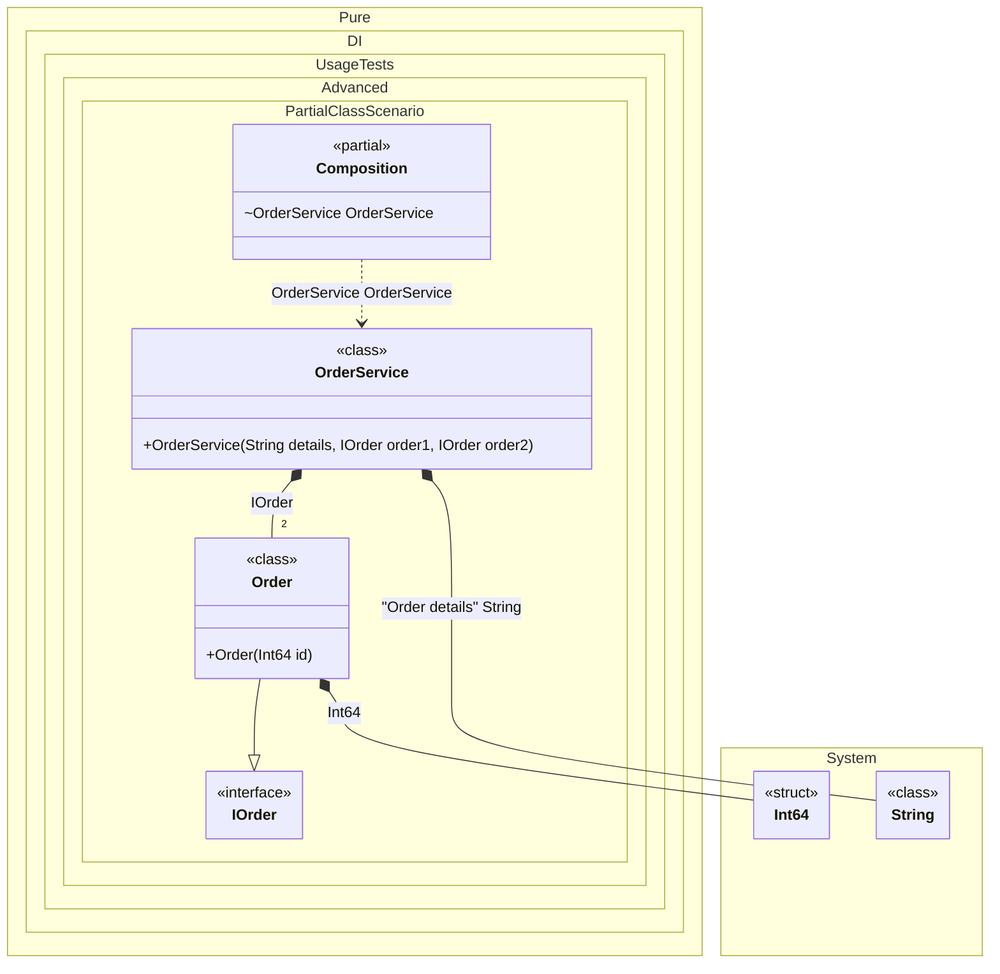

#### Partial class

A partial class can contain setup code.


```c#
using Shouldly;
using Pure.DI;
using static Pure.DI.RootKinds;
using System.Diagnostics;

var composition = new Composition("NorthStore");
var orderService = composition.OrderService;

// Checks that the dependencies were created correctly
orderService.Order1.Id.ShouldBe(1);
orderService.Order2.Id.ShouldBe(2);
// Checks that the injected string contains the store name and the generated ID
orderService.OrderDetails.ShouldBe("NorthStore_3");

interface IOrder
{
    long Id { get; }
}

class Order(long id) : IOrder
{
    public long Id { get; } = id;
}

class OrderService(
    [Tag("Order details")] string details,
    IOrder order1,
    IOrder order2)
{
    public string OrderDetails { get; } = details;

    public IOrder Order1 { get; } = order1;

    public IOrder Order2 { get; } = order2;
}

// The partial class is also useful for specifying access modifiers to the generated class
public partial class Composition
{
    private readonly string _storeName = "";
    private long _id;

    // Customizable constructor
    public Composition(string storeName)
        : this()
    {
        _storeName = storeName;
    }

    private long GenerateId() => Interlocked.Increment(ref _id);

    // In fact, this method will not be called at runtime
    [Conditional("DI")]
    void Setup() =>

        DI.Setup()
            .Bind<IOrder>().To<Order>()
            .Bind<long>().To(_ => GenerateId())
            // Binds the string with the tag "Order details"
            .Bind<string>("Order details").To(_ => $"{_storeName}_{GenerateId()}")
            .Root<OrderService>("OrderService", kind: Internal);
}
```

<details>
<summary>Running this code sample locally</summary>

- Make sure you have the [.NET SDK 10.0](https://dotnet.microsoft.com/en-us/download/dotnet/10.0) or later is installed
```bash
dotnet --list-sdk
```
- Create a net10.0 (or later) console application
```bash
dotnet new console -n Sample
```
- Add references to NuGet packages
  - [Pure.DI](https://www.nuget.org/packages/Pure.DI)
  - [Shouldly](https://www.nuget.org/packages/Shouldly)
```bash
dotnet add package Pure.DI
dotnet add package Shouldly
```
- Copy the example code into the _Program.cs_ file

You are ready to run the example 🚀
```bash
dotnet run
```

</details>

The partial class is also useful for specifying access modifiers to the generated class.

The following partial class will be generated:

```c#
partial class Composition
{
  [OrdinalAttribute(256)]
  public Composition()
  {
  }

  internal Composition(Composition parentScope)
  {
  }

  internal OrderService OrderService
  {
    [MethodImpl(MethodImplOptions.AggressiveInlining)]
    get
    {
      long transientInt644 = GenerateId();
      long transientInt645 = GenerateId();
      string transientString1 = $"{_storeName}_{GenerateId()}";
      return new OrderService(transientString1, new Order(transientInt644), new Order(transientInt645));
    }
  }
}
```

Class diagram:



