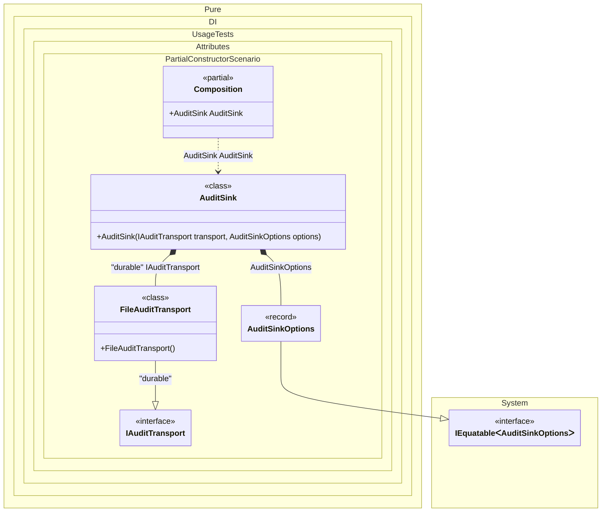

#### Partial constructor injection

C# 14 partial constructors let a type declare its construction contract in one part and provide the body in another. Pure.DI sees the combined constructor symbol, resolves its parameters once, and invokes it like a regular constructor. This is useful when a source generator owns the defining declaration while application code supplies the implementation.


```c#
using Shouldly;
using Pure.DI;

DI.Setup(nameof(Composition))
    .Bind<IAuditTransport>("durable").To<FileAuditTransport>()
    .Bind().To(_ => new AuditSinkOptions(BatchSize: 128))

    // Composition root
    .Root<AuditSink>("AuditSink");

var composition = new Composition();
var sink = composition.AuditSink;

sink.Transport.ShouldBeOfType<FileAuditTransport>();
sink.BatchSize.ShouldBe(128);

interface IAuditTransport;

class FileAuditTransport : IAuditTransport;

record AuditSinkOptions(int BatchSize);

abstract class AuditSinkBase(IAuditTransport transport)
{
    public IAuditTransport Transport { get; } = transport;
}

partial class AuditSink : AuditSinkBase
{
    // This defining declaration participates in constructor lookup.
    // Its parameter attributes are merged with the implementing part.
    public partial AuditSink(
        [Tag("durable")] IAuditTransport transport,
        AuditSinkOptions options);

    public int BatchSize { get; private set; }
}

partial class AuditSink
{
    // A base/this initializer is allowed only on the implementing declaration.
    public partial AuditSink(
        IAuditTransport transport,
        AuditSinkOptions options)
        : base(transport)
    {
        BatchSize = options.BatchSize;
    }
}
```

<details>
<summary>Running this code sample locally</summary>

- Make sure you have the [.NET SDK 10.0](https://dotnet.microsoft.com/en-us/download/dotnet/10.0) or later installed
```bash
dotnet --list-sdk
```
- Create a net10.0 (or later) console application
```bash
dotnet new console -n Sample
```
- Add references to the NuGet packages
  - [Pure.DI](https://www.nuget.org/packages/Pure.DI)
  - [Shouldly](https://www.nuget.org/packages/Shouldly)
```bash
dotnet add package Pure.DI
dotnet add package Shouldly
```
- Copy the example code into the _Program.cs_ file

You are ready to run the example 🚀
```bash
dotnet run
```

</details>

A partial constructor must have exactly one defining declaration ending with `;` and one implementing declaration with a body. Only the defining declaration participates in lookup, while constructor and parameter attributes from both parts are combined.
Place `this(...)` or `base(...)` constructor initializers on the implementing declaration. `OrdinalAttribute`, `TagAttribute`, and `OverloadResolutionPriorityAttribute` can be placed on either part and are observed through the combined Roslyn symbol.

<details>
<summary>The following partial class will be generated</summary>

```c#
partial class Composition
{
  public AuditSink AuditSink
  {
    [MethodImpl(MethodImplOptions.AggressiveInlining)]
    get
    {
      AuditSinkOptions transientAuditSinkOptions = new AuditSinkOptions(BatchSize: 128);
      return new AuditSink(new FileAuditTransport(), transientAuditSinkOptions);
    }
  }
}
```

</details>

Class diagram:



See also:

- [Overload resolution priority](overload-resolution-priority.md)
- [Constructor ordinal attribute](constructor-ordinal-attribute.md)

